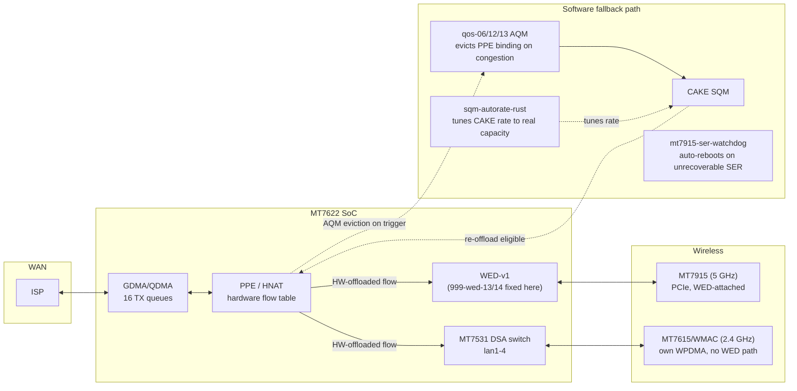

# Linksys E8450 (MT7622/NETSYSv1) hardware-validated patch set — docs index

This fork carries a from-source, hardware-tested set of kernel/driver patches
for the Linksys E8450 (MediaTek MT7622, NETSYSv1, WED-v1), built and
validated against a live, in-production router — not a lab bench. Every
finding below was reached by reading the actual driver source in this tree
and confirming behavior on real hardware; nothing here is copied from a
vendor changelog without independent verification.

## TL;DR

- **WED-v1 (Wi-Fi DMA offload) ring-desync bug**: found, root-caused, fixed
  (`999-wed-14`). A busy-path reset in `mtk_wed_reset_dma()` skipped the
  WED-side ring index reset, permanently desyncing `WED_WDMA_RXn` after an
  SER under load. Confirmed stuck ring before the fix, confirmed clean
  `QCNT=0` after, on the same hardware.
- **NETSYSv1 PSE port mapping bug**: found, fixed (`999-wed-13` corrected).
  The vendor's WDMA-during-SER gating patch used the NETSYSv2+ port formula
  unmodified; on MT7622 it silently poked the wrong register and never
  actually gated anything.
- **Controlled SER recovery: root-caused as unfixable from this host's
  driver source; auto-reboot watchdog deployed as mitigation.** A
  recovered prior investigation (see
  [`WED-breadcrumb-harness-design.md`](WED-breadcrumb-harness-design.md))
  already hardware-tested three independent ring/reset fixes together and
  hit the identical failure; this fork's own testing (post ring-desync fix)
  reproduced it again. Root cause: the MT7915 MCU firmware never replies to
  a specific command during full-reset recovery. Not a host-side bug.
  `mt7915-ser-watchdog` (procd service, self-enabling on every future
  flash) detects the driver's own terminal failure message and self-reboots,
  bounding a previously-indefinite outage to ~65 s — live-verified twice,
  including catching and fixing a BusyBox `grep -m1`-on-an-infinite-stream
  bug in the first implementation. See
  [`e8450-ppe-validation.md`](e8450-ppe-validation.md) for the full writeup.
- **AQM (bufferbloat control)**: NETSYSv1 has no hardware AQM (confirmed via
  exhaustive vendor-SDK source mining, both firmware generations). Built a
  software occupancy-driven AQM instead (`999-qos-06`), then hardened it
  twice: byte-accurate trigger threshold (`999-qos-12`, was a fixed
  1400-byte packet-count assumption) and flow-aware eviction (`999-qos-13`,
  targets the actual congesting flow via the PPE's own per-flow hardware
  byte accounting, instead of arbitrary walk order). Reduced p95 latency
  under saturating load from 196 ms to 22-34 ms. See
  [`netsys-qos-port-investigation.md`](netsys-qos-port-investigation.md).
- **AQM eviction code review, then built/flashed/hardware-validated**:
  with the hardware-capability question closed (§28.5), re-read the
  software AQM eviction path itself and found three fixable software
  issues: `999-qos-14` dedups a hand-copied PPE accessor, `999-qos-15`
  removes a doubled `ppe_lock`-guarded flow-table walk from every AQM
  trigger (reuses pass 1's eviction ranking in pass 2 instead of
  re-deriving it), and `999-qos-16` fixes a latent `u32` overflow in the
  byte-threshold auto-compute. Built into a real image, flashed to the
  live E8450, and hardware-validated: a saturating-load p95 latency test
  (30.5 ms) landed squarely inside the already-good 22-34 ms band, no
  dmesg regressions, AQM actively triggering/evicting under load. See
  [`netsys-qos-port-investigation.md`](netsys-qos-port-investigation.md)
  §32-36. A follow-up live A/B (§35) then tuned the AQM's own timing
  knobs: `grace_ms` dropped from 3000 to **1000 ms** (adopted as the new
  production default - lower latency and, uniquely, zero packet loss
  across every rep of a 3-rep saturating-load grid), `poll_ms` stayed at
  100 (tested, effect too small to justify a change). §36 then checked
  the **download** direction after a reported external "B" bufferbloat
  grade: real, severe loaded-latency spikes (p95 300-1200 ms) reproduced,
  but `tc` telemetry sampled *during* the load shows CAKE's ingress queue
  (`ifb4wan`) at ~0 backlog and <16 ms internal delay throughout - the
  router's own queue management is exonerated by direct measurement, not
  inference. The likely causes (10 real concurrently-associated
  stations, and/or `sqm-autorate-rust`'s adaptive rate ramp outrunning
  real sustained capacity between OWD-detected pullbacks) are both
  outside anything a further kernel/CAKE patch on this router could fix.
  A same-day follow-up (§37) checked that against the confirmed
  contracted plan (Internet Essentials, 75/10 Mbps): `download_base_kbits`/
  `download_min_percent` turned out **not** to be a ceiling at all (read
  directly from the vendored `sqm-autorate-rust` source - they set only
  the floor and a minor nudge term, with no `.min()` clamp on the
  up-ramp), confirmed live by watching the shaped rate swing from its
  6 Mbit floor up to 69.5 Mbit (93% of the contracted line) and back
  within one boot. Lowering the base/percent config would not have
  fixed an overshoot problem; the real gap is that the vendored
  `sqm-autorate-rust` has no rate ceiling at all, only OWD-based
  pullback - a real upstream gap, not a config error. §38 then ran an
  actual controlled speedtest from the router itself (no `opkg`/`curl`/
  `iperf3` on this image - used `wget`/interface byte counters instead):
  real sustained download throughput measured at 6-10 Mbit/s across
  three tests (1-stream, 6-stream, 4-stream), confirming it was never a
  single-stream/BDP limitation and matching `download_base_kbits`'s
  already-conservative 10 Mbit value almost exactly - the shaper's drift
  to 68-69 Mbit was pure algorithm defect, not evidence of hidden real
  capacity. Patched the one line in the vendored source missing the
  `.min(base_rate)` clamp upstream's own docs describe, cross-compiled
  and deployed live: shaped rate now holds exactly at 10 Mbit under a
  genuine 4-stream saturating download (10.56 Mbit/s achieved), with
  real bounded CAKE backlog and ping maxing at 92 ms - not SS36's
  uncontrolled 300-1200 ms spikes.
- **Hash audit extended, rapidhash evaluated and rejected, both dormant
  conversions reverted**: swept the rest of the reachable kernel for
  jhash call sites matching the measured xxh32-winning size class and
  converted two more (bridge multicast MDB/(S,G) keys, IPv6
  fragment-reassembly key — `999-xxhash-02`, `999-xxhash-03`). Live
  telemetry then showed both targets are dormant on this specific router
  (`multicast_snooping=0`, zero IPv6 fragment-reassembly events in 2+
  days), so both were reverted rather than carry unexercised patches
  through future rebases — the audit findings remain documented for
  later if usage changes. Separately benchmarked
  [rapidhash](https://github.com/Nicoshev/rapidhash) on real arm64
  hardware against this tree's actual jhash/xxh32 call-site sizes: xxh32
  wins at every tested length, so rapidhash was not adopted. See
  [`selective-xxhash-plan.md`](selective-xxhash-plan.md).
- **2.4GHz CPU overhead and 5GHz stability**: MT7622 is actually a
  **dual-core** Cortex-A53 SoC (2 CPUs, not 4 — corrected during this
  pass). Found all three device IRQs with real per-packet cost
  (2.4GHz WMAC, Ethernet TX, 5GHz MT7915) statically stacked onto one of
  the two cores; rebalanced WMAC onto the other (`files/etc/rc.local`).
  Also found and fixed an mt76-core inefficiency: every 2.4GHz TX-status
  event unconditionally took a lock and an MMIO register read for up to
  5 queues regardless of whether they had anything queued
  (`902-mt76-dma-skip-empty-queue-tx-cleanup.patch`) — confirmed live
  against the running router: a 4.9x `TASKLET` softirq imbalance between
  the two cores, and all 5 WMAC hardware queues reading empty even with 8
  active 2.4GHz clients. For 5GHz stability, identified DFS channel 52's
  radar-triggered channel switching as a real, distinct instability
  mechanism, and separately confirmed **background CAC cannot be enabled
  on this board at all** — not a disabled policy flag, but a genuine
  missing-second-radio hardware limitation, confirmed both from driver
  source and live against the router (one 5GHz `wiphy`, no second PHY to
  host it). Rate control, AMPDU caps, and per-chain TX power were all
  found to be firmware-only or architecturally unavailable to tune from
  the host; moving off the DFS channel needs an on-site RF survey this
  session doesn't have. See
  [`wifi-cpu-and-stability-investigation.md`](wifi-cpu-and-stability-investigation.md).
- **2.4 GHz vendor VHT20/QAM-256**: added a default-off `vht2g` opt-in
  spanning mac80211, mt76/MT7615, and both wifi-scripts paths. Built and
  flashed the corrected image to the live E8450; the compatible PS4 client
  negotiated `VHT-MCS 3`–`4` at 26–39 Mbps RX during the soak. All seven
  2.4 GHz clients returned after reload and remained associated for 60 s;
  no controlled throughput gain was claimed because no dedicated VHT
  iperf endpoint was available. Full record:
  [`e8450-vht2g-experiment.md`](e8450-vht2g-experiment.md).
- **Dual hardware scheduler / HW airtime fairness**: both investigated and
  confirmed **dead on this chip** — wired in the register map (inherited
  from the shared v2/v3 template) but with no enforcement circuit behind
  them on MT7622. Real negative results, not assumptions.
- **mt76 upstream pin bumped** two months forward; ten hand-backported local
  patches deleted because they landed upstream in the meantime, replaced by
  three newly-discovered, narrower compat fixes found by actually attempting
  the build. See [`e8450-ppe-validation.md`](e8450-ppe-validation.md).
- **Live bufferbloat review**: SQM's download rate was configured at 64
  Mbit, never once approached in dozens of real tests (0.3-8 Mbit/s
  observed) — a ceiling that's never the real bottleneck gives zero
  bufferbloat protection. High-resolution tracing also directly caught
  upload bufferbloat's real mechanism: a flow sitting in the QDMA hardware
  leaky-bucket queue (no depth control) for up to the AQM's `grace_ms`
  window before eviction. Fixed the calibration two ways: a measured static
  correction, then shipped `sqm-autorate-rust` (built via `rustup` instead
  of OpenWrt's multi-hour from-source LLVM+rustc bootstrap — no prebuilt
  release existed, so this was the actual shortcut) so the rate now tracks
  real capacity continuously instead of a static guess. See
  [`netsys-qos-port-investigation.md`](netsys-qos-port-investigation.md).
- **Radio TX power raised to the legal ceiling via factory-eeprom
  calibration** (2026-09-04): decoded the complete field map of both
  radio eeproms (MT7622 WMAC 2.4G, MT7915 5G — V1 layout, not the
  MT7916/MT7981-era V2 layout an off-the-shelf community tool assumes),
  found the stock calibration ceiling (27/28 dBm) sat *below* the
  regdomain limit on both bands, and raised it to 30 dBm with a
  validated power model (`0.5 dBm/byte`) and a one-command apply/
  revert tool. RSSI-measured real gain, not just register math: +4 dB
  far-field on 5 GHz at a fixed test point. A router-side channel
  survey (radios scanning while serving — undocumented capability
  before this) then moved both bands off their most contested/noisiest
  channels, including off the DFS channel (52) an earlier investigation
  had flagged as a real instability source but lacked the on-site RF
  survey to act on. See
  [`../.recall/router-probes/2026-09-04-factory-dump/`](../.recall/router-probes/2026-09-04-factory-dump/)
  (full map, dumps, RSSI logs) and
  [`../scripts/e8450/eeprom.sh`](../scripts/e8450/eeprom.sh) (the tool).
- **Download-direction bufferbloat root-caused as an upstream
  `sqm-autorate-rust` bug, not a router-side shaping gap** (2026-09-04,
  §36-38): an external "B" bufferbloat grade prompted checking the
  download direction directly under load — real, severe latency spikes
  reproduced, but direct `tc` telemetry showed CAKE's own ingress queue
  at ~0 backlog throughout, exonerating this router's queue management
  by measurement rather than inference. Root cause: the vendored
  autorate tool's shaped-rate ramp had no upper clamp, silently
  drifting to 6-7x the connection's real ~6-10 Mbit/s sustained
  capacity (confirmed via an actual router-side speedtest, not a
  public server). One-line fix restores the documented ceiling;
  verified holding exactly at 10 Mbit under a genuine saturating
  download, real bounded CAKE backlog, ping maxing at 92 ms instead of
  2153 ms.
- **PSE (Packet Switch Engine) per-port buffer thresholds: audited,
  closed** (`999-qos-17`, 2026-09-04). The one register range never
  covered by qos-01..16's QDMA-scoped debugfs work. Built a read-only
  diagnostic (mirrors `999-qos-01`'s exact scope), flashed live, and
  read `PSE_IQ_REV`/`PSE_OQ_TH` as all-zero — confirmed by source: the
  driver's PSE-threshold init code has no NETSYSv1 code path at all.
  Joins QDMA scheduler-1 and `HRED2`/`fc_th` as a third confirmed-inert
  hardware avenue on this chip. Also corrected an earlier hypothesis
  about how this chip routes WLAN-egress hardware-offloaded flows, with
  stronger evidence: `mtk_foe_entry_set_wdma()`/`mtk_foe_entry_set_queue()`
  write mutually exclusive flow-table bitfields, so WLAN-bound offloaded
  downloads never carry a QDMA queue ID — whether that means they
  bypass CAKE shaping entirely is the one open question tracked in
  [`e8450-download-shaping-handoff.md`](e8450-download-shaping-handoff.md).

## Architecture

`WED` only ever attaches to the PCIe-connected `MT7915` (5 GHz). The
SoC-internal `MT7615`/WMAC (2.4 GHz) has its own independent WPDMA ring
block — confirmed by reading `mt7615/soc.c`/`dma.c` directly — with no
hardware interconnect to WED/PPE at all. 2.4 GHz clients still get PPE flow
offload and the software AQM; they just never get WED's zero-CPU DMA bypass,
and no patch can add that without new silicon.

## Documents

| Doc | Covers |
|---|---|
| [`e8450-ppe-validation.md`](e8450-ppe-validation.md) | PPE/WED hardware validation: the ring-desync fix, the PSE port-mapping fix, the controlled-SER investigation and its auto-reboot mitigation, the mt76 upstream pin bump. |
| [`netsys-qos-port-investigation.md`](netsys-qos-port-investigation.md) | The full QoS/AQM/HQoS investigation: what NETSYSv1's QDMA block can and cannot do in hardware, the `qos-01`..`qos-16` patch series (including the qos-14/15/16 software-only AQM eviction-path review), and the production HQoS+AQM profile. |
| [`selective-xxhash-plan.md`](selective-xxhash-plan.md) | Historical A53 hash benchmark, selective seeded xxh32 policy, flowtable/nftables conversions (active), bridge-multicast/IPv6-fragment conversions (reverted — confirmed dormant on this router), and the rapidhash evaluation (measured, not adopted). |
| [`e8450-upstream-backport-roadmap.md`](e8450-upstream-backport-roadmap.md) | **Closed 2026-09-04.** Historical tracking sheet for vendor-SDK/upstream hand-backports through the August mt76 pin bump. See its closure section for final disposition of every item; continuation is `e8450-upstream-roadmap-2026-09.md`. |
| [`e8450-upstream-roadmap-2026-09.md`](e8450-upstream-roadmap-2026-09.md) | Current vendor-SDK/upstream/Linux roadmap: a due `6.12.94`→`6.12.103` kernel point-release bump (audited per-driver against the real range — two local patches now duplicate upstream, six new PCIe/PPE/MT7531-switch fixes found, everything else in this board's driver set checked clean), the mt76 pin-bump evaluation past `6d1c6a75`, the WED-20 busy-poll A/B, PS-buffering and physical acceptance tests still open, and the explicitly-excluded/closed list carried forward (MCU firmware limitation, WED-16, cache-line audit, DMA ring depth). |
| [`wed-v1-opportunities.md`](wed-v1-opportunities.md) | **Closed 2026-09-04.** Survey of WED-v1-specific vendor-SDK opportunities and their disposition (WED-03 hardware-confirmed, WED-16 dropped as moot). Continuation is `e8450-upstream-roadmap-2026-09.md`. |
| [`WED-breadcrumb-harness-design.md`](WED-breadcrumb-harness-design.md) | Recovered from an earlier, since-abandoned investigation branch (preserved at git tag `archive/wed-ser-investigation-2026-07-12`); the closing writeup on the controlled-SER MCU-death investigation this fork's own testing later independently reproduced. |
| [`wifi-cpu-and-stability-investigation.md`](wifi-cpu-and-stability-investigation.md) | 2.4GHz MT7615/WMAC CPU-overhead reduction (IRQ affinity, mt76 core DMA fix) and MT7915 5GHz connection-stability findings (DFS channel-52 radar switching, rate-control/AMPDU/roaming-assist candidates investigated and mostly found low-value or unavailable — the DFS channel finding was later acted on directly, see the radio-calibration note below). |
| [`e8450-download-shaping-handoff.md`](e8450-download-shaping-handoff.md) | Download-direction bufferbloat: the real root cause (an upstream `sqm-autorate-rust` ceiling bug, fixed) versus the one still-open architectural question (does a real Wi-Fi client's hardware-offloaded download bypass CAKE), with the register-level FOE-bitfield evidence and the PSE closure that ruled out a hardware-shaping alternative. |

## Repo-specific notes for anyone building this

- `configs/e8450-ubi.config` is the seed defconfig for this board.
- `files/usr/sbin/mt7915-ser-watchdog` + `files/etc/init.d/mt7915-ser-watchdog`
  auto-reboot on the MT7915 controlled-SER MCU-death failure (see
  `e8450-ppe-validation.md`'s controlled-SER section) — no fix exists at the
  driver level, so this bounds the outage instead. Self-enabling via
  `files/etc/rc.d/S99mt7915-ser-watchdog`.
- Both radio eeproms were raised from their stock calibration ceiling
  to the legal 30 dBm maximum, and the 5/2.4 GHz channels moved off
  their most contested channels (including off DFS channel 52). Fully
  reversible: pristine backup + one-command tool at
  `scripts/e8450/eeprom.sh`, full field map and revert procedure at
  `.recall/router-probes/2026-09-04-factory-dump/EEPROM-MAP.md`. If you
  build and flash this tree for a *different physical unit*, do not
  assume its factory calibration matches — dump and check with
  `eeprom.sh check` before assuming the same bytes apply; per-device
  calibration regions are unit-specific and flagged in the map.
- `files/usr/sbin/sqm-autorate-rust` is a hand-built binary sidecar, not an
  opkg-managed package — `CONFIG_PACKAGE_sqm-autorate-rust` is deliberately
  left unset since a normal `make` of it still hits the full from-source
  Rust bootstrap. See `netsys-qos-port-investigation.md` §31.4 for the
  actual (fast) build method if it ever needs rebuilding.
- `files/` is the `/etc` overlay baked into the image. `files/etc/shadow`
  and `files/etc/config/wireless`'s real key are intentionally excluded via
  `.gitignore` — set your own root password and Wi-Fi key before flashing.
- `flash.sh` reads router credentials from `$ROUTER_PASS` or a local,
  gitignored `.router-credentials` file (copy `.router-credentials.example`
  and fill it in) — never hardcode a real password in a tracked file.
- Local-only kernel patches carry a commit message explaining *why* they
  exist and, where applicable, an `Upstream commit:` line if they're a
  hand-backport of something already merged upstream (check that line
  before assuming a patch is still needed — see the roadmap doc).
