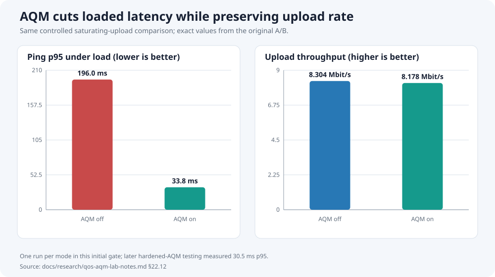
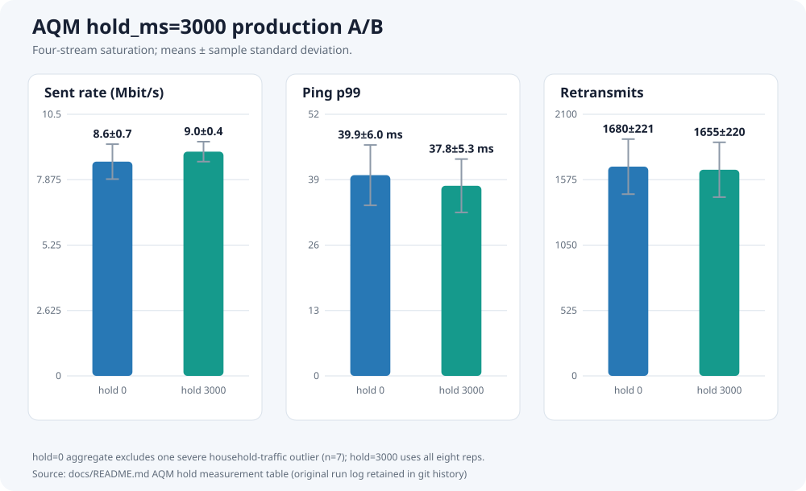
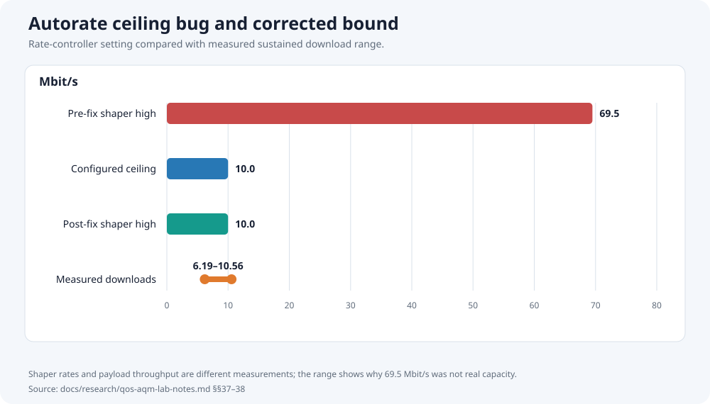
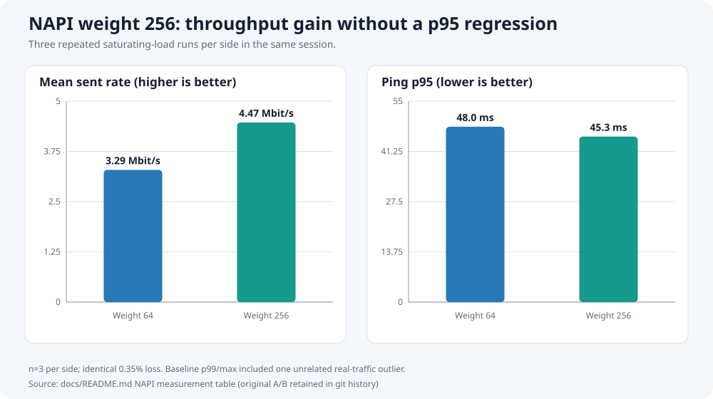
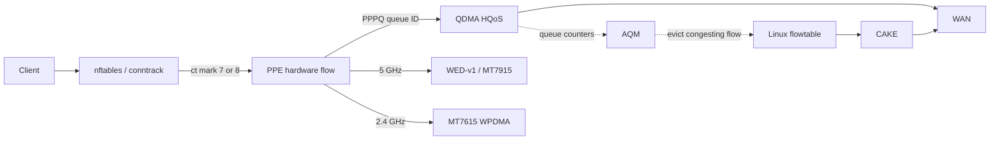
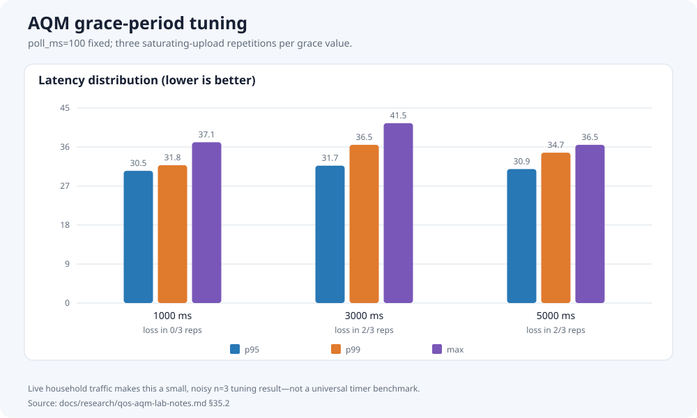

# E8450 Performance ROM handbook

This is the technical companion to the project
[`README`](../README.md). It explains what the ROM changes, how the packet
path works, what can be configured safely, and why some patches remain local.
It replaces the former collection of overlapping roadmaps, handoffs, design
documents, and dated test summaries.

> **Status: maintained handbook.** Update this file when shipped behavior or
> production defaults change. Historical test chronology belongs in
> [`research/`](research/).

## Contents

- [Feature guide](#feature-guide)
- [How traffic moves through the router](#how-traffic-moves-through-the-router)
- [Production settings](#production-settings)
- [Operations and troubleshooting](#operations-and-troubleshooting)
- [Wi-Fi and radio behavior](#wi-fi-and-radio-behavior)
- [Backports and upstreaming](#backports-and-upstreaming)
- [Patch map](#patch-map)
- [Known limits and open work](#known-limits-and-open-work)
- [Research and evidence](#research-and-evidence)
- [Building and changing the ROM](#building-and-changing-the-rom)

## Feature guide

### PPE: hardware flow offload

The **Packet Processing Engine (PPE)** remembers established flows and forwards
later packets without repeating the full Linux networking path. This lowers CPU
cost and leaves more headroom for Wi-Fi, encryption, and local services.

Hardware offload normally conflicts with software queue management: packets
which stay in the PPE may not visit CAKE. This ROM keeps the PPE enabled but
adds a controlled path back to software when its hardware upload queue becomes
congested.

Default:

```text
firewall flow_offloading=1
firewall flow_offloading_hw=1
```

For a controlled comparison, `scripts/e8450/ppe-offload-bypass.sh` marks new
flows for one IPv4 host with conntrack mark `0x99`. Patch `999-ppe-93` refuses
PPE binding for those flows, leaving them on the software/CAKE path. Existing
flows must be re-established because marking does not retroactively unbind
them.

### PPPQ: selecting a hardware queue

**PPPQ means per-port/per-queue QoS. It is unrelated to PPP, PPPoE, or modem
authentication.**

NETSYSv1 has 16 QDMA transmit queues. PPPQ stores a queue ID in an offloaded
PPE flow, so different classes can reach different hardware queues instead of
all offloaded traffic sharing one undifferentiated path.

The shipped nftables policy in `files/etc/nftables.d/30-queue-mark.nft` uses:

| Queue | Class | Selection |
|---:|---|---|
| 7 | Bulk/default WAN upload | Every otherwise-unclassified WAN flow |
| 8 | Priority WAN upload | ICMP and DSCP `EF`, `AF41`, `CS4`, or `CS5` |
| 4 | Software priority fallback | `meta mark 4` for non-offloaded priority packets |

Wi-Fi WMM voice/video priorities are translated to DSCP before conntrack and
offload classification. Existing non-zero DSCP is preserved.

### HQoS: scheduling the selected queues

**Hierarchical QoS (HQoS)** is the hardware scheduler policy applied after PPPQ
has selected a queue.

The production profile uses weighted round robin on scheduler 0:

- queue 7: bulk, weight 4, capped at 8.3 Mbit/s;
- queue 8: priority, weight 12, no per-queue cap;
- scheduler ceiling: 9.5 Mbit/s.

The hierarchy matters. PPPQ answers **which queue?** HQoS answers **how should
those queues share the link?** Neither one detects persistent congestion or
replaces CAKE.

### AQM: moving congestion back to CAKE

**Active Queue Management (AQM)** prevents a full queue from turning into
hundreds of milliseconds of delay. MT7622/NETSYSv1 does not implement usable
hardware AQM, even though the shared register layout exposes names which imply
otherwise.

This ROM supplies a software controller around the hardware:

1. Poll QDMA queue 7's byte and drop counters every 100 ms.
2. Detect sustained traffic at the queue's configured cap or a hardware drop.
3. Respect a 1,000 ms grace period between eviction cycles.
4. Rank the offloaded flows on that queue using the PPE's hardware byte
   counters.
5. Evict up to four of the largest contributors from the PPE.
6. Synchronize Linux flowtable state and hold the evicted conntrack entries out
   of the PPE for 3,000 ms.
7. Let those packets traverse the normal software path and CAKE.

This is called **AQM v2** in the patch history. The v2 work made eviction
flow-aware, byte-accurate, synchronized with `nf_flowtable`, and resistant to
immediate re-offload.

It is not a general Linux AQM implementation and it does not pretend NETSYSv1
has capabilities it lacks. It is a board-specific bridge between QDMA, PPE,
conntrack, and CAKE.



The persisted `hold_ms=3000` decision was checked with a larger four-stream
A/B after smaller runs proved too noisy:

| Metric | No hold (n=7 after one excluded outlier) | 3,000 ms hold (n=8) |
|---|---:|---:|
| Sent rate | 8.6 ± 0.7 Mbit/s | 9.0 ± 0.4 Mbit/s |
| Average latency | 27.7 ± 1.0 ms | 26.8 ± 1.0 ms |
| p95 latency | 32.5 ± 1.0 ms | 32.3 ± 2.6 ms |
| p99 latency | 39.9 ± 6.0 ms | 37.8 ± 5.3 ms |
| Retransmits | 1,680 ± 221 | 1,655 ± 220 |



Values are mean ± sample standard deviation. One no-hold run coincided with a
severe household-traffic event (71.5 ms average, 254 ms p95, 1,065 ms maximum)
and was excluded from that leg's aggregate before comparing like-for-like
runs. No comparable event occurred in the hold leg, but one event is not proof
of causality; it remains suggestive supporting evidence, not a plotted effect
size.

### CAKE and adaptive rates

CAKE remains the actual software queue discipline:

```text
WAN upload:   cake on wan, 8.3 Mbit/s baseline
WAN download: cake on ifb4wan, 10 Mbit/s baseline
```

`sqm-autorate-rust` watches delay to external reflectors and changes those CAKE
rates when capacity changes. The pinned upstream Rust port omitted the
documented upper clamp in its rate controller; under light-delay samples it
could increase to six or seven times the real connection capacity. The local
one-line fix applies both the minimum and maximum bounds. A four-stream live
download then held at the configured 10 Mbit/s ceiling with bounded backlog.



Upload and download are not symmetric:

- the HQoS/PPPQ/AQM stack described above manages the hardware-offloaded
  **WAN-egress upload** path;
- download shaping uses CAKE on `ifb4wan`;
- a Wi-Fi-destined hardware-offloaded download has a different WED/WDMA path,
  which is why its final CAKE traversal remains an explicit acceptance test.

### WED-v1: 5 GHz DMA offload

**Wi-Fi Ethernet Dispatch (WED)** connects the PPE and Ethernet DMA path to the
PCIe MT7915 5 GHz radio, reducing CPU-owned packet movement.

Two local fixes matter:

- `999-wed-13` corrects the PSE WDMA port calculation used during recovery.
  The vendor version used a newer-NETSYS formula and silently gated the wrong
  register on MT7622.
- `999-wed-14` resets the WED-side WDMA receive index on the busy reset path.
  Without it, the WED and WDMA ring indices could remain permanently
  desynchronized after recovery under load.

The integrated MT7615 2.4 GHz radio has its own WPDMA block. It can use PPE
flow offload, but it has no physical WED connection.

### Recovery watchdog

A separate MT7915 failure remains after the host-side ring fixes: firmware can
stop responding to a recovery command. The driver cannot reset a firmware core
which never acknowledges the command.

`files/usr/sbin/mt7915-ser-watchdog` and its procd service watch for the
driver's terminal failure message and reboot. This is intentionally documented
as a mitigation, not presented as a firmware fix.

### Smaller fixes and tuning

- Ethernet NAPI poll weight raised from 64 to 256 after a controlled A/B
  improved upload throughput without a latency regression.
- MT7622 Ethernet RX ring increased to 1,024 descriptors.
- A false MDIO timeout race and an MT7531 VLAN deletion FID bug are fixed.
- The PPE's MIB-cache typo, multicast metadata, queue bounds, flow aging,
  bridge-offload plumbing, and leak paths are corrected.
- Seeded xxh32 is used only at measured, suitable flowtable/nftables key sizes;
  blanket hash replacement was rejected.
- The 2.4 GHz WMAC interrupt is moved away from the core already carrying the
  Ethernet and 5 GHz packet load.
- mt76 skips transmit cleanup's lock and MMIO read when a queue is already
  empty.

The NAPI A/B used three repeated saturating-load runs per side:

| Configuration | Sent rate | Average latency | p95 | Loss |
|---|---:|---:|---:|---:|
| Weight 64 baseline | 3.29 Mbit/s | 34.5 ms | 48.0 ms | 0.35% |
| Weight 256 | 4.47 Mbit/s | 32.9 ms | 45.3 ms | 0.35% |



The baseline's p99/maximum contained one real-traffic outlier, so the claim is
limited to higher measured throughput with no p95 or loss regression—not a
general tail-latency improvement.

## How traffic moves through the router



For ordinary upload traffic, the short path is:

```text
LAN/Wi-Fi -> nftables class -> PPE -> PPPQ queue -> HQoS -> WAN
```

When queue 7 is persistently busy:

```text
AQM trigger -> largest PPE flow evicted -> Linux forwarding -> CAKE -> WAN
```

The priority queue is deliberately not the AQM target. ICMP and selected
voice/video DSCP classes avoid bulk queue 7, but the policy does not manufacture
priority for arbitrary applications.

## Production settings

Source of truth:
[`package/qdma-shaper/files/qdma-shaper.config`](../package/qdma-shaper/files/qdma-shaper.config)

| Setting | Value | Meaning |
|---|---:|---|
| WAN hardware cap | 8,300 kbit/s | Base queue-7 upload ceiling |
| Scheduler ceiling | 9,500 kbit/s | Room for priority queue 8 |
| Bulk queue / weight | 7 / 4 | Default offloaded upload |
| Priority queue / weight | 8 / 12 | ICMP and selected DSCP |
| AQM poll | 100 ms | Counter sampling interval |
| AQM byte threshold | automatic | Derived from effective queue rate |
| AQM batch | 4 flows | Maximum eviction candidates per trigger |
| AQM grace | 1,000 ms | Minimum time between eviction cycles |
| AQM hold | 3,000 ms | Time evicted flows remain off PPE |
| CAKE upload baseline | 8,300 kbit/s | `wan` SQM rate |
| CAKE download baseline | 10,000 kbit/s | `ifb4wan` SQM rate |
| Autorate minimum | 60% | Per-direction floor relative to baseline |

These are measured values for one asymmetric connection, not universal E8450
defaults. For another ISP, tune these files together:

- `package/qdma-shaper/files/qdma-shaper.config`
- `files/etc/config/sqm`
- `files/etc/config/sqm-autorate`

Keep the invariants:

- queue 7's bulk cap and CAKE's upload baseline describe the same physical
  bottleneck;
- scheduler rate must leave intentional headroom for queue 8;
- download rate is independent of the QDMA WAN-egress cap;
- lower AQM timers are not automatically better. A controlled three-repetition
  load test found 100 ms polling preferable to spending more CPU for an
  inconsistent latency change;
- `byte_thresh=0` means derive the threshold from the actual effective queue
  rate. It does not disable the threshold.

The production grace period was also selected from a three-repetition grid.
The chart includes p95, p99, maximum, and the number of runs with any loss:



After changing UCI state on a router:

```sh
service qdma-shaper reload
service sqm restart
service sqm-autorate-rust restart
qdma-shaper status wan
```

Persist the same values in the source overlay before the next firmware build,
or `sysupgrade`/configuration replacement can reintroduce drift.

## Operations and troubleshooting

### Quick health check

```sh
qdma-shaper status wan
tc -s qdisc show dev wan
tc -s qdisc show dev ifb4wan
logread -e qdma-shaper
logread -e mt7915-ser-watchdog
```

Expected `qdma-shaper status wan` properties:

- board resolves as `linksys,e8450-ubi`;
- WAN resolves to hardware queue 7;
- `flow_offloading=1` and `flow_offloading_hw=1`;
- the override and effective rate are non-zero;
- AQM reports enabled on queue 7.

The helper validates the board, DSA port, queue range, write readback, and
whether any unrelated queue changed. A failed apply rolls queue 7 back instead
of silently leaving a partial configuration.

### Hardware-offload comparison

From the build workstation:

```sh
scripts/e8450/ppe-offload-bypass.sh mark 192.168.1.100
# Reconnect the test application so it creates a new conntrack flow.
scripts/e8450/ppe-offload-bypass.sh status
scripts/e8450/ppe-offload-bypass.sh unmark
```

Replace the address with the test client. This helper has a fixed router target
of `root@192.168.1.1` and uses `ROUTER_PASS` or `.router-credentials`.

`[HW_OFFLOAD]` in `/proc/net/nf_conntrack` is not sufficient proof that a flow
is bound in the MediaTek PPE. Use the PPE debugfs entry table and byte counters
when proving the hardware path.

### Load-test harness

`scripts/e8450/saturating-load-harness.sh` records throughput, latency, and TCP
retransmits for repeated comparisons. Use more than one repetition and change
one variable at a time. Household traffic made single-run conclusions
misleading during earlier work.

### Recovery safety

- Never runtime-load/unload `mt7915e`.
- Never PCI unbind/rebind the MT7915.
- Clear stale pstore panic files before rebooting after a crash.
- A missing 5 GHz network after the watchdog signature is a firmware recovery
  problem, not evidence that lowering queue timers will help.

## Wi-Fi and radio behavior

### 5 GHz

- MT7915, PCIe, WED-v1 attached.
- Production deployment uses a non-DFS channel after a local RF survey.
- Background CAC cannot work: the board has no second 5 GHz PHY to perform it.
- Rate control and several aggregation/power decisions are firmware-owned and
  cannot be meaningfully tuned from the host driver.

### 2.4 GHz

- Integrated MT7615/WMAC with its own WPDMA rings.
- PPE flow offload is available; WED is not.
- Optional VHT20/QAM-256 support is default-off. It was confirmed to negotiate
  VHT rates with a compatible client, but no general throughput gain is
  claimed.

### EEPROM calibration

`scripts/e8450/eeprom.sh` can view, check, apply, and revert the known
calibration layout. Factory images contain per-device regions. Only apply a
profile after checking the current unit; never assume another E8450 has
identical bytes.

Changing the regulatory domain or requested `txpower` is not equivalent to
changing the EEPROM ceiling. Both regulatory limits and calibrated limits
apply, and neither authorizes operation above the local legal maximum.

Measured signal changes are shown only for controlled comparisons. The
far-field 2.4 GHz result was inconclusive and is deliberately absent:


## Backports and upstreaming

### What “backport” means here

A backport takes a specific fix from a newer kernel, mt76 snapshot, mac80211
snapshot, or MediaTek vendor feed and adapts it to this ROM's older stable
baseline. It is not a wholesale upgrade and it is not proof that every nearby
vendor feature belongs on MT7622.

Every candidate is filtered by:

1. **Reachability:** does this board execute the changed code?
2. **Generation:** is it NETSYSv1/WED-v1 code, not a v2/v3 register lookalike?
3. **Minimality:** can the bug fix land without importing vendor-only
   frameworks or debug interfaces?
4. **Build proof:** does it apply and compile against the pinned source?
5. **Hardware proof:** is the intended path observable on the E8450?

This process rejected many apparently relevant patches for MT7986/MT7988,
WED-v2/v3 RRO, multiple PPEs, hardware airtime fairness, and unused PSE
thresholds.

### Three kinds of local patch

| Kind | Example | Maintenance rule |
|---|---|---|
| Upstream backport | later mt76/kernel correctness fix | Remove when the pinned source includes it |
| Vendor adaptation | WED recovery or PPE/DSA fix | Keep only the minimal mainline-compatible part |
| Fork-original | NETSYSv1 QDMA AQM and control plane | Keep evidence and split generic fixes from board policy |

An mt76 pin refresh already removed ten local patches after their upstream
commits became part of the pinned source. The 2.4 GHz QAM-256 path uses the
driver-opt-in form from an upstream-submitted series rather than a broad vendor
capability override. These are examples of the desired lifecycle: prefer the
maintained implementation, then delete the duplicate local patch.

### What has not been claimed

This repository does **not** claim that every local patch has been submitted or
accepted upstream. Several parts are intentionally poor upstream candidates in
their present form:

- debugfs experiment controls and register probes;
- deployment policy containing fixed queues, rates, and conntrack marks;
- a cross-subsystem AQM controller specialized to NETSYSv1's missing hardware;
- mitigation for a firmware failure which cannot be fixed in host code.

Before submission, a patch must be separated into:

1. a generic correctness fix with no local policy;
2. a device capability or driver mechanism;
3. optional OpenWrt packaging/UCI policy;
4. test-only diagnostics, which should normally stay out of production
   interfaces.

Small generic fixes—ring reset correctness, bounds checks, MDIO polling, DSA
state, and resource lifetime—are the most suitable upstream units. The HQoS
profile itself belongs in this ROM; upstream kernels should expose mechanisms,
not one household's rate plan.

### Tracking future upstream changes

When updating Linux, mt76, or mac80211:

1. search each local patch's subject and `Upstream commit:` header;
2. verify the new source contains the behavior, not only a similar title;
3. remove the local patch rather than carry an empty/conflicting compatibility
   layer;
4. rebuild the affected package and image;
5. repeat the hardware scenario which originally justified the patch.

Closed roadmaps and audit diaries are intentionally not retained as active
documentation. Git history preserves them; this handbook records their current
disposition.

## Patch map

The patch files remain the authoritative description of exact code changes.
This map is by responsibility rather than chronology.

| Area | Patch range | Purpose |
|---|---|---|
| QDMA diagnostics/control | `999-qos-01`–`05`, `11`, `17` | Register, rate, MIB-byte, scheduler, and PSE visibility |
| QDMA AQM | `999-qos-06`, `08`, `12`–`16`, `18`, `19` | Triggering, SER re-prime, byte accounting, flow selection, teardown, hold/release |
| Queue classification | `999-qos-07`, `10` | skb mark and DSCP-to-queue handling |
| PPE/HQoS | `999-ppe-04`, `10`–`17`, `36`, `89`–`94`, `999-zz-*` | PPPQ, flow metadata, bridge offload, hashing, bypass, safety, prefetch |
| WED recovery | `999-wed-13`, `14` | Correct PSE gating and reset ring indices |
| Ethernet/DSA | `999-eth-*`, `999-dsa-06` | NAPI, MDIO, RX ring, panic, and VLAN fixes |
| mt76/mac80211 | package patch directories | Compatibility, empty-queue cleanup, station handling, optional VHT2G |
| Other | `999-hwrng-*`, `999-xxhash-*` | RNG correctness and selective hashing |

The UCI/userspace side is:

| Path | Role |
|---|---|
| `package/qdma-shaper/` | Board-safe QDMA, AQM, and HQoS service |
| `package/sqm-autorate-rust/` | Package metadata and reflector list |
| `files/etc/config/sqm*` | CAKE and autorate production configuration |
| `files/etc/nftables.d/30-queue-mark.nft` | WMM/DSCP translation and q7/q8 policy |
| `files/etc/init.d/mt7915-ser-watchdog` | Firmware-failure mitigation |
| `scripts/e8450/` | EEPROM, load-test, and PPE comparison tools |

## Known limits and open work

### Closed hardware dead ends

Do not reopen these without new register-level evidence:

- no usable second QDMA scheduler on MT7622;
- no hardware airtime fairness;
- no enforcing `HRED2`/flow-control threshold path;
- no initialized PSE per-port threshold mechanism;
- no WED path for the integrated 2.4 GHz radio;
- no background DFS CAC with one 5 GHz PHY.

The shared MediaTek headers expose some of these register names because newer
SoCs implement them. Register presence is not capability proof. Live readback
and differentiated-load tests showed them inert on this silicon.

### Current open work

- Verify with a physical Wi-Fi client whether a genuinely PPE-bound download
  traverses `ifb4wan`/CAKE; the wired-client control is complete.
- A/B the vendor WED busy-poll timeout reduction before deciding whether to
  carry it.
- Validate power-save buffering and remaining physical recovery cases.
- Treat a Linux 6.18 move as a separate migration, not a pile of opportunistic
  patch changes.

### Research and evidence

Maintained behavior belongs in this handbook. Chronological experiments and
raw hardware findings live under `research/` and may contain superseded
hypotheses:

| Record | Purpose |
|---|---|
| [`research/qos-aqm-lab-notes.md`](research/qos-aqm-lab-notes.md) | Detailed NETSYSv1 QoS/AQM chronology, failed hypotheses, register experiments, and measurements. Later numbered sections supersede some earlier ones. |
| [`research/eeprom-calibration.md`](research/eeprom-calibration.md) | Consolidated EEPROM field map, controlled RSSI measurements, channel survey, safety boundary, and rollback evidence. |
| `vendor-reference/` | Small vendor patch samples needed to explain specific ports; never applied directly as a patch queue. |

Raw calibration images and captures remain in `.recall/router-probes/`.

## Building and changing the ROM

### Reproducible starting point

```sh
./scripts/feeds update -a
./scripts/feeds install -a
cp configs/e8450-ubi.config .config
make defconfig
make -j"$(nproc)"
```

The seed config, local feeds, patch directories, and `files/` overlay together
define the image. A successful kernel package build alone is not a flashable
deliverable; build the final sysupgrade image.

### Change discipline

- Change one packet-path variable at a time.
- Keep configuration changes and the source overlay synchronized.
- Test default-off experiments as default-off.
- For a bug fix, reproduce the original failure path and verify it no longer
  occurs.
- For performance work, record throughput, latency distribution, loss/ECN,
  retransmits, CPU load, and the relevant PPE/QDMA counters.
- Do not infer hardware binding from Linux flowtable state alone.
- Delete experiment-only patches and controls after a negative result unless
  they are the minimal evidence needed to prevent the same dead end.

### Regenerating measurement graphs

The committed SVGs use no external charting dependency:

```sh
python3 scripts/docs/render-claim-graphs.py
python3 scripts/docs/render-claim-graphs.py --check
```

Chart data lives beside its renderer in that script. Change a value only when
the cited measurement record changes; keep sample sizes, excluded outliers,
different test sessions, and inconclusive results visible.

### Flashing hazards

`../flash.sh` targets `root@192.168.1.1` and retains configuration with
`sysupgrade -c`. Review the script and deployment overlay before use. The
repository's included firewall, addresses, rates, and radio choices are not a
generic release profile.

Two board-specific rules are non-negotiable:

1. no runtime `mt7915e` reload or PCI rebind;
2. no reboot after a panic until stale `/sys/fs/pstore/dmesg-*` files have been
   handled.
