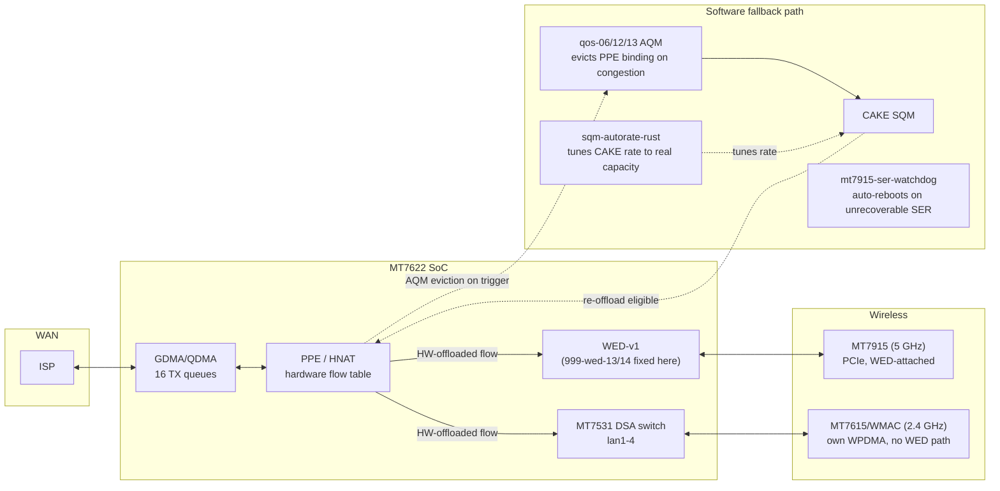

# Linksys E8450 (MT7622/NETSYSv1) hardware-validated patch set — docs index

This fork carries a from-source, hardware-tested set of kernel/driver patches
for the Linksys E8450 (MediaTek MT7622, NETSYSv1, WED-v1), built and
validated against a live, in-production router — not a lab bench. Every
finding below was reached by reading the actual driver source in this tree
and confirming behavior on real hardware; nothing here is copied from a
vendor changelog without independent verification.

## TL;DR

- **WED-v1 (Wi-Fi DMA offload) ring-desync bug**: found, root-caused, fixed
  (`999-wed-14`). A busy-path reset in `mtk_wed_reset_dma()` skipped the
  WED-side ring index reset, permanently desyncing `WED_WDMA_RXn` after an
  SER under load. Confirmed stuck ring before the fix, confirmed clean
  `QCNT=0` after, on the same hardware.
- **NETSYSv1 PSE port mapping bug**: found, fixed (`999-wed-13` corrected).
  The vendor's WDMA-during-SER gating patch used the NETSYSv2+ port formula
  unmodified; on MT7622 it silently poked the wrong register and never
  actually gated anything.
- **Controlled SER recovery: root-caused as unfixable from this host's
  driver source; auto-reboot watchdog deployed as mitigation.** A
  recovered prior investigation (see
  [`WED-breadcrumb-harness-design.md`](WED-breadcrumb-harness-design.md))
  already hardware-tested three independent ring/reset fixes together and
  hit the identical failure; this fork's own testing (post ring-desync fix)
  reproduced it again. Root cause: the MT7915 MCU firmware never replies to
  a specific command during full-reset recovery. Not a host-side bug.
  `mt7915-ser-watchdog` (procd service, self-enabling on every future
  flash) detects the driver's own terminal failure message and self-reboots,
  bounding a previously-indefinite outage to ~65 s — live-verified twice,
  including catching and fixing a BusyBox `grep -m1`-on-an-infinite-stream
  bug in the first implementation. See
  [`e8450-ppe-validation.md`](e8450-ppe-validation.md) for the full writeup.
- **AQM (bufferbloat control)**: NETSYSv1 has no hardware AQM (confirmed via
  exhaustive vendor-SDK source mining, both firmware generations). Built a
  software occupancy-driven AQM instead (`999-qos-06`), then hardened it
  twice: byte-accurate trigger threshold (`999-qos-12`, was a fixed
  1400-byte packet-count assumption) and flow-aware eviction (`999-qos-13`,
  targets the actual congesting flow via the PPE's own per-flow hardware
  byte accounting, instead of arbitrary walk order). Reduced p95 latency
  under saturating load from 196 ms to 22-34 ms. See
  [`netsys-qos-port-investigation.md`](netsys-qos-port-investigation.md).
- **Dual hardware scheduler / HW airtime fairness**: both investigated and
  confirmed **dead on this chip** — wired in the register map (inherited
  from the shared v2/v3 template) but with no enforcement circuit behind
  them on MT7622. Real negative results, not assumptions.
- **mt76 upstream pin bumped** two months forward; ten hand-backported local
  patches deleted because they landed upstream in the meantime, replaced by
  three newly-discovered, narrower compat fixes found by actually attempting
  the build. See [`e8450-ppe-validation.md`](e8450-ppe-validation.md).
- **Live bufferbloat review**: SQM's download rate was configured at 64
  Mbit, never once approached in dozens of real tests (0.3-8 Mbit/s
  observed) — a ceiling that's never the real bottleneck gives zero
  bufferbloat protection. High-resolution tracing also directly caught
  upload bufferbloat's real mechanism: a flow sitting in the QDMA hardware
  leaky-bucket queue (no depth control) for up to the AQM's `grace_ms`
  window before eviction. Fixed the calibration two ways: a measured static
  correction, then shipped `sqm-autorate-rust` (built via `rustup` instead
  of OpenWrt's multi-hour from-source LLVM+rustc bootstrap — no prebuilt
  release existed, so this was the actual shortcut) so the rate now tracks
  real capacity continuously instead of a static guess. See
  [`netsys-qos-port-investigation.md`](netsys-qos-port-investigation.md).

## Architecture

`WED` only ever attaches to the PCIe-connected `MT7915` (5 GHz). The
SoC-internal `MT7615`/WMAC (2.4 GHz) has its own independent WPDMA ring
block — confirmed by reading `mt7615/soc.c`/`dma.c` directly — with no
hardware interconnect to WED/PPE at all. 2.4 GHz clients still get PPE flow
offload and the software AQM; they just never get WED's zero-CPU DMA bypass,
and no patch can add that without new silicon.

## Documents

| Doc | Covers |
|---|---|
| [`e8450-ppe-validation.md`](e8450-ppe-validation.md) | PPE/WED hardware validation: the ring-desync fix, the PSE port-mapping fix, the controlled-SER investigation and its auto-reboot mitigation, the mt76 upstream pin bump. |
| [`netsys-qos-port-investigation.md`](netsys-qos-port-investigation.md) | The full QoS/AQM/HQoS investigation: what NETSYSv1's QDMA block can and cannot do in hardware, the `qos-01`..`qos-13` patch series, and the production HQoS+AQM profile. |
| [`e8450-upstream-backport-roadmap.md`](e8450-upstream-backport-roadmap.md) | Tracking sheet for which local patches are hand-backports of commits later merged upstream, and candidates for future pin bumps. |
| [`wed-v1-opportunities.md`](wed-v1-opportunities.md) | Survey of WED-v1-specific opportunities and their disposition. |
| [`WED-breadcrumb-harness-design.md`](WED-breadcrumb-harness-design.md) | Recovered from an earlier, since-abandoned investigation branch (preserved at git tag `archive/wed-ser-investigation-2026-07-12`); the closing writeup on the controlled-SER MCU-death investigation this fork's own testing later independently reproduced. |

## Repo-specific notes for anyone building this

- `configs/e8450-ubi.config` is the seed defconfig for this board.
- `files/usr/sbin/mt7915-ser-watchdog` + `files/etc/init.d/mt7915-ser-watchdog`
  auto-reboot on the MT7915 controlled-SER MCU-death failure (see
  `e8450-ppe-validation.md`'s controlled-SER section) — no fix exists at the
  driver level, so this bounds the outage instead. Self-enabling via
  `files/etc/rc.d/S99mt7915-ser-watchdog`.
- `files/usr/sbin/sqm-autorate-rust` is a hand-built binary sidecar, not an
  opkg-managed package — `CONFIG_PACKAGE_sqm-autorate-rust` is deliberately
  left unset since a normal `make` of it still hits the full from-source
  Rust bootstrap. See `netsys-qos-port-investigation.md` §31.4 for the
  actual (fast) build method if it ever needs rebuilding.
- `files/` is the `/etc` overlay baked into the image. `files/etc/shadow`
  and `files/etc/config/wireless`'s real key are intentionally excluded via
  `.gitignore` — set your own root password and Wi-Fi key before flashing.
- `flash.sh` reads router credentials from `$ROUTER_PASS` or a local,
  gitignored `.router-credentials` file (copy `.router-credentials.example`
  and fill it in) — never hardcode a real password in a tracked file.
- Local-only kernel patches carry a commit message explaining *why* they
  exist and, where applicable, an `Upstream commit:` line if they're a
  hand-backport of something already merged upstream (check that line
  before assuming a patch is still needed — see the roadmap doc).
