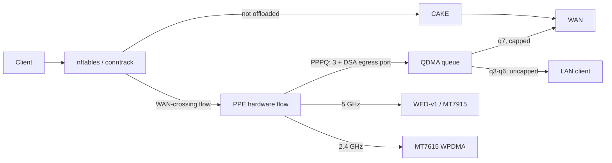

# E8450 Performance ROM handbook

This is the technical companion to the project
[`README`](../README.md). It explains what the ROM changes, how the packet
path works, what can be configured safely, and why some patches remain local.
It replaces the former collection of overlapping roadmaps, handoffs, design
documents, and dated test summaries.

> **Status: maintained handbook.** Update this file when shipped behavior or
> production defaults change. Historical test chronology belongs in
> [`research/`](research/).

## Contents

- [Feature guide](#feature-guide)
- [How traffic moves through the router](#how-traffic-moves-through-the-router)
- [Production settings](#production-settings)
- [Operations and troubleshooting](#operations-and-troubleshooting)
- [Wi-Fi and radio behavior](#wi-fi-and-radio-behavior)
- [Backports and upstreaming](#backports-and-upstreaming)
- [Patch map](#patch-map)
- [Known limits and open work](#known-limits-and-open-work)
- [Research and evidence](#research-and-evidence)
- [Building and changing the ROM](#building-and-changing-the-rom)

## Feature guide

### PPE: hardware flow offload

The **Packet Processing Engine (PPE)** remembers established flows and forwards
later packets without repeating the full Linux networking path. This lowers CPU
cost and leaves more headroom for Wi-Fi, encryption, and local services.

Hardware offload normally conflicts with software queue management: packets
which stay in the PPE may not visit CAKE. This ROM keeps the PPE enabled but
adds a controlled path back to software when its hardware upload queue becomes
congested.

Default:

```text
firewall flow_offloading=1
firewall flow_offloading_hw=1
```

For a controlled comparison, `scripts/e8450/ppe-offload-bypass.sh` marks new
flows for one IPv4 host with conntrack mark `0x99`. Patch `999-ppe-93` refuses
PPE binding for those flows, leaving them on the software/CAKE path. Existing
flows must be re-established because marking does not retroactively unbind
them.

### PPPQ: selecting a hardware queue

**PPPQ means per-port/per-queue QoS. It is unrelated to PPP, PPPoE, or modem
authentication.**

NETSYSv1 has 16 QDMA transmit queues. PPPQ stores a queue ID in an offloaded
PPE flow, so different classes can reach different hardware queues instead of
all offloaded traffic sharing one undifferentiated path.

The production profile uses the driver's **native PPPQ mode**
(`qos_toggle=2`): the queue is `3 + DSA egress port index`.

| Queue | Class | Selection |
|---:|---|---|
| 7 | Bulk WAN upload | Egress to `wan` (DSA port 4) |
| 3–6 | LAN egress | Egress to `lan1`–`lan4` (DSA ports 0–3), uncapped |
| 13 | WAN-egress TCP ACKs | `999-ppe-11` small-ACK boost (`queue + 6`) |
| 8 | Priority WAN upload | Learned DSCP `EF`, `AF41`, `CS4`, `CS5` via `qos_prio_map` |
| 4 | Software priority fallback | `meta mark 4` for non-offloaded priority packets |
| 0 | Wi-Fi (WED/WDMA) egress | Queue assignment is skipped for the WDMA path |

Wi-Fi WMM voice/video priorities are translated to DSCP before conntrack and
offload classification. Existing non-zero DSCP is preserved.

**Why not the conntrack-mark mode (`qos_toggle=1`).** That mode takes the
queue from `ct mark`, and a conntrack mark belongs to the *connection*, not a
direction. The driver has an asymmetric path for this (`ct_mark >> 16` for
upload) but it is gated on egress being GDM2, and this board's WAN is DSA port
4 behind gmac0 — so on the E8450 both FOE directions receive the same queue.
With `ct mark 7`, bulk download and every download's own ACK stream were
placed inside the 8.3 Mbit/s WAN *upload* bucket. Measured, wired client,
75 Mbit/s contracted downstream:

| Configuration | Download |
|---|---:|
| `qos_toggle=1`, scheduler-0 cap 9,500 kbit/s | 5.7 Mbit/s |
| `qos_toggle=2`, scheduler-0 cap 9,500 kbit/s | 7.7 Mbit/s |
| `qos_toggle=1`, no scheduler cap | 5.9 Mbit/s |
| `qos_toggle=2`, no scheduler cap | **76.6 Mbit/s** (8-stream: 82.7) |

The two caps were in series, so removing either alone left the other binding.
This is also the correction to a long-standing wrong conclusion: the
"0.3–10 Mbit/s" download figures throughout the research record were this
router capping itself, not the connection's capacity.

`999-qos-20` makes the priority-DSCP queue configurable so native PPPQ can
still reach the HQoS priority queue; without it, `999-qos-10` sends priority
traffic to a hardcoded queue 4, which under PPPQ is LAN port 1's own queue.

### HQoS: scheduling the selected queues

**Hierarchical QoS (HQoS)** is the hardware scheduler policy applied after PPPQ
has selected a queue.

The production profile uses weighted round robin on scheduler 0:

- queue 7: bulk WAN upload, weight 4, capped at 8.3 Mbit/s;
- queue 8: priority WAN upload, weight 12, no per-queue cap;
- scheduler ceiling: **none** (`scheduler_rate_kbps=0`).

The scheduler ceiling must stay off. All 16 queues report `scheduler=0`
(`MTK_QTX_SCH_TX_SEL` is never set), so a scheduler max-rate is an aggregate
cap over *every* QDMA egress path — every switch port, both directions,
offloaded and software-forwarded alike. The previous 9,500 kbit/s value was a
router-wide throughput ceiling; mainline leaves this register with
`MAX_RATE_EN` clear. Shape per queue instead.

The hierarchy matters. PPPQ answers **which queue?** HQoS answers **how should
those queues share the link?** Neither one detects persistent congestion or
replaces CAKE.

### AQM: why there is no hardware-side controller

**Active Queue Management (AQM)** prevents a full queue from turning into
hundreds of milliseconds of delay. MT7622/NETSYSv1 implements no usable
hardware AQM, even though the shared register layout exposes names which imply
otherwise — and, as of the v3 work, it is also established that **NETSYSv1
exposes no per-queue counter at all**.

Earlier releases shipped a software controller ("AQM v1/v2") that polled QDMA
queue 7's packet/byte/drop counters every 100 ms and evicted the largest
offloaded flows from the PPE so their traffic would fall back to CAKE. That
controller has been removed. Two independent findings retired it:

- **Its input did not exist.** MediaTek gates the QDMA `QTX_MIB_IF` debug mode
  to NETSYSv2-or-greater in every vendor generation and never assigns the
  register for the NETSYSv1 map. This ROM had invented `mib_if = 0x1abc` for
  MT7622 and was reading an unimplemented window: zero on ~95% of samples,
  small implausible values otherwise, including while that queue's own leaky
  bucket was provably the bottleneck. Because the controller computed
  `delta = current - previous` on those readings, any decrease produced an
  unsigned underflow that exceeded every threshold — so it fired on *falling*
  traffic, roughly 26 evictions per minute regardless of congestion.
- **It was measurably harmful.** A controlled A/B with four valid saturating
  upload reps per side, controller on versus off:

| Configuration | Sent rate | Retransmits | p50 | p95 | p99 | max |
|---|---:|---:|---:|---:|---:|---:|
| Controller on | 8.27 Mbit/s | **364** | 25.0 ms | 31.7 ms | 35.8 ms | 43.1 ms |
| Controller off | 8.26 Mbit/s | **1** | 25.2 ms | 31.6 ms | 36.7 ms | 44.4 ms |

Identical throughput and identical latency at every percentile, with two to
three orders of magnitude more TCP retransmits — the cost of tearing live
flows out of the hardware path for no benefit. The `hold_ms`, `grace_ms` and
`poll_ms` values tuned in earlier releases were all measured against this
broken trigger; their numbers remain in the research record but their
conclusions do not carry forward.

**CAKE is the AQM.** The hardware's only useful roles are a per-queue rate
meter and a CPU-saving fast path, and the production profile now uses it that
way: a rate cap on the WAN egress queue, per-port queues everywhere else, and
no software controller in the packet path.

Two invariants replace the controller:

- the hardware queue cap must never be *tighter* than CAKE's rate for the same
  direction. When it is, the standing queue moves from CAKE into a dumb
  leaky bucket: measured p95 79.6 ms versus CAKE's 34.3 ms;
- a queue's cap must apply to one direction only. See the PPPQ section.

### CAKE and adaptive rates

CAKE remains the actual software queue discipline:

```text
WAN upload:   cake on wan, 8.3 Mbit/s baseline
WAN download: cake on ifb4wan, 75 Mbit/s baseline
```

`sqm-autorate-rust` watches delay to external reflectors and changes those CAKE
rates when capacity changes. The pinned upstream Rust port omitted the
documented upper clamp in its rate controller; under light-delay samples it
could increase to six or seven times the configured baseline. The local
one-line fix applies both the minimum and maximum bounds.


That chart was measured with the old 10,000 kbit/s download baseline; it shows
the clamp working, not this connection's capacity.

The download baseline was 10,000 kbit/s until the v3 work. That number came
from repeated measurements which all topped out near 8 Mbit/s — measurements
this router was itself producing, by placing the download direction on the
capped WAN upload queue underneath a 9.5 Mbit/s router-wide scheduler ceiling.
With both removed, an 8-stream saturating download sustains 82.7 Mbit/s on a
75 Mbit/s contracted line, so the baseline now matches the contracted rate and
the autorate download floor is 20% rather than 60%.

Upload and download are not symmetric:

- the PPPQ/HQoS rate cap manages the hardware-offloaded **WAN-egress upload**
  path; CAKE manages everything the PPE does not bind;
- download shaping uses CAKE on `ifb4wan`, which only sees traffic the PPE did
  not offload — a hardware-forwarded packet never reaches the `wan` ingress
  hook. Offloaded download is therefore unshaped by design;
- a Wi-Fi-destined hardware-offloaded download takes the WED/WDMA path, where
  no queue is assigned at all (`ib2` QID 0, PSE_QOS clear — confirmed live).

### WED-v1: 5 GHz DMA offload

**Wi-Fi Ethernet Dispatch (WED)** connects the PPE and Ethernet DMA path to the
PCIe MT7915 5 GHz radio, reducing CPU-owned packet movement.

Two local fixes matter:

- `999-wed-13` corrects the PSE WDMA port calculation used during recovery.
  The vendor version used a newer-NETSYS formula and silently gated the wrong
  register on MT7622.
- `999-wed-14` resets the WED-side WDMA receive index on the busy reset path.
  Without it, the WED and WDMA ring indices could remain permanently
  desynchronized after recovery under load.

The integrated MT7615 2.4 GHz radio has its own WPDMA block. It can use PPE
flow offload, but it has no physical WED connection.

### Recovery watchdog

A separate MT7915 failure remains after the host-side ring fixes: firmware can
stop responding to a recovery command. The driver cannot reset a firmware core
which never acknowledges the command.

`files/usr/sbin/mt7915-ser-watchdog` and its procd service watch for the
driver's terminal failure message and reboot. This is intentionally documented
as a mitigation, not presented as a firmware fix.

### Smaller fixes and tuning

- Ethernet NAPI poll weight raised from 64 to 256 after a controlled A/B
  improved upload throughput without a latency regression.
- MT7622 Ethernet RX ring increased to 1,024 descriptors.
- A false MDIO timeout race and an MT7531 VLAN deletion FID bug are fixed.
- The PPE's MIB-cache typo, multicast metadata, queue bounds, flow aging,
  bridge-offload plumbing, and leak paths are corrected.
- Seeded xxh32 is used only at measured, suitable flowtable/nftables key sizes;
  blanket hash replacement was rejected.
- The 2.4 GHz WMAC interrupt is moved away from the core already carrying the
  Ethernet and 5 GHz packet load.
- mt76 skips transmit cleanup's lock and MMIO read when a queue is already
  empty.

The NAPI A/B used three repeated saturating-load runs per side:

| Configuration | Sent rate | Average latency | p95 | Loss |
|---|---:|---:|---:|---:|
| Weight 64 baseline | 3.29 Mbit/s | 34.5 ms | 48.0 ms | 0.35% |
| Weight 256 | 4.47 Mbit/s | 32.9 ms | 45.3 ms | 0.35% |


The baseline's p99/maximum contained one real-traffic outlier, so the claim is
limited to higher measured throughput with no p95 or loss regression—not a
general tail-latency improvement.

## How traffic moves through the router



For ordinary upload traffic, the short path is:

```text
LAN/Wi-Fi -> PPE -> PPPQ q7 (8.3 Mbit/s cap) -> WAN
```

Anything the PPE does not bind — new flows, ICMP, router-originated traffic,
unoffloadable protocols — takes the software path and is queued by CAKE:

```text
LAN/Wi-Fi -> Linux forwarding -> CAKE -> WAN
```

The consequence worth stating plainly: **an offloaded flow does not traverse
CAKE in either direction.** Egress CAKE on `wan` is bypassed for offloaded
upload, and ingress CAKE on `ifb4wan` never sees offloaded download at all,
because a hardware-forwarded packet is never presented to the `wan` ingress
hook. The hardware queue's rate cap is the only thing shaping offloaded
upload, and nothing shapes offloaded download. Measured cost of that at
66 Mbit/s of saturating download: average loaded latency 28.0 ms against a
~26 ms idle baseline, p95 49.0 ms, max 56.6 ms. If strict download AQM
matters more than the CPU saving, set `flow_offloading_hw=0` and let CAKE own
both directions.

Priority classes avoid the capped bulk queue but the policy does not
manufacture priority for arbitrary applications.

## Production settings

Source of truth:
[`package/qdma-shaper/files/qdma-shaper.config`](../package/qdma-shaper/files/qdma-shaper.config)

| Setting | Value | Meaning |
|---|---:|---|
| `qos_toggle` | 2 (native PPPQ) | Queue = 3 + DSA egress port |
| WAN hardware cap | 8,300 kbit/s | Queue-7 upload ceiling |
| Scheduler ceiling | none (0) | A scheduler cap throttles *all* QDMA egress |
| Bulk queue / weight | 7 / 4 | WAN egress |
| Priority queue / weight | 8 / 12 | Learned EF/AF41/CS4/CS5, via `qos_prio_map` |
| LAN egress queues | 3–6 | Per DSA port, uncapped |
| CAKE upload baseline | 8,300 kbit/s | `wan` SQM rate |
| CAKE download baseline | 75,000 kbit/s | `ifb4wan` SQM rate (contracted line rate) |
| Autorate minimum | 60% up / 20% down | Per-direction floor relative to baseline |

These are measured values for one asymmetric connection, not universal E8450
defaults. For another ISP, tune these files together:

- `package/qdma-shaper/files/qdma-shaper.config`
- `files/etc/config/sqm`
- `files/etc/config/sqm-autorate`

Keep the invariants:

- queue 7's bulk cap and CAKE's upload baseline describe the same physical
  bottleneck, and the hardware cap must never be the *tighter* of the two;
- `scheduler_rate_kbps` stays 0. Every queue reports scheduler 0, so a
  scheduler max-rate is a router-wide QDMA egress cap, not WAN headroom;
- a queue's cap applies to whichever direction egresses that port. Never route
  both directions of a flow onto the WAN queue — that is what `qos_toggle=1`
  does on this board, and it cost 13x the download throughput;
- download rate is independent of the QDMA WAN-egress cap.

After changing UCI state on a router:

```sh
service qdma-shaper reload
service sqm restart
service sqm-autorate-rust restart
qdma-shaper status wan
```

Persist the same values in the source overlay before the next firmware build,
or `sysupgrade`/configuration replacement can reintroduce drift.

## Operations and troubleshooting

### Quick health check

```sh
qdma-shaper status wan
tc -s qdisc show dev wan
tc -s qdisc show dev ifb4wan
logread -e qdma-shaper
logread -e mt7915-ser-watchdog
```

Expected `qdma-shaper status wan` properties:

- board resolves as `linksys,e8450-ubi`;
- WAN resolves to hardware queue 7 (`phys_port_name=p4`, so PPPQ gives
  `3 + 4`);
- `flow_offloading=1` and `flow_offloading_hw=1`;
- the effective rate is non-zero;
- `qos_toggle=2` and `qos_prio_map=7 8`.

To confirm the per-direction queue split is actually in effect, read the PPE's
bound entries and decode `ib2`'s low nibble (the QID) against `etype`
(`ntohs(BIT(dsa_port))`):

```sh
cat /sys/kernel/debug/ppe0/bind
```

`etype=1000` (DSA port 4, WAN egress) must pair with QID 7 for ordinary
traffic or QID 13 for boosted ACKs. An EF probe (`TOS=0xb8`) was observed on
QID 8, confirming the priority remap end to end. `etype=0400`-style LAN
egress must pair with its own `3 + port` queue — never 7. Entries bound before
a `qos_toggle` change keep their old queue until they age out.

The helper validates the board, DSA port, queue range, write readback, and
whether any unrelated queue changed. A failed apply rolls queue 7 back instead
of silently leaving a partial configuration.

### Hardware-offload comparison

From the build workstation:

```sh
scripts/e8450/ppe-offload-bypass.sh mark 192.168.1.100
# Reconnect the test application so it creates a new conntrack flow.
scripts/e8450/ppe-offload-bypass.sh status
scripts/e8450/ppe-offload-bypass.sh unmark
```

Replace the address with the test client. This helper has a fixed router target
of `root@192.168.1.1` and uses `ROUTER_PASS` or `.router-credentials`.

`[HW_OFFLOAD]` in `/proc/net/nf_conntrack` is not sufficient proof that a flow
is bound in the MediaTek PPE. Use the PPE debugfs entry table and byte counters
when proving the hardware path.

### Load-test harness

`scripts/e8450/saturating-load-harness.sh` records throughput, latency, and TCP
retransmits for repeated comparisons. Use more than one repetition and change
one variable at a time. Household traffic made single-run conclusions
misleading during earlier work.

### Recovery safety

- Never runtime-load/unload `mt7915e`.
- Never PCI unbind/rebind the MT7915.
- Clear stale pstore panic files before rebooting after a crash.
- A missing 5 GHz network after the watchdog signature is a firmware recovery
  problem, not evidence that lowering queue timers will help.

## Wi-Fi and radio behavior

### 5 GHz

- MT7915, PCIe, WED-v1 attached.
- Production deployment uses a non-DFS channel after a local RF survey.
- Background CAC cannot work: the board has no second 5 GHz PHY to perform it.
- 160 MHz (HE160) was investigated and rejected: no DFS-free 160 MHz block
  exists in the US 5 GHz table, and MT7915 has an unresolved real-world
  throughput collapse at 160 MHz even where it negotiates. See the
  [160 MHz record](research/160mhz-investigation.md).
- Rate control and several aggregation/power decisions are firmware-owned and
  cannot be meaningfully tuned from the host driver.

### 2.4 GHz

- Integrated MT7615/WMAC with its own WPDMA rings.
- PPE flow offload is available; WED is not.
- Optional VHT20/QAM-256 support is default-off. It was confirmed to negotiate
  VHT rates with a compatible client, but no general throughput gain is
  claimed.

### EEPROM calibration

`scripts/e8450/eeprom.sh` can view, check, apply, and revert the known
calibration layout. Factory images contain per-device regions. Only apply a
profile after checking the current unit; never assume another E8450 has
identical bytes.

Changing the regulatory domain or requested `txpower` is not equivalent to
changing the EEPROM ceiling. Both regulatory limits and calibrated limits
apply, and neither authorizes operation above the local legal maximum.

Measured signal changes are shown only for controlled comparisons. The
far-field 2.4 GHz result was inconclusive and is deliberately absent:


## Backports and upstreaming

### What “backport” means here

A backport takes a specific fix from a newer kernel, mt76 snapshot, mac80211
snapshot, or MediaTek vendor feed and adapts it to this ROM's older stable
baseline. It is not a wholesale upgrade and it is not proof that every nearby
vendor feature belongs on MT7622.

Every candidate is filtered by:

1. **Reachability:** does this board execute the changed code?
2. **Generation:** is it NETSYSv1/WED-v1 code, not a v2/v3 register lookalike?
3. **Minimality:** can the bug fix land without importing vendor-only
   frameworks or debug interfaces?
4. **Build proof:** does it apply and compile against the pinned source?
5. **Hardware proof:** is the intended path observable on the E8450?

This process rejected many apparently relevant patches for MT7986/MT7988,
WED-v2/v3 RRO, multiple PPEs, hardware airtime fairness, and unused PSE
thresholds.

### Three kinds of local patch

| Kind | Example | Maintenance rule |
|---|---|---|
| Upstream backport | later mt76/kernel correctness fix | Remove when the pinned source includes it |
| Vendor adaptation | WED recovery or PPE/DSA fix | Keep only the minimal mainline-compatible part |
| Fork-original | NETSYSv1 QDMA AQM and control plane | Keep evidence and split generic fixes from board policy |

An mt76 pin refresh already removed ten local patches after their upstream
commits became part of the pinned source. The 2.4 GHz QAM-256 path uses the
driver-opt-in form from an upstream-submitted series rather than a broad vendor
capability override. These are examples of the desired lifecycle: prefer the
maintained implementation, then delete the duplicate local patch.

### What has not been claimed

This repository does **not** claim that every local patch has been submitted or
accepted upstream. Several parts are intentionally poor upstream candidates in
their present form:

- debugfs experiment controls and register probes;
- deployment policy containing fixed queues, rates, and conntrack marks;
- a cross-subsystem AQM controller specialized to NETSYSv1's missing hardware;
- mitigation for a firmware failure which cannot be fixed in host code.

Before submission, a patch must be separated into:

1. a generic correctness fix with no local policy;
2. a device capability or driver mechanism;
3. optional OpenWrt packaging/UCI policy;
4. test-only diagnostics, which should normally stay out of production
   interfaces.

Small generic fixes—ring reset correctness, bounds checks, MDIO polling, DSA
state, and resource lifetime—are the most suitable upstream units. The HQoS
profile itself belongs in this ROM; upstream kernels should expose mechanisms,
not one household's rate plan.

### Tracking future upstream changes

When updating Linux, mt76, or mac80211:

1. search each local patch's subject and `Upstream commit:` header;
2. verify the new source contains the behavior, not only a similar title;
3. remove the local patch rather than carry an empty/conflicting compatibility
   layer;
4. rebuild the affected package and image;
5. repeat the hardware scenario which originally justified the patch.

Closed roadmaps and audit diaries are intentionally not retained as active
documentation. Git history preserves them; this handbook records their current
disposition.

## Patch map

The patch files remain the authoritative description of exact code changes.
This map is by responsibility rather than chronology.

| Area | Patch range | Purpose |
|---|---|---|
| QDMA diagnostics/control | `999-qos-01`–`05`, `09`, `17` | Register, rate, scheduler, fc_th, and PSE visibility |
| Queue classification | `999-qos-07`, `10`, `20` | skb mark, DSCP-to-queue, configurable PPPQ priority queue |
| PPE/HQoS | `999-ppe-04`, `10`–`17`, `36`, `89`–`94`, `999-zz-*` | PPPQ, flow metadata, bridge offload, hashing, bypass, safety, prefetch |
| WED recovery | `999-wed-13`, `14` | Correct PSE gating and reset ring indices |
| Ethernet/DSA | `999-eth-*`, `999-dsa-06` | NAPI, MDIO, RX ring, panic, and VLAN fixes |
| mt76/mac80211 | package patch directories | Compatibility, empty-queue cleanup, station handling, optional VHT2G |
| Other | `999-hwrng-*`, `999-xxhash-*` | RNG correctness and selective hashing |

`999-qos-06`, `08`, `11`–`16`, `18` and `19` are gone. They implemented the
software AQM controller and the per-queue MIB readout it polled; both were
removed once the readout was shown to target a register MT7622 does not
implement and the controller was measured to cost retransmits for no latency
benefit. `999-qos-05` was reduced to the `fc_th` control it also carried.

The UCI/userspace side is:

| Path | Role |
|---|---|
| `package/qdma-shaper/` | Board-safe QDMA rate, PPPQ, and HQoS service |
| `package/sqm-autorate-rust/` | Package metadata and reflector list |
| `files/etc/config/sqm*` | CAKE and autorate production configuration |
| `files/etc/nftables.d/30-queue-mark.nft` | WMM-to-DSCP translation and software-path priority marking |
| `files/etc/init.d/mt7915-ser-watchdog` | Firmware-failure mitigation |
| `scripts/e8450/` | EEPROM, load-test, and PPE comparison tools |

## Known limits and open work

### Closed hardware dead ends

Do not reopen these without new register-level evidence:

- no usable second QDMA scheduler on MT7622;
- **no per-queue QDMA counter at all** — the vendor gates the `QTX_MIB_IF`
  debug mode to NETSYSv2+ and never assigns the register for the NETSYSv1
  map. Per-flow accounting via the PPE (`has_accounting`) does work;
- no hardware airtime fairness;
- no enforcing `HRED2`/flow-control threshold path;
- no initialized PSE per-port threshold mechanism;
- no WED path for the integrated 2.4 GHz radio;
- no background DFS CAC with one 5 GHz PHY;
- no HE160 (MT7915 throughput regression, no DFS-free US channel).

The shared MediaTek headers expose some of these register names because newer
SoCs implement them. Register presence is not capability proof. Live readback
and differentiated-load tests showed them inert on this silicon.

### Current open work

- Wi-Fi-client download shaping. An offloaded download never reaches the `wan`
  ingress hook, so `ifb4wan`/CAKE cannot see it; live `ib2` evidence confirms
  WED/WDMA-destined flows are not even queue-assigned. Measured loaded latency
  at 66 Mbit/s of saturating download is acceptable (avg 28.0 ms against a
  ~26 ms idle baseline, p95 49.0 ms, max 56.6 ms), so this ships as a
  documented tradeoff rather than a defect. The lever, if a real workload
  shows it mattering, is `flow_offloading_hw=0`.
- Two-client fairness remains the one untested dimension of the queue policy.
  Every measurement in the record is single-client.
- Re-derive the WRR weights. `bulk_weight 4` / `priority_weight 12` were
  chosen when queue 7 carried both directions and a 9.5 Mbit/s scheduler
  ceiling made the weights binding. With no scheduler cap they only matter
  once the physical link saturates.
- Verify the priority path end to end. `qos_prio_map=7 8` is confirmed applied
  from `qdma_regs`/debugfs, but no EF-marked offloaded flow has been observed
  landing on queue 8 on hardware yet.
- A/B the vendor WED busy-poll timeout reduction before deciding whether to
  carry it.
- Validate power-save buffering and remaining physical recovery cases.
- Treat a Linux 6.18 move as a separate migration, not a pile of opportunistic
  patch changes.

### Research and evidence

Maintained behavior belongs in this handbook. Chronological experiments and
raw hardware findings live under `research/` and may contain superseded
hypotheses:

| Record | Purpose |
|---|---|
| [`e8450-aqm-v3-design.md`](e8450-aqm-v3-design.md) | The v3 investigation: what the shipped AQM controller was actually measuring, why it and the MIB readout were removed, and the queue policy that replaced them. |
| [`research/qos-aqm-lab-notes.md`](research/qos-aqm-lab-notes.md) | Detailed NETSYSv1 QoS/AQM chronology, failed hypotheses, register experiments, and measurements. Later numbered sections supersede some earlier ones. |
| [`research/eeprom-calibration.md`](research/eeprom-calibration.md) | Consolidated EEPROM field map, controlled RSSI measurements, channel survey, safety boundary, and rollback evidence. |
| `vendor-reference/` | Small vendor patch samples needed to explain specific ports; never applied directly as a patch queue. |

Raw calibration images and captures remain in `.recall/router-probes/`.

## Building and changing the ROM

### Reproducible starting point

```sh
./scripts/feeds update -a
./scripts/feeds install -a
cp configs/e8450-ubi.config .config
make defconfig
make -j"$(nproc)"
```

The seed config, local feeds, patch directories, and `files/` overlay together
define the image. A successful kernel package build alone is not a flashable
deliverable; build the final sysupgrade image.

### Change discipline

- Change one packet-path variable at a time.
- Keep configuration changes and the source overlay synchronized.
- Test default-off experiments as default-off.
- For a bug fix, reproduce the original failure path and verify it no longer
  occurs.
- For performance work, record throughput, latency distribution, loss/ECN,
  retransmits, CPU load, and the relevant PPE/QDMA counters.
- Do not infer hardware binding from Linux flowtable state alone.
- Delete experiment-only patches and controls after a negative result unless
  they are the minimal evidence needed to prevent the same dead end.

### Regenerating measurement graphs

The committed SVGs use no external charting dependency:

```sh
python3 scripts/docs/render-claim-graphs.py
python3 scripts/docs/render-claim-graphs.py --check
```

Chart data lives beside its renderer in that script. Change a value only when
the cited measurement record changes; keep sample sizes, excluded outliers,
different test sessions, and inconclusive results visible.

### Flashing hazards

`../flash.sh` targets `root@192.168.1.1` and retains configuration with
`sysupgrade -c`. Review the script and deployment overlay before use. The
repository's included firewall, addresses, rates, and radio choices are not a
generic release profile.

Two board-specific rules are non-negotiable:

1. no runtime `mt7915e` reload or PCI rebind;
2. no reboot after a panic until stale `/sys/fs/pstore/dmesg-*` files have been
   handled.
