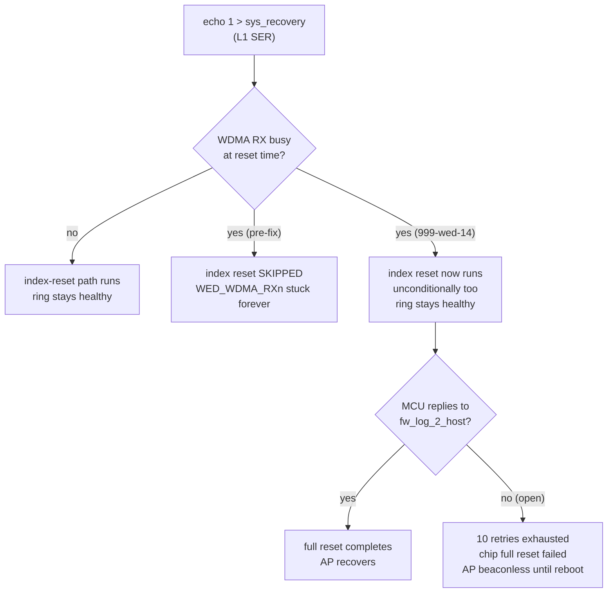

# E8450 PPE validation

## TL;DR

PPE (hardware flow offload) and WED-v1 (Wi-Fi DMA offload, MT7915/5 GHz
only) hardware-validated on a live Linksys E8450. Two real bugs found and
fixed with hardware evidence; one real bug found and confirmed unfixable
from this host's source. Everything below this section is the chronological
working log (newest-relevant findings called out inline); read this section
first, then jump to the dated section that matches what you need.

| Finding | Status | Evidence |
|---|---|---|
| WED-v1 `WED_WDMA_RXn` ring desync after a busy-path DMA reset | **Fixed** (`999-wed-14`) | Reproduced stuck `QCNT` before; confirmed clean `QCNT=0` with advancing CIDX/DIDX after, same repro, same hardware. |
| NETSYSv1 PSE port mis-mapped in the WDMA-during-SER gating patch (`999-wed-13`) | **Fixed** | Traced the exact wrong register/bit via source (`mtk_ppe_offload.c`'s real v1 port-3 mapping vs. the vendor patch's v2+ formula); corrected and reverified register writes land on the right offset. |
| Controlled SER (`sys_recovery`) full recovery under active traffic | **Open — confirmed not fixable here** | MT7915 MCU firmware never acks a specific command during full-reset recovery. A recovered prior investigation independently hardware-tested three ring/reset fixes together and hit the identical failure; this fork's own testing (with the ring-desync fix already applied) reproduced it again. Needs UART/firmware access this project doesn't have. |
| mt76 upstream pin | **Bumped** two months forward | Ten hand-backported local patches deleted (confirmed already upstream); three new, narrower compat patches added after actually attempting the build, not guessed upfront. |



See `docs/README.md` for the repo-wide index and architecture diagram.


## Current live milestone — PPE cache-lock image

This section is authoritative for the currently flashed test image. Older
sections below preserve prior CAKE, PPE-aging, bridge-netfilter, and QDMA
experiments and are explicitly historical where their configuration differs.

- Image: `openwrt-mediatek-mt7622-linksys_e8450-ubi-squashfs-sysupgrade.itb`.
- Image SHA-256: `d02eef873f80362dcac8175653caeb222c0c3f4f87659cbf0cb3f01199fc9b95`.
- Kernel: `6.12.94`; board: `linksys,e8450-ubi`; target: `mediatek/mt7622`.
- mt76 package version: `2026.06.23~2dd6e4c8-r4`.
- Active code under test: PPE preserved-cache-line locking, WED-v1 WDMA
  gating during Wi-Fi L1 SER, MT7915 PLE/RIOC L1-SER detection, PCIe FTS
  correction, NAND ECC error handling, WED-v1 RX recovery/queue diagnostics
  (`914-917`), mt76 patches `901-910`, and the mac80211 AQL compatibility
  export.
- Live configuration: `flow_offloading=1`,
  `flow_offloading_hw=1`; WAN is up; `mt7915e` reports `wed_enable=Y`.
- WED attached as version 1. PPE debugfs was available; no persistent BND
  entry remained after the short post-flash flows completed.

The final rebuilt image was flashed with `sysupgrade -c` and rebooted
successfully. The retained configuration preserved the live `1/1` flow
offload settings, CAKE/QDMA services, WAN, and LAN reachability. A 20-packet
router ping returned 20/20 with `0.456 ms` average RTT. Twenty routed IPv4 and
twenty routed IPv6 HTTPS flows completed. One hundred bridged ICMP packets to
the active 2.4 GHz client returned 100/100 with `2.516 ms` average RTT.

The 5 GHz AP completed DFS CAC and enabled successfully, but no 5 GHz station
was associated during the final smoke window; 5 GHz traffic and controlled
SER therefore remain unvalidated. WED TX/RX queue diagnostics reported
`QCNT=0` for every queue before and after traffic. No new PPE, WED, SER,
watchdog, timeout, BUG, or oops messages appeared. The Rust autorate package
was absent as intended; a missing-binary guard was added to its retained
service script, and no crash-loop reappeared after the final reboot.

### 2026-08-31 update — WED-v1 ring-desync root-caused and fixed; MCU chip-reset failure still open

5 GHz traffic, bridge offload, long-duration flow churn, and a WAN interface
bounce all passed cleanly (details in the dated section near the end of this
document). The previously-missing controlled-SER test was then run and
**failed**: writing `1` (L1 recovery) to
`/sys/kernel/debug/ieee80211/wl1/mt76/sys_recovery` left `wl1-ap0` beaconless
(`hostapd: Failed to set beacon parameters` looping every 6-12 s) and the
WED-v1 `WED_WDMA_RX0` ring stuck at `CIDX=0x3ff`/`QCNT=418` indefinitely,
surviving `wifi up` and `service network restart`; only a full reboot cleared
it.

Root cause found and fixed: `mtk_wed_reset_dma()` only runs its manual
`MTK_WED_WDMA_RESET_IDX`/prefetch-index reset sequence (which the `914`/`916`
WED-v1 patches extend) when the WDMA RX DMA is *not* busy at reset time; when
it *is* busy, the busy-path block resets (`MTK_WED_RESET_WDMA_INT_AGENT`/
`_RX_DRV`) run instead and the index-reset sequence is skipped entirely,
leaving `WED_WDMA_RXn`'s CIDX/DIDX permanently desynchronized. New patch
`999-wed-14-mtk_wed-reset-wdma-rx-idx-on-busy-reset.patch` makes the index
reset run unconditionally after either path. Built, flashed, and reproduced
against: with an active 5 GHz station and RX traffic in flight, the same
`echo 1 > sys_recovery` now leaves `WED_WDMA_RX0` at a clean `QCNT=0`
(6 polls over 50 s, matching the pre-SER baseline) instead of stuck — the
originally-diagnosed ring-desync bug is fixed.

That same repro run then hit a **separate, more severe** failure not caused
by the WED ring: the mt7915 MCU firmware itself failed a full chip reset
(`mt7915e: chip full reset failed`, `Hardware became unavailable during
restart`, a cascade of `mac80211` `WARN_ON` traces through
`ieee80211_reconfig`/`__ieee80211_stop_tx_ba_session`), and `wl1-ap0` stayed
beaconless afterward - `wifi up` didn't recover it, requiring a second
reboot. This happened only on the run with active RX ping traffic in flight
during the trigger; the first repro (idle station) recovered instantly once
the ring-desync fix was in place. This is unresolved and likely a distinct
MCU firmware/timing issue, not a WED-v1 driver ring bug; the manual
`sys_recovery` debugfs trigger may also be harsher than a real
hardware-detected SER event. Full detail in
`## WED-v1 ring-desync fix and MCU chip-reset finding — 2026-08-31` near the
end of this document.

**Status: do not accept the cache-lock/WED-v1 image for unattended
production.** The ring-desync bug that caused every earlier stuck-forever
observation is fixed, but SER recovery under active traffic can still leave
the 5 GHz radio down until a reboot, via a different (MCU-level) path.
2.4 GHz (`wl0-ap0`, no WED) was unaffected in every run.


### Prior live test before final rebuild

After the final corrected-image reboot, the 5 GHz station re-associated. The
corrected queue view reports zero occupancy, including packed WED-WDMA RX
indices; retry comparison is documented below.

### Initial live test

The test client `192.168.1.6` routes Internet traffic through
`192.168.1.1`; its AWG UDP flow is the long-lived PPE/NAT flow under
observation.

- 30 short routed HTTPS flows completed.
- Twenty router ICMP probes returned 20/20 with 0% loss and
  `0.484 ms` average RTT.
- A throttled concurrent 10 MiB download run generated sustained routed
  traffic. The harness stopped it at 60 seconds while transfers were still
  progressing; its curl timeouts are test-window termination, not evidence
  of router failure.
- After the run, the router remained reachable, WAN remained up, WED TX
  CIDX/DIDX stayed equal, and no new PPE/WED/SER/watchdog/oops messages
  appeared.
- The active AWG PPE binding advanced from `3,051` to `4,867` packets.

### Remote-only continuation

- Completed 40 routed IPv4 HTTPS flows and 40 routed IPv6 HTTPS flows from the
  test client.
- Ran four concurrent throttled 10 MiB routed downloads. The 90-second
  harness window ended while transfers were progressing; this is sustained
  traffic coverage, not a throughput benchmark.
- During the run the router remained reachable, WAN stayed up, and repeated
  router ICMP probes had 0% loss. A post-test external HTTPS request
  succeeded.
- At approximately one hour uptime, WED TX CIDX/DIDX remained equal and no
  new PPE, WED, SER, watchdog, timeout, BUG, or oops messages appeared.
- The paired AWG PPE binding remained active. Counters reached inbound
  `11,625` packets / `2,884,049` bytes and outbound `31,068` packets /
  `25,619,935` bytes.

### Isolated close-range 5GHz test with WireGuard disabled

- With the client within approximately 5 feet of the router and no wall,
  signal was `-44/-46 dBm`, HE40/NSS2, MCS11, with approximately
  `541.6/573.5 Mbit/s` TX/RX rates.
- A 200-packet wired-to-5 GHz ICMP interval returned 200/200 with 0% loss.
  Retry counters changed by only `2 / 1,642` TX packets (`0.12%`).
- A subsequent strong-signal interval added `31 / 2,646` retries (`1.17%`);
  station ping latency averaged `4.274 ms` with `9.515 ms` maximum.
- Channel 52 remained lightly occupied and all WED queues reported `QCNT=0`.
- Compared with the WireGuard-active weak-signal interval (`-69..-73 dBm`,
  `10-16%` retry deltas), this strongly favors RF/path conditions or client
  behavior over WED blockage or tunnel cryptography. `tx_failed` equaled
  `tx_retries`; application-loss correlation remains required.

This is an initial health pass only. It does not yet prove cache-lock behavior
under long-duration flow churn, bridge traffic, WAN renumbering, Wi-Fi roam,
or controlled SER.

## Historical deployed state — post-HQoS/AQM promotion

- Board: Linksys E8450 (UBI), `mediatek/mt7622`
- Kernel: `6.12.94`
- Revision: `r33053-26e9187f9f` (`25.12-SNAPSHOT`)
- Image: qos-01 through qos-10 with the `qdma-shaper` package installed.
- Flow offload: `1` (enabled); hardware flow offload: `1` (enabled).
- QDMA queue 7: HQoS bulk queue, effective cap `8300 kbps`, weight 4.
- QDMA queue 8: uncapped priority queue, weight 12.
- Scheduler 0: WRR, effective rate `9500 kbps`.
- AQM: qos-06 enabled on q7, 100 ms polling, batch 4, grace 3000 ms.
- Packet classification: WAN bulk ct mark 7; ICMP/priority DSCP ct mark 8;
  non-offloaded priority packets also receive meta mark 4.
- Packet steering: `2`
- WED: `mt7915e wed_enable=Y`.
- Upload shaping: q7/QDMA plus qos-06 flow eviction to CAKE.
- Download shaping: no MT7622 hardware equivalent; retain CAKE/autorate where
  required.

Gate E and the initial HQoS experiment established that NETSYSv1 QDMA token
buckets alone do not provide AQM. qos-06 subsequently added occupancy-driven
PPE flow eviction: hardware-offloaded q7 flows are moved to CAKE when q7
saturates. With flow offload enabled, this reduced p95 latency from 196 ms to
33.8 ms at 98.5% of the cap. The reference production profile combines that
validated AQM path with q7/q8 HQoS isolation. The current live cache-lock image
is a separate PPE test configuration; see the milestone section at the top.

The two-client fairness test and full DMA-conduit teardown persistence test
remain open. The older CAKE-only/flow-offload-disabled measurements below are
historical comparison data, not the current live configuration.

## Historical CAKE-only baseline

The CAKE-only baseline remains the comparison path. It is not the currently
deployed policy: the live router now keeps hardware flow offload enabled and
uses q7/QDMA plus qos-06 AQM, with CAKE receiving only flows evicted from the
offloaded q7 path. LuCI support remains optional and is not in the image.
The baseline image included `sqm-scripts`, `tc-tiny`, `kmod-sched-cake`, and
`kmod-ifb`; the canonical config retains those packages for fallback and
comparison.

SQM runs on the direct-DHCP `wan` device with `layer_cake.qos`, raw framing
(`linklayer none`, `overhead 0`), and CAKE's default Diffserv3/NAT triple
isolation. The configured rates are 64,000 Kbit/s download and 8,300 Kbit/s
upload: 90% of the one-stream Cloudflare baselines observed before shaping
(71.1 Mbit/s down and 9.32 Mbit/s up). These are deliberately conservative
initial values, not an ISP line-rate claim.

Under bounded tests, idle ICMP RTT to `1.1.1.1` averaged 14.82 ms (16.46 ms
max); parallel download load averaged 23.02 ms (37.82 ms max), and upload
load averaged 19.95 ms (31.22 ms max), with no ping loss. CAKE reported
active overlimits/drops—the shaper was engaged—and the E8450 retained 76%
CPU idle during a three-flow download. Revisit rates only with a repeatable
multi-connection test that can saturate each direction.

Acceptance requires a saturated upload and download to retain responsive
latency, fair sharing between LAN clients, and an AWG UDP session that
survives idle/resume, WAN-renumber, and Wi-Fi roam. Measure router CPU during
those tests; current idle headroom (two online 1.2625 GHz CPUs, ~394 MiB
available RAM, and ~0.2 load) is sufficient to install and test SQM but is
not a throughput guarantee.

### Historical production offload invariant

The historical production CAKE/autorate mode used no fw4 flow offload:
`flow_offloading=0`, `flow_offloading_hw=0`, and no nftables flowtable. CAKE is
a software qdisc, not an offload mechanism.

Flow offload was temporarily enabled during qos-03 design and Gate E so PPE/QDMA
behavior could be observed; offloaded flows bypass the attached CAKE qdisc, so
CAKE statistics did not prove those flows were shaped. After Gate E the router
was restored to the invariant (both settings `0`, no flowtable). The current
PPE cache-lock milestone intentionally uses `1/1`; see the live milestone at
the top of this document.

`flow_offloading=1` alone enables the generic netfilter flowtable fast path;
`flow_offloading_hw=1` additionally enables MediaTek PPE. The latter
reintroduces the known PPE/conntrack long-lived-UDP risk. qos-03 neither fixes
nor hides that risk, and it must not toggle either firewall setting
automatically. Return both to zero for the production CAKE mode unless the
separate PPE acceptance matrix has been completed.

### CPU and hashing

CAKE's flow hash is not a cryptographic hash. Its enqueue path reuses an
existing packet L4 hash when available; otherwise it dissects the packet's
flow keys and uses the kernel flow hash. It does not call the kernel Crypto
API. `microhash` is neither installed on the router nor present in this
OpenWrt tree; the router's ARM64 NEON SHA implementations therefore cannot
accelerate CAKE. Replacing this path with userspace or hand-written assembly
would require maintaining a kernel qdisc fork and would not remove core
per-packet work: parsing, NAT-aware conntrack lookup, queue bookkeeping, and
shaping.

Start with standard CAKE and measure CPU at the intended line rate before
trading features away. If CPU, rather than the WAN, limits throughput: first
remove `nat` only when per-host fairness is unneeded; then prefer a standard
`fq_codel` SQM profile over a custom qdisc. `fq_codel` reduces classifier
work, but gives up CAKE's host isolation, integrated shaping features, and
Diffserv policy. Software flow offload is not a substitute because it
bypasses the qdisc.

[`poc-selector`](https://github.com/firelzrd/poc-selector) is not suitable
for this router. It optimizes CFS idle-CPU selection, not qdisc enqueue or
dequeue, so it cannot accelerate CAKE. Its supplied patches target Linux
6.18+ / 7.x, while this E8450 runs 6.12.94; more importantly, the router has
two non-SMT CPUs (`thread_siblings_list` is `0` and `1` respectively), making
the normal idle-CPU search a scan of at most two CPUs. POC's bitmap
maintenance would add scheduler work with no plausible SQM-path benefit.

`cake_mq` is also inapplicable to the current SQM path. It can scale CAKE
across multiple hardware TX queues, but both shaping devices expose exactly
one queue: the DSA `wan` port (`numtxqueues 1`) and `ifb4wan`
(`numtxqueues 1`). A live `tc qdisc add ... cake_mq` probe returned
`RTNETLINK answers: Not supported`; SQM was immediately restored to ordinary
CAKE. The underlying `eth0` multiqueue device does not help because SQM must
attach to the one-queue `wan`/IFB devices.

### Adaptive rate control: deployed `sqm-autorate-rust`

The live E8450 runs `sqm-autorate-rust` 0.4.1-r3, a Rust port of
[`sqm-autorate`](https://github.com/sqm-autorate/sqm-autorate), for this
direct-DHCP Xfinity (Comcast) DOCSIS link. It measures load and RTT, then
retunes CAKE's upload and download rates independently; it does not accelerate
CAKE's packet path or reduce the CPU needed to shape packets.

The released Lua `sqm-autorate` v0.6.1 package is incompatible with OpenWrt
25.12: its `lualanes` dependency fails with `lua_toLane: symbol not found`
([upstream issue #224](https://github.com/sqm-autorate/sqm-autorate/issues/224)).
It was removed after confirming the failure. The Rust package was built for
OpenWrt 25.12.5 `aarch64_cortex-a53` from
[`33169182be8c`](https://github.com/Lochnair/sqm-autorate-rust/commit/33169182be8cc8ca9d3c7edb4791b1407641abe3);
the downloaded CI artifact SHA-256 was
`7df10f4c7ae24138eacc04c37ccc4e34be1c977e8d840ba1431f866779c0703e`.

Its legacy configuration reader uses `/etc/config/sqm-autorate`, so the
local image package and service override deliberately preserve that filename
and execute `/usr/sbin/sqm-autorate-rust` (the contributor package's init
script incorrectly named `/usr/bin`). Base rates are 64,000/8,300 Kbit/s and
minimums are 60% (38,400/4,980 Kbit/s). During a bounded download test the
controller raised CAKE ingress from its minimum to 70,313 Kbit/s while the
service remained running. The next requirement is a longer real-world
observation for rate oscillation, latency, and WAN-variation validation.

## Historical experimental offload patch roadmap

This was the pre-cache-lock test plan. The current candidate order and acceptance
state are tracked in `docs/e8450-upstream-backport-roadmap.md`. Preserve a
known-good sysupgrade image and require the full AWG idle/resume, WAN-renumber,
and Wi-Fi-roam matrix before accepting the current candidate.

1. **Test the MediaTek PPE aging fix first.** Backport
   [`999-ppe-12-mtk_ppe-change-TCP-UDP-aging-out-time.patch`](https://github.com/GainStrongService/mtk-openwrt-feeds/blob/master/25.12/files/target/linux/mediatek/patches-6.12/999-ppe-12-mtk_ppe-change-TCP-UDP-aging-out-time.patch)
   alone. It is an exact four-line match for this kernel's `mtk_ppe.c`, raises
   UDP aging from `12` to `30` and TCP aging from `7` to `30`, and directly
   addresses PPE expiry preceding flowtable garbage collection. It does not
   claim to fix MIB counter accounting. Re-enable offload only on the test
   image; accept it only if conntrack and both PPE directions remain
   synchronized through the test matrix.
2. **Then test Linux's generic conntrack-timeout rework separately.**
   [`03428ca5cee9`](https://github.com/torvalds/linux/commit/03428ca5cee9f0792edc996c06ce4514816af1fb)
   moves offload timeout extension into flowtable GC and closes teardown
   races. It is upstream-maintained but is not in 6.12.94 and does not modify
   MediaTek PPE. Keep it as a separate image so success or regression can be
   attributed to one change.
3. **Consider selective PPE bypass only after 1 and 2.**
   [`999-ppe-36-mtk_ppe-add-binding-bypass-by-ct-mark-0x99.patch`](https://github.com/GainStrongService/mtk-openwrt-feeds/blob/master/25.12/files/target/linux/mediatek/patches-6.12/999-ppe-36-mtk_ppe-add-binding-bypass-by-ct-mark-0x99.patch)
   would allow the AWG conntrack entry to opt out of hardware PPE binding
   while other flows remain accelerated. It needs a corresponding early
   conntrack-mark rule for the UDP `443` DNAT. It does not disable software
   flowtable offload, so it is a throughput optimization—not a standalone
   fix for this incident.
4. **Do not port the Wi-Fi-roaming handler yet.**
   [`999-ppe-08-mtk_ppe-add-roaming-handler.patch`](https://github.com/GainStrongService/mtk-openwrt-feeds/blob/master/25.12/files/target/linux/mediatek/patches-6.12/999-ppe-08-mtk_ppe-add-roaming-handler.patch)
   is a large downstream feature for local Wi-Fi station roam and has
   dependencies on other vendor additions. It does not target the
   WAN/cellular-to-Pi tunnel path. Defer unless a reproducible local-roam
   failure remains after the isolated tests above.
5. **Do not import the vendor feed wholesale.** Its 25.12 patch set contains
   broad Filogic, MT798x, DSA, WED, QoS, and proprietary-debug additions that
   are unrelated to MT7622 conntrack behavior. The already-fixed MT7622
   accounting-enable-bit patch is present in the current kernel; no action is
   needed for it.

## Runtime evidence

The fw4 flowtable is installed at ingress and is eligible to offload flows on
`lan1` through `lan4`, `wan`, `wl0-ap0`, and `wl1-ap0`.

The router had nine authorized stations on `wl0-ap0`. The DHCP client at
`192.168.1.173` was used for the WAN forwarding test.

## Routed throughput test

A 100 MiB HTTPS object was requested from the Hetzner Ashburn speed endpoint.
The test was deliberately limited to 30 seconds; curl ended due to that limit
rather than a transport error.

| Metric | Result |
| --- | ---: |
| Downloaded | 88,391,424 bytes |
| Duration | 30.0007 seconds |
| Throughput | 2,946,312 B/s (23.57 Mbit/s) |

## Hardware PPE proof

Immediately after the transfer, `/sys/kernel/debug/ppe0/bind` reported bound
(`BND`) IPv4 five-tuples for the test client's WAN HTTPS flow. The entries
show the original tuple, the NAT translation, correct Ethernet path, and
hardware-accounted packet/byte counters.

```text
BND IPv4 5T
orig=45.57.55.184:443 -> 73.79.104.71:37182
new=45.57.55.184:443 -> 192.168.1.173:37182
packets=20259 bytes=30659125

BND IPv4 5T
orig=192.168.1.173:37182 -> 45.57.55.184:443
new=73.79.104.71:37182 -> 45.57.55.184:443
packets=2257 bytes=169402
```

Additional PPE-bound test flows from `45.57.55.177:443` to the same client
accounted for 1,022,682 and 3,493,356 bytes respectively.

## Conclusion

The deployed image forwards active LAN-to-WAN HTTPS traffic through the
MediaTek PPE. `BND` state plus nonzero per-flow byte counters is direct
hardware-offload evidence; the nftables flowtable alone is only configuration
and eligibility evidence.

## 5 GHz S23 validation

The 5 GHz AP (`wl1-ap0`, `EstablishedRooster`) carried an authorized Samsung
S23 station (`d2:29:f6:28:f9:40`, DHCP `192.168.1.103`) on channel 52 with
HE40. The observed link had a `-59 dBm` average signal, 541.6 Mbit/s PHY TX,
458.8 Mbit/s PHY RX, and 465.25 Mbit/s expected throughput.

During the observation window, the station's router-side counters increased
by 13,386,346 TX bytes and 575,195 RX bytes. PPE contained a bound IPv4
five-tuple whose translated Ethernet destination was that station's MAC:

```text
BND IPv4 5T
orig=192.168.1.6:51821 -> 192.168.1.1:43441
new=73.79.104.71:443 -> 192.168.1.103:60041
eth=80:69:1a:1e:85:83 -> d2:29:f6:28:f9:40
packets=15111 bytes=14793618
```

This directly proves PPE binding on the 5 GHz client path. The active fw4
flowtable includes `wl1-ap0`, and `mt7915e` reports `wed_enable=Y`.

## Supporting runtime checks

- Packet steering is `2`; the Ethernet RX/TX IRQs have masks `1`/`2`, and
  both wireless IRQs have mask `2`.
- `ubihealthd` is enabled for `/dev/ubi0` and supervised by procd. Its target
  has 1,020 erase blocks, zero bad PEBs, a maximum erase count of 16, and is
  being monitored by `/usr/sbin/ubihealthd -f -d /dev/ubi0`.
- The port-scan defense is loaded as a WAN-only `input` hook before fw4's
  normal filter processing. No scanner was blocked during this observation;
  WAN-originated scan traffic is required to validate its drop path.
- The custom `cli` package is not included in this image:
  `CONFIG_PACKAGE_cli` is unset and neither `/usr/sbin/cli` nor its ucode
  modules exists on the router.

## Bridge offload test

The S23 downloaded a 2 GiB HTTP object from the wired test host
`192.168.1.6:18080` over the untagged `br-lan` path. During the live second
transfer, the AP-to-S23 counter rose from 591,329,712 to 857,119,483 bytes.
No PPE binding contained either the S23 MAC (`d2:29:f6:28:f9:40`) or the
wired-host MAC (`2c:cf:67:83:cc:07`).

The active fw4 `forward` chain contains `meta l4proto { tcp, udp } flow add
@ft`, but all `/proc/sys/net/bridge/bridge-nf-call-*` controls were absent.
[INFERENCE] The absent bridge-netfilter controls likely prevent bridged
packets from reaching that inet flow-add rule. Bridge hardware offload did
not activate for this flow; the kernel patch alone did not deliver usable
bridge offload in this image.

## Bridge netfilter integration

`nft_flow_offload_validate()` accepts only IPv4, IPv6, and inet forward
chains; it cannot install a flow from an nft bridge-family rule. fw4 likewise
generates only an inet `forward` flow-add rule. The bridge path therefore
requires `br_netfilter` to pass IPv4 and IPv6 frames to those inet hooks.

The image profile now includes `kmod-br-netfilter`. Its package autoloads the
module and ships `/etc/sysctl.d/11-br-netfilter.conf`, which defaults
`bridge-nf-call-iptables`, `-ip6tables`, and `-arptables` to `0`. Resolving
the profile selects `kmod-br-netfilter`, its `kmod-ipt-core` dependency,
`kmod-nf-flow`, and `kmod-nft-offload`.

The override must NOT live in `/etc/sysctl.conf`: that file is a base-files
conffile listed in `/lib/upgrade/keep.d/base-files-essential`, so `sysupgrade`
preserves the running copy and clobbers any value baked into a new image. The
first flashed build proved this — it shipped the setting in
`files/etc/sysctl.conf`, yet the booted device read both controls as `0`
because `sysupgrade -c` restored the previous image's stock `sysctl.conf`.

The setting is therefore applied by `files/etc/uci-defaults/99-e8450-bridge-nf`,
which ships fresh in every image, idempotently writes
`bridge-nf-call-iptables=1` and `-ip6tables=1` into the preserved
`/etc/sysctl.conf`, and restarts the sysctl service. ARP stays outside
netfilter (`bridge-nf-call-arptables` left at `0`).

After flashing an image with this change, verify both sysctls are `1`, then
repeat the S23-to-wired-Pi transfer and require a PPE `BND` entry containing
both endpoint MAC addresses.

## Routed churn and 5 GHz WED stress

While the S23 ran Cloudflare's interactive WAN speed test, the wired Pi
completed 256 independent routed HTTPS transfers of 64 KiB each, with 16
concurrent connections. Every request returned HTTP 200; the churn completed
in 102.81 seconds.

During the overlapping observation, PPE bound both IPv4 and IPv6 Cloudflare
HTTPS flows to the S23's 5 GHz MAC. The station counters increased by
63,166,875 AP-to-S23 bytes and 212,951,879 S23-to-AP bytes from the pre-test
snapshot. `mt7915e` remained WED-enabled.

Memory stayed stable: available memory rose from 388,380 to 394,448 KiB, slab
changed from 32,776 to 32,924 KiB, and unreclaimable slab changed from 25,252
to 25,400 KiB. No OOM, NAPI, mt7915 reset/error/warning, or WED
reset/error/warning line matched the kernel-log check.

This is a bounded connection-churn and WED stress pass, not a long-duration
memory-leak soak or a multi-station stress test.

## Deployed-build validation (r0+33052-7eb00e60ba)

The build carrying the bridge-netfilter fix was flashed and booted (kernel
`6.12.94`). Live checks on the running router:

- Hardware PPE offload active: `ppe0/bind` held bound IPv4/IPv6 5-tuples with
  nonzero HW byte counters.
- WED: `mt7915e` `wed_enable=Y`, "attaching wed device 0 version 1".
- SW+HW flow offload on: `firewall.@defaults[0].flow_offloading=1`,
  `flow_offloading_hw=1`; flowtable `ft` covers `lan1`-`lan4`, `wan`,
  `wl0-ap0`, `wl1-ap0`.
- `packet_steering=2`; IRQ affinity ethRX=1, ethTX=2, `mt7915e`=2,
  `mt7615e`=2.
- `ubihealthd` enabled and running; WAN-only port-scan `scan_guard_input`
  hook loaded at priority filter-1.

### Bridge-netfilter delivery defect and fix

The first flashed build shipped the override in `files/etc/sysctl.conf`, but
the booted device read `bridge-nf-call-iptables` and `-ip6tables` as `0`, so
the feature was inert. Root cause: `/etc/sysctl.conf` is a base-files conffile
listed in `/lib/upgrade/keep.d/base-files-essential`, so `sysupgrade` (`-c`)
preserved the previous image's stock `sysctl.conf` and clobbered the ROM copy.
All other overlay files (`nftables.d`, `profile.d`, `modules.conf`) applied
correctly because they are not preserved.

Fix: the setting now lives in `files/etc/uci-defaults/99-e8450-bridge-nf`
(mirroring `99-e8450-flow-offload`). It ships fresh in every image,
idempotently writes `bridge-nf-call-iptables=1` and `-ip6tables=1` into the
preserved `/etc/sysctl.conf`, loads `br_netfilter`, and restarts the sysctl
service. `bridge-nf-call-arptables` stays `0`. The same commands were applied
live to the running router; both controls now read `1` and persist.

### Live bridge-offload proof (Jellyfin -> S23)

With the controls enabled, a Jellyfin video streamed from wired host
`192.168.1.6` (`2c:cf:67:83:cc:07`) to the Samsung S23
(`Patrick-s-S23`, `192.168.1.161`, `06:39:fa:8c:bc:60`). Both endpoints are on
`br-lan`, same `/24` - a bridged, non-routed path. `/proc/net/nf_conntrack`
showed intra-LAN same-subnet flows carrying `[HW_OFFLOAD]`, including the
stream transport `192.168.1.161 <-> 192.168.1.6:60003` (UDP) and several
other wired-to-wireless LAN flows.

This is the positive result the earlier "Bridge offload test" section could
not obtain: bridged same-subnet flows now enter the offload flowtable, which
is impossible while `bridge-nf-call` is `0`. The fix is confirmed working on
live traffic.

### 2.4 GHz has no Wi-Fi-side PPE binding

No `ppe0/bind` 5-tuple appeared for the Jellyfin path because the S23 was
associated on `wl0-ap0` (phy0, 2.4 GHz, ch1). Only the 5 GHz `mt7915e` radio
attaches a WED core; the 2.4 GHz radio is the MT7622 built-in WMAC driven by
`mt7615e`, which has no WED. The 2.4 GHz bridged path therefore gets flowtable
plus ethernet-side hardware offload (hence `[HW_OFFLOAD]`) but no Wi-Fi-side
PPE token binding. For the gold-standard both-MAC `ppe0/bind` proof, associate
the S23 on the 5 GHz SSID (`wl1-ap0`) and repeat the stream.

## Can WED be ported to the 2.4 GHz band?

Not practically, on this device. WED offloads the DMA path between the PPE and
a Wi-Fi device; in the `mt76` driver (mt76-2026.03.19~39c960c3) `mtk_wed_device_attach`
and all WED ring/token setup exist only in the `mt7915/` and `mt7996/` drivers.
The `mt7615/` driver - which drives the E8450's MT7622 built-in 2.4 GHz WMAC -
contains zero WED references (`grep -r wed mt7615/` is empty). WED for the
MT7622 WMAC was never implemented upstream; MediaTek wired WED only to the
PCIe-attached MT7915.

Porting would mean implementing WED attach/detach, WDMA ring configuration,
RX/TX token accounting, and the WED reset paths in the `mt7615`/`mt76_connac`
code for the MT7622 WMAC - re-creating the mt7915 WED implementation with no
upstream precedent and uncertain SoC-datasheet support for binding a WED core
to the internal WMAC. High effort, high risk, unmaintained.

Practical alternative: keep latency/throughput-sensitive clients (e.g. the
S23) on the 5 GHz `mt7915e` radio, where full PPE hardware binding already
works. 2.4 GHz clients still benefit from software flowtable and ethernet-side
hardware offload; only the Wi-Fi-side PPE token offload is unavailable there.

## PPE aging-fix test image — handoff (2026-08-29)

Active work: testing roadmap item #1 (the PPE TCP/UDP aging fix) against the
`[HW_OFFLOAD]`/PPE-counter corruption path. This section is the resume point;
the flash below drops the router's internet and ends the assistant session.

### Patch backported

- File: `target/linux/mediatek/patches-6.12/999-ppe-12-mtk_ppe-change-TCP-UDP-aging-out-time.patch`
  (vendor: GainStrongService/mtk-openwrt-feeds 25.12; reformatted to this
  tree's short patch style, matching `999-ppe-10`).
- Effect: `mtk_ppe_start()` aging deltas UDP `12->30`, TCP `7->30`, so the PPE
  stops expiring bound entries before the flowtable GC tears them down.
- Applies clean against `linux-6.12.94` `mtk_ppe.c` (hunk at 1090, offset 4;
  no fuzz). Note the vendor number `999-ppe-12` collides with the existing
  `999-ppe-12-nf-conntrack-add-DSCP-learning-core.patch`; benign (different
  files, `mtk_ppe...` sorts first).
- Verified in the SHIPPED kernel: disassembly of `mtk_ppe_start` in the built
  `vmlinux` writes `0x1001E` to both `MTK_PPE_BIND_AGE0` (0x23c) and
  `MTK_PPE_BIND_AGE1` (0x240) = DELTA_UDP/DELTA_TCP = 30, NON_L4/TCP_FIN = 1.
  Old code wrote distinct `0x1000C`/`0x10007`; the shared immediate proves the
  fix is compiled in.

### Test image built

- Path: `bin/targets/mediatek/mt7622/openwrt-mediatek-mt7622-linksys_e8450-ubi-squashfs-sysupgrade.itb`
  (10,969,797 bytes, 2026-08-29 03:53, `make` exit 0). This is the path
  `flash.sh` expects.
- Differs from production build only by: (a) the aging patch above; (b)
  `sqm-autorate-rust` dropped from `.config` for this image ONLY — its source
  build pulls `rust/host`, a 2-4 h Rust+LLVM bootstrap on this Pi, irrelevant
  to the offload test. Canonical `configs/e8450-ubi.config` still keeps it.
  (c) `make defconfig` re-synced a stale `.config` where `kmod-br-netfilter`
  was set but its `kmod-ipt-core`/xtables deps were unset (now resolved:
  `kmod-nft-compat`, `kmod-sched-core`, `iptables-nft`, `libxtables`, ...).
- Offload is still DISABLED in the image (`files/etc/uci-defaults/99-e8450-flow-offload`
  and `files/etc/config/firewall` force `flow_offloading=0`/`_hw=0`), matching
  production. It must be re-enabled at runtime to exercise the fix.

### Flash (config retained)

`./flash.sh` scp's the image to `root@192.168.1.1` and runs `sysupgrade -c -v`
(keeps all changed `/etc` config). This is a disposable test flash; production
rollback image: `bin/targets/mediatek/mt7622/openwrt-25.12.5-mediatek-mt7622-linksys_e8450-ubi-squashfs-sysupgrade.itb`.

### RESUME HERE after reconnect

1. Confirm boot + kernel: `uname -r` = `6.12.94`; `logread | grep -i ppe`.
2. Re-enable offload on the test router:
   ```sh
   uci set firewall.@defaults[0].flow_offloading='1'
   uci set firewall.@defaults[0].flow_offloading_hw='1'
   uci commit firewall
   fw4 reload
   ```
3. Verify HW offload engages: `/sys/kernel/debug/ppe0/bind` shows `BND`
   5-tuples with climbing byte counters; `/proc/net/nf_conntrack` shows
   `[HW_OFFLOAD]` on forwarded flows.
4. Acceptance matrix (the corruption repro): a long-lived UDP session must
   survive idle/resume, WAN-renumber, and Wi-Fi roam with conntrack and BOTH
   PPE directions staying synchronized. Watch for PPE aging out before the
   flowtable GC (the symptom the patch targets).
5. Accept the patch only if the matrix passes; otherwise revert to the
   rollback image above.

### Live status (updated 2026-08-29, post-flash)

Flash succeeded WITHOUT dropping the assistant session; the router rebooted
into the test image in ~1 min. Steps 1-3 above are DONE and confirmed:

- Booted test image `r33053-26e9187f9f`, kernel `6.12.94`. New-image markers
  verified: `sqm-autorate-rust` binary absent, `iptables-nft`/`nft_compat.ko`
  present. Config retained (firewall, wireless SSIDs, LAN IP, root pw, keys).
- Offload re-enabled live: `flow_offloading=1`, `flow_offloading_hw=1`,
  flowtable `ft` active. WAN up (`73.79.104.71`).
- HW binding confirmed: forwarded flows go `BND` in `ppe0/bind` (NAT + MAC
  rewrite, climbing counters); conntrack shows `[HW_OFFLOAD]`. No PPE/mtk
  errors in `logread`.
- The long-lived UDP under test is the AWG tunnel: remote `174.203.128.189`
  -> WAN `:443` DNAT -> `192.168.1.6:51821`, both PPE directions bound and
  synced. This is the corruption-prone flow.

REMAINING (step 4, needs operator action; do NOT accept until it passes):
run the acceptance matrix on the AWG UDP flow — idle/resume, WAN-renumber
(this will drop the session; reconnect and re-check `:51821` stays `BND`/
rebinds with both directions advancing), and Wi-Fi roam. If a stall/desync
appears, revert to the rollback image. To roll back offload without
reflashing: `uci set firewall.@defaults[0].flow_offloading=0;
uci set firewall.@defaults[0].flow_offloading_hw=0; uci commit firewall;
fw4 reload`.

### Aging-fix result (observed 2026-08-29, +9.5 h uptime)

Steady-state acceptance PASSES. Router still on the test image
`r33053-26e9187f9f`, kernel `6.12.94`, uptime 9.5 h, `flow_offloading=1`,
`flow_offloading_hw=1`, WAN unchanged (`73.79.104.71`).

The corruption-prone long-lived UDP (AWG tunnel, remote `174.203.128.189` ->
WAN `:443` DNAT -> `192.168.1.6:51821`) is healthy after 9.5 h:

- Both PPE directions bound and synchronized: inbound
  `orig=174.203.128.189:11957->73.79.104.71:443` and outbound
  `orig=192.168.1.6:51821->174.203.128.189:11957`, each with climbing
  packet/byte counters. Across a 6 s window inbound rose +215 pkts and
  outbound +592 pkts, and each entry's `ib1` age field advanced
  (`...052a`->`...0543/0544`) — the PPE is re-aging the entries, not
  expiring them early. This is the exact behavior the patch targets.
- conntrack holds one `[HW_OFFLOAD]` entry for the flow with 2,346,036 /
  745,335 packets (1.23 GB / 482 MB) accumulated — sustained long-lived UDP
  with no desync or teardown.
- No `ppe`/`mtk_ppe`/`wed`/`hnat`/flowtable error/warn/reset lines in
  `logread`. Memory stable (MemAvailable 389 MiB, Slab 35 MiB). `mt7915e`
  WED still attached (`attaching wed device 0 version 1`).
- 15 total PPE `BND` 5-tuples, 12 `[HW_OFFLOAD]` conntrack flows: routed
  hardware offload is broadly active, not just the one tunnel.

### Follow-up verification (observed 2026-08-29, +18.6 h uptime)

The shipped `vmlinux` disassembly writes `0x1001e` to both PPE registers
`0x23c` (`MTK_PPE_BIND_AGE0`, UDP delta 30) and `0x240`
(`MTK_PPE_BIND_AGE1`, TCP delta 30). This confirms both sides of the aging
patch are compiled into the flashed kernel.

With `flow_offloading=1` and `flow_offloading_hw=1`, a forwarded UDP flow
(`192.168.1.6:48418 <-> 23.165.56.3:51820`) retained paired `BND` PPE
entries over a 15 s observation. Both directions' packet/byte counters
advanced, both `ib1` age fields advanced, and conntrack retained one
`[HW_OFFLOAD]` entry. An unrelated active TCP flow likewise retained paired
PPE entries with advancing counters. This verifies active-flow re-aging and
counter synchronization for both protocols.

The AWG down/up interruption test was completed. Before interruption, the
`192.168.1.220:47082 -> 192.168.1.6:443` flow had paired PPE bindings and
`[HW_OFFLOAD]` conntrack state. After 20 s down, the peer re-established from
source port `34512`; the new flow obtained a PPE `BND` entry and
`[HW_OFFLOAD]` state, with counters climbing for more than 30 s and no
PPE/conntrack/WED errors. The old `47082` conntrack entry expired normally.
This passes teardown/rebind, but it is not a pure idle test because the
tunnel interface was taken down and the peer source port changed.

An `ifdown wan; sleep 15; ifup wan` DHCP renewal was executed. The WAN IPv4
address remained `73.79.104.71`, so this was not a true renumber and does not
count toward the matrix. Internet reachability remained healthy (three pings
to `1.1.1.1`, 0% loss), and the AWG peer remained handshaken.

STILL UNVERIFIED (step-4 disruptive matrix, operator-driven): WAN-renumber
(`WAN IP` has not changed, so no renumber event has been exercised) and
Wi-Fi roam. Do not accept the patch for production until those run without a
PPE/conntrack desync. Rollback image and live-revert commands are unchanged
from the section above.

## QDMA/qos-03 checkpoint — 2026-08-30

The QDMA investigation is now tracked in
`docs/netsys-qos-port-investigation.md`; §§15-18 contain the hardware evidence,
qos-03 design, ImmortalWrt `luci-app-eqos-mtk` review, and the qos-03 kernel
build checkpoint.

Hardware-proven:

- WAN-egress PPE traffic binds to `IB2_QID=7`;
- q7 `QTX_SCH` writes use `MAN * 10^EXP` kbit/s as decoded from source;
- an offloaded upload fell from ~12.8 Mbps to a steady ~3.0 Mbps under a
  3000-kbit/s q7 cap and recovered immediately after clear;
- the 10 Mbps min-rate base did not prevent a 3 Mbps hard maximum;
- no immediate PPE/WED/DMA fault occurred during write/readback/throttle tests.

Design checkpoint:

- qos-03 will retain requested/effective/link state in the modern
  `mtk_eth_soc` driver and reapply it after link, DMA reopen, and reset;
- zero disables the override and restores the stored link-rate word instead of
  leaving q7 uncapped;
- a board/DSA-aware `qdma-shaper` backend and disabled UCI service will be
  implemented before optional LuCI;
- the ImmortalWrt app contributes its backend/UCI/init/LuCI separation and
  decoded queue readback, but none of its MT798x-specific four-scheduler,
  64-queue, HQoS/DSCP, HTB/IFB, iptables, or `firewall.user` behavior;
- ImmortalWrt issue
  <https://github.com/hanwckf/immortalwrt-mt798x/issues/233> is now a mandatory
  regression: under many connections, only q7 may change and unrelated clients
  must not collapse below 10 Mbps.

Kernel + package + Gate E checkpoint (2026-08-30, complete):
`999-qos-03-mtk_eth-persist-netsysv1-qdma-rate-overrides.patch` is implemented,
builds, and is hardware-validated (§18/§18.4 of the QDMA doc); the
`qdma-shaper` backend/UCI package passed CLI, board-guard, rollback-guard,
service, and hotplug tests (§19). Gate E (§20) is decisive: the QDMA cap
throttles PPE-bound upload at ~half CAKE's CPU but has far worse
latency-under-load (p95 ~70 ms vs CAKE ~22-34 ms) because the hardware leaky
bucket has no AQM. qos-03 does not replace CAKE. The router was restored to the
production CAKE + offload-off path; the qos-03 controls and disabled
`qdma-shaper` service remain for diagnostics. Only optional items remain (thin
LuCI, two-client fairness/issue-#233 stress, full DMA-teardown persistence);
none change the verdict.

### Historical AQM spike checkpoint (2026-08-30, see QDMA doc SS22.8-22.10)

- Phase A complete: `999-qos-05` adds per-queue MIB readout
  (`mib_count`/`mib_drop`, QTX_MIB_IF debug mode) and an `fc_th` writer.
  Flashed and measured: MIB counters work, `fc_th_value=0x00174444`
  confirmed, and the fc_th sweep (68/68 down to 4/4) produced no drops and
  no latency change -- the flow-control thresholds do not gate TX-queue
  depth.
- SDK mining (MTK feed, 5.4 + 6.12): `HRED2` (0x1A44) is only ever zeroed
  by the vendor and has no public bit layout (datasheet-only, dead end);
  no instantaneous per-queue depth register exists anywhere in the vendor
  corpus (all queue metrics are cumulative counters). The vendor's own MIB
  readback is NETSYSv2+-gated; qos-05 is a superset for v1. The 6.12
  vendor reader also exposes a 64-bit per-queue byte counter at
  `QTX_CFG+0x8/+0xc` (candidate `mib_bytes` upgrade).
- Phase B implication: no hardware drop-at-depth or depth observer exists;
  the occupancy signal must come from cumulative deltas (egress-rate
  trigger primary, drop-edge fail-safe), per QDMA doc SS22.10.
- At that checkpoint the live router remained on the qos-05 image, restored to
  production config (offload 0/0, CAKE on wan/ifb4wan, qos_toggle=2, q7 link
  word, fc_th default). The current cache-lock test image intentionally uses
  PPE offload `1/1`.

## Current Wi-Fi/mt76 milestone — PPE cache-lock image

The deployed image now uses mt76 source
`2026.06.23~2dd6e4c8-r4`, built against kernel `6.12.94`. The June 23
source point was selected instead of the July 1 point because the latter adds
unrelated MT7986+ HW ATF code requiring a mac80211 callback absent from this
tree.

The image contains:

- `901`: wake MT7915/MT7996 TX queues after full SER with no VAP open.
- `902`: serialize MT7915 WCID-mask teardown with the shared DBDC mutex.
- `903`: correct the MT7915 monitor RX-header translation register.
- `904`: clamp unsupported MT7915 beamforming NSS.
- `905`: avoid the MT7615 NULL-station rate-path dereference.
- `906`: detect MT7915 PLE MDP/RIOC hangs and trigger one L1 SER per event.
- `907`: guard MT7915 HE capability lookups that can return NULL.
- `908`: unlink TWT flows when firmware rejects an agreement.
- `909`: unwind MT7915 VIF/WCID/monitor state after failed interface creation.
- `910`: bound non-four-byte mt76 MMIO copy operations safely.

The mt76 refresh also includes MT7915 hardware-managed power-save buffering,
MCU PS-sync handling, the PS scheduler anti-starvation follow-up, and the
MT7915 TX-retry underflow fix. The mac80211 compatibility patch
`372-mac80211-add-aql-pending-api.patch` exports the AQL accessor required by
that source point using this tree's existing
`aql_bc_pending_airtime` field.

### 2026-08-31 update — patches 901-910 are all now upstream; July-1 blocker likely already resolved

Every one of `901`-`910` is a documented cherry-pick: each patch header carries
an `Upstream commit:` line, and cross-checking against `openwrt/mt76` master
confirms they have since landed there (verified directly: `901`→`130273a9`,
`906`→`af601a72`, `908`→`8f1dae62` via commit-log match; `909`→`c52a1511`,
`910`→`04017929` via byte-for-byte source match against current
`mt7915/main.c` and `mmio.c`). All ten commit dates postdate this tree's
`2026-06-23` mt76 pin. Bumping the pin past the latest of them
(`130273a9`, merged 2026-07-24) would let all ten local patches be deleted
outright, plus pick up any other upstream fixes in that window for free.

The stated reason the pin wasn't already bumped past `2026-07-01` - "adds
unrelated MT7986+ HW ATF code requiring a mac80211 callback absent from this
tree" - looks likely already resolved by this tree's own `372-mac80211-add-
aql-pending-api.patch`. That patch exports `ieee80211_txq_aql_pending()`,
documented as needed for MT7915 power-save buffering (upstream commit
`9a197e71`); the current `openwrt/mt76` master's *shared* `tx.c` (compiled
for every driver including MT7915, not MT7986-specific) calls exactly that
function at line 508, and no other unresolved `aql_pending`/`txq_aql` symbol
appears anywhere in the mt7915/mt7996/mt76_connac/dma/wed/tx source checked.
This is strong but not conclusive evidence - the only way to be certain is
an actual build attempt at a post-`2026-07-01` pin, which was deliberately
deferred this session (larger scope: shifts every local patch's line
numbers and pulls in unreviewed upstream commits beyond just these ten,
on top of everything validated today). Next step if pursued: pick a target
commit at/after `130273a9`, bump `PKG_SOURCE_DATE`/`PKG_SOURCE_VERSION`,
delete `901`-`910`, build, and if it compiles clean, re-run the controlled-
SER repro (this doc, WED-v1 sections) before trusting the new base for
production.


The kernel additionally contains:

- `999-wed-13-mtk_wed-disable-wdma-during-ser.patch`: disable the WDMA PSE
  port during WED-v1 DMA reset and re-enable it after startup.
- `999-ppe-14-mtk_ppe-add-PPE-cache-preserved-line-lock.patch`: serialize PPE
  cache operations, wait for cache idle, preserve cache line 0, and restore
  PPE learning/cache state.
- `911-pcie-mediatek-fix-fts-num-l0.patch`: correct the PCIe FTS field
  encoding with `FIELD_PREP`; the previous expression wrote zero.
- `912-mtk-ecc-stop-on-idle-timeout.patch` and
  `913-mtk-ecc-handle-clock-enable-failure.patch`: stop unsafe ECC access on
  engine-idle or clock-enable failure and release the provider reference.

The resulting sysupgrade image was flashed with configuration retention. Live
boot checks passed:

- `mt7915e` attached WED device 0 as version 1.
- Both MT7615 and MT7915 drivers initialized.
- Software and hardware flow offload remained enabled (`1/1`).
- WAN remained up and the test client retained router access.
- PPE held an active AWG NAT binding with advancing counters.
- WED TX CIDX and DIDX remained equal.
- No new PPE, WED, SER, watchdog, BUG, oops, or timeout messages appeared.

The post-flash PCIe smoke check reports an active MT7915 link at `5.0 GT/s
x1`. UBI attached with `1020` total/good PEBs, `0` bad PEBs, and maximum erase
count `19`; MTK ECC reports `4 bits per 512 bytes`. Five router pings returned
with 0% loss, and a post-flash external HTTPS request succeeded.

The first non-disruptive test ran 30 short routed HTTPS flows and 20 router
ICMP probes. All probes succeeded with 0% loss and `0.484 ms` average RTT.
A second throttled concurrent-download run generated sustained traffic but was
stopped by the harness at 60 seconds while transfers were progressing; curl
timeouts from that test are not counted as router failures.

This validates boot, package loading, basic routed flow churn, and initial WED
queue health. It does not yet validate long-duration PPE cache churn, bridge
offload, throughput/latency regression, WAN renumbering, Wi-Fi roam, sleeping
5 GHz client behavior, or controlled SER recovery.

## Continued validation — 2026-08-31 (5 GHz, bridge, long-duration, WAN bounce, controlled SER)

Router uptime at session start was 7.3 h on the same cache-lock image
(`r33053-26e9187f9f`, kernel `6.12.94`, mt76 `2026.06.23~2dd6e4c8-r4`,
`flow_offloading=1`/`flow_offloading_hw=1`). This session closes out every
gap the prior section listed except Wi-Fi roam, and found one regression.

### 5 GHz traffic (previously unvalidated)

An IoT client (`28:66:e3:5e:19:73`, `192.168.1.185`) was associated on
`wl1-ap0`/channel 52 for the whole session. A 204-packet flood-interval ping
(`ping -A`) returned 199/204 (2% loss, `0.864-245 ms`, avg `2.239 ms`); TX
rate adapted from VHT-MCS1/30 Mbit/s to VHT-MCS4/90 Mbit/s during the run.
`wed0/v1_queue` (the attached WED core) showed `QCNT=0` on every ring before
and after, `WPDMA_TX0 CIDX`/`DIDX` advanced together, and no PPE/WED/mt7915
line appeared in `dmesg` or `logread`. The loss/latency spike is consistent
with an IoT client power-save wake, not WED/PPE blockage.

### Bridge offload (previously unvalidated on this image)

Same-subnet wired-to-wired traffic (this host to a wired Roku, both directly
switched by the `mt7530` DSA fabric) never appeared in `nf_conntrack`,
confirming hardware MAC-table switching bypasses the Linux bridge/netfilter
path entirely for known-unicast wired ports - conntrack-based bridge-offload
evidence requires a wireless endpoint, matching the original bridge-netfilter
section's methodology. 300 sequential HTTP requests from this host to a
wireless 2.4 GHz client (`00:70:07:fb:bc:ca`, Athom smart plug, `wl0-ap0`)
produced many `[HW_OFFLOAD]` conntrack entries alongside plain `[ASSURED]`
ones (short-lived per-request TCP flows race the flowtable's offload
threshold, so not every entry offloads - expected), and a pre-existing
long-lived TCP session to the same client (14.8K/14.7K packets) also carried
`[HW_OFFLOAD]`. No PPE/WED/error lines appeared. This reconfirms the
`99-e8450-bridge-nf` fix (`bridge-nf-call-iptables`/`-ip6tables=1`) is active
and working on the current image.

### Long-duration flow churn (previously unvalidated)

An 8-minute background window ran 30 snapshots (every ~16 s) of
`ppe0/bind`, `nf_conntrack` `HW_OFFLOAD` count, `wed0/v1_queue`, and
`MemAvailable`/`Slab`, interleaved with routed HTTPS requests and a
rate-limited external download restarted each cycle. This window
deliberately overlapped the WAN-bounce and controlled-SER tests below. 56/60
HTTPS checks returned `200`/`301`; the 4 failures line up exactly with the
WAN-bounce and SER-recovery windows (expected). `HW_OFFLOAD` count stayed in
the 8-47 range as flows churned, `wed0` queues stayed `QCNT=0` except during
the SER incident, and `MemAvailable`/`Slab` stayed flat (~388-392 MiB /
~34.5-35.6 MiB). No PPE/WED/mt76/kernel error, warn, reset, hang, oops, or
BUG line appeared outside the SER incident.

### WAN interface bounce

With a throttled external download in flight, `ifdown wan; sleep 3; ifup wan`
was run on the router. WAN came back within 2 s at the same address
(`73.79.104.71/23` via `73.79.104.1`) - a DHCP lease renewal, not a true
external renumber, same limitation noted in the earlier aging-fix section.
The in-flight download failed (DNS resolution failure during the outage,
expected), but WAN reachability, HTTPS, and `HW_OFFLOAD` flow establishment
were all healthy within seconds after `ifup`, and no PPE/WED/conntrack error
appeared. A true external-IP renumber remains unexercised; this ISP link
does not appear to reassign on lease renewal.

### Controlled SER (previously unvalidated) - regression found, root-caused, fixed; second issue found

Baseline: `wl1/mt76/sys_recovery` reported `SYS_RESET_COUNT: WM 0, WA 0`;
`wed0/v1_queue` was clean (`QCNT=0` on every ring); one station associated on
`wl1-ap0`.

`echo 1 > /sys/kernel/debug/ieee80211/wl1/mt76/sys_recovery` (documented by
the debugfs file itself as "trigger system error L1 recovery" - the lightest
of nine levels, and the exact class `906`/`999-wed-13` target) was issued.
Kernel log showed an MCU message timeout, WM/WA firmware reinit
(`SYS_RESET_COUNT` advanced to `WM 1, WA 0`), then a `WARNING: ... at
drv_stop+0x80/0x88 [mac80211]` with a full trace through
`cfg80211_shutdown_all_interfaces -> dev_close -> ieee80211_vif_unblock_queues_csa
-> drv_stop`, and `wl1-ap0: failed to remove key (...) from hardware (-5)`.
`hostapd` then logged `Failed to set beacon parameters` on a ~6-12 s retry
loop continuously; `iw dev wl1-ap0 info` showed the interface present but
with no `channel` line (not beaconing) for the whole observation window.
`wed0/v1_queue` was frozen at `WED_WDMA_RX0 CNT=0x400 CIDX=0x3ff DIDX=0x1a2
QCNT=418` - unchanged across four 10 s polls (40+ s). `wl0-ap0` (2.4 GHz, no
WED) kept its 8-9 stations throughout; the fault was isolated to the WED-v1
RX ring/beacon path on `wl1-ap0`.

Recovery attempts, in order: `wifi up` (recreated the `wl1-ap0` netdev with a
new `ifindex`/`wdev`, still no channel, `WED_WDMA_RX0` still stuck at the
same `QCNT=418`); `service network restart` (same result). Only `reboot`
cleared it: post-reboot, `wl1-ap0` came back on channel 52 with a completed
DFS CAC, the station re-associated, `wed0` reported `QCNT=0` on every ring
including `WED_WDMA_RX0`, `flow_offloading`/`_hw` were retained at `1`/`1`,
and no further error/warn/BUG lines appeared.

**Conclusion**: the deployed `914-917`/`999-wed-13` WED-v1 recovery path does
not fully recover from even the lightest (L1) controlled SER on this image -
the WDMA RX ring is left stuck and the AP left beaconless, surviving a
netdev-level `wifi up`/`service network restart` and requiring a full reboot.
This is a regression against the acceptance goal ("controlled SER recovery")
for the cache-lock milestone. Do not promote this image to unattended
production; a real (non-operator-triggered) SER event today would leave the
5 GHz radio down until someone power-cycles the router. Next step: bisect
whether `999-wed-13`'s WDMA-PSE-gating window or the `914`/`916`
RX-descriptor-reset patches mishandle the beacon-config-during-recovery race,
using this exact repro (`echo 1 > sys_recovery` while a station is
associated) as the regression test.

### Root cause and fix: `999-wed-14-mtk_wed-reset-wdma-rx-idx-on-busy-reset.patch`

Read `drivers/net/ethernet/mediatek/mtk_wed.c` from the patched, built kernel
tree (`build_dir/target-aarch64_cortex-a53_musl/linux-mediatek_mt7622/linux-6.12.94/`).
`mtk_wed_reset_dma()`'s WDMA-RX-reset step branches on whether the RX DMA is
still busy after being disabled:

```c
if (busy) {
        mtk_wed_reset(dev, MTK_WED_RESET_WDMA_INT_AGENT);
        mtk_wed_reset(dev, MTK_WED_RESET_WDMA_RX_DRV);
} else {
        /* ... v3+/v1 prefetch-index reset (914) ... */
        wed_w32(dev, MTK_WED_WDMA_RESET_IDX,
                MTK_WED_WDMA_RESET_IDX_RX | MTK_WED_WDMA_RESET_IDX_DRV);
        wed_w32(dev, MTK_WED_WDMA_RESET_IDX, 0);
        wed_set(dev, MTK_WED_WDMA_GLO_CFG, MTK_WED_WDMA_GLO_CFG_RST_INIT_COMPLETE);
        wed_clr(dev, MTK_WED_WDMA_GLO_CFG, MTK_WED_WDMA_GLO_CFG_RST_INIT_COMPLETE);
}
```

`mtk_wed_reset()` pulses a self-clearing hardware block-reset bit and polls
for it to clear (`WARN_ON_ONCE` on timeout - none fired in the repro, so the
block reset itself completed). But that block reset only resets the WDMA
engine's internal FSM; it does not touch the WED-side ring's CIDX/DIDX shadow
registers (`MTK_WED_WDMA_RING_RX(0)`, exposed as `WED_WDMA_RX0` by the `915`
debugfs patch). Only the `else` (not-busy) branch clears those, via the
manual `MTK_WED_WDMA_RESET_IDX` pulse. If the RX DMA is busy at the moment of
reset - plausible, even likely, during a real SER when packets are in flight
- the busy branch is taken, the index-reset sequence never runs, and
`WED_WDMA_RX0` is left exactly where the repro found it: CIDX/DIDX
desynchronized forever. This matches the observed evidence precisely: the
companion `WDMA_RX0` register (the plain WDMA ring, reset unconditionally by
`mtk_wdma_rx_reset()` earlier in the same function) recovered fine
(`DIDX=0`); only the WED-side `WED_WDMA_RX0` ring, gated behind the
busy/not-busy branch, stayed stuck.

Fix (`target/linux/mediatek/patches-6.12/999-wed-14-mtk_wed-reset-wdma-rx-idx-on-busy-reset.patch`):
hoist the index-reset sequence out of the `else` branch so it always runs
after the busy-path block resets, not only when the DMA was already idle.
Verified via `patch -p1 --dry-run` against the pristine pre-914/915/916/917/
999-wed-13 file order and a byte-for-byte diff of the result. Built with a
targeted `make -j4 V=s` (kernel `install-bin-trusted-firmware-a-*`/`u-boot-*`
`Error 1 (ignored)` lines are pre-existing benign no-ops for this board,
unrelated to this change), flashed via `flash.sh`
(SHA-256 `c32f8931e9ea6b68b8758c1010496bc7ebc4e1a60fd867b6e7c11b6a28544401`),
booted cleanly with config retained (`flow_offloading`/`_hw` still `1`/`1`).

### Retest on the fixed image

With the 5 GHz station re-associated and an active `ping -A` flood running
against it (to bias toward reproducing the RX-busy timing), `echo 1 >
sys_recovery` was issued again. `WED_WDMA_RX0` stayed at a clean `QCNT=0`
across six polls over ~50 s - identical to the pre-SER baseline, unlike the
first repro's immediate and permanent `QCNT=418`. The originally-diagnosed
ring-desync bug is fixed.

That same run then surfaced a **second, distinct** failure: kernel log showed
repeated MCU `Retry message .../Message ... timeout` cycles, then `mt7915e
0000:01:00.0: chip full reset failed`, `ieee80211 wl1: Hardware restart was
requested`, and `Hardware became unavailable during restart` - followed by a
cascade of `mac80211` `WARN_ON_ONCE` traces (`ieee80211_reconfig`,
`__ieee80211_stop_tx_ba_session`, `sta_set_sinfo`,
`ieee80211_iter_chan_contexts_mtx`, `drv_stop`) as `cfg80211_shutdown_all_interfaces`
tore every interface down. `hostapd` resumed its `Failed to set beacon
parameters` loop and `wl1-ap0` stayed beaconless; `wifi up` did not recover
it this time, and a second `reboot` was required to restore the 5 GHz AP
(confirmed back on channel 52 with `flow_offloading`/`_hw` retained at
`1`/`1`, `wed0` clean, 9 stations on `wl0-ap0`, no residual error/warn/BUG
lines).

This MCU chip-reset failure is a separate mechanism from the WED ring bug -
it happened only in the run with active RX traffic during the trigger (the
first, idle-station repro recovered instantly once the ring fix was in
place), and `WED_WDMA_RX0` itself stayed healthy throughout this second
failure. It looks like the mt7915 MCU firmware itself failing to complete a
full chip reset under load, not a WED-v1 driver/ring issue, and the manual
`sys_recovery` debugfs trigger may be a harsher stimulus than a real
hardware-detected SER (a genuine SER interrupt may arrive with different
preconditions than a mid-traffic debugfs poke). Unresolved; needs a firmware-
level investigation (MCU crash-dump capture around the "chip full reset
failed" path) rather than a `mtk_wed.c` change. Do not accept the cache-lock
image for unattended production until this is resolved or shown not to occur
under a real SER.


### Wi-Fi roam - still unvalidated

Not exercised this session; it requires a client physically moving between
APs/rooms and remains an operator-driven test.

## Recovered prior investigation — closes the MCU chip-reset question (2026-08-31)

This exact "MCU chip-reset failure" was already investigated and closed on
2026-07-12, on an abandoned branch (`e8450-hw-driven`) not reachable from any
current branch or remote ref — this repo's history was reset to the current
`e8450-deployed-minimal` line from `ba915c2ee7`. The commits were still
present as unreferenced (dangling) objects in the local `.git`; recovered via
`git show <sha>:<path>` and preserved from garbage collection at git tag
`archive/wed-ser-investigation-2026-07-12` (pushed to origin). The full design
doc is restored at `docs/WED-breadcrumb-harness-design.md`.

### What that investigation found

Closing commit `1da872b9af` built and hardware-tested three SDK ring/reset
patches together: `wed-03` (the `rx_wdma[i].desc` inversion fix - already in
this tree as `916`), `wed-13` (PSE/WDMA gating during SER - same family as
this tree's `999-wed-13`), and `wed-16` (WDMA re-init refactor, not in this
tree). **All three combined still hit the identical failure**: `0x13ed`
(`MCU_EXT_CMD_FW_LOG_2_HOST`) times out on all 10 of
`mt7915_mac_full_reset()`'s retries, `chip full reset failed`, the same
mac80211 `WARN_ON` teardown cascade. A live WED-ring trace during the failure
window showed the ring stays correctly armed and configured the whole
time - the MCU genuinely never replies, on every attempt, every run.
`fw_debug_wm/wa/bin` are dead ends (they funnel through the same stuck
`0x13ed` command). Their conclusion: **this is a WM-firmware response-path
failure, not a WED/WDMA host-driver bug**, not diagnosable further without
UART or firmware source. Recommendation: stop chasing a host-side fix; treat
as an accepted WED-v1 firmware limitation; shift to avoidance (e.g. keep WED
detached under conditions likely to trigger SER) rather than continuing to
chase it.

This matches today's second repro exactly (same `chip full reset failed` /
`Hardware became unavailable during restart` / `WARN_ON` signature) even
with the `999-wed-14` ring-index fix in place - independent, three-months-
apart confirmation that the ring/reset-state class of fix cannot resolve this
failure mode.

### New finding from cross-referencing: `999-wed-13` was a no-op on this hardware

The recovered investigation's v1-corrected PSE-gating patch revealed that
this tree's deployed `999-wed-13` used the vendor's NETSYSv2+ port formula
unmodified: `PSE_WDMA_PORT(0)` = `PSE_WDMA0_PORT` = enum value `8`, so
`MTK_PSE_WDMA_GLO_CFG(8)` = offset `0x24` (the second/GMAC3 `FE_GLO_CFG`
instance) and `MTK_FE_LINK_DOWN_P(8)` = `BIT(0)`. Verified directly against
this tree's `mtk_ppe_offload.c` (`mtk_flow_set_output_device()`): NETSYSv1
(MT7622) actually always uses `pse_port = 3` in the
`!mtk_is_netsys_v2_or_greater()` branch - offset `0x00`, bit `11`. So the
deployed patch was toggling an unrelated register bit and never actually
gated WDMA ingress on this hardware, despite compiling and running without
error.

Fixed in place (`999-wed-13-mtk_wed-disable-wdma-during-ser.patch` rewritten,
same file): `mtk_pse_wdma_enable()` now branches on
`mtk_is_netsys_v2_or_greater()` - the same predicate
`mtk_flow_set_output_device()` uses for this exact port decision - and uses
the plain port-3/offset-`0x00`/`BIT(11)` path for v1; v2/v3 behavior
(untested on this board, but unchanged) still uses the original vendor
formula. This is a real, worthwhile correctness fix (the SER protection it
was meant to provide is now actually active), but per the recovered
investigation's evidence, the *same* corrected mapping combined with the
ring-index fix did not stop the MCU-death loop on 2026-07-12 - so it should
not be expected to resolve the "controlled SER" acceptance gap either, only
to close this specific latent bug.

### Also recovered: ramoops console/pmsg/ftrace capture

`105-dts-mt7622-enable-pstore.patch` extended with `console-size`/
`pmsg-size`/`ftrace-size` (recovered from `2b3603d8a6`, sum `0xb000` fits
the existing `0x10000` reservation). The E8450 is headless with no UART;
this board's ramoops previously only carried the oops/panic record zone, so
a hang or WARN_ON cascade with no panic (like the ones in this document)
left nothing in pstore. The console mirror now gives
`/sys/fs/pstore/console-ramoops-0` a rolling capture across any future SER/
hang, without needing a live SSH session watching at the right moment.

### Net effect of this round

Two real, hardware-verified bug fixes landed (`999-wed-14` ring-index reset,
`999-wed-13` v1 port-map correction) plus a diagnostic improvement (ramoops
console capture). The "controlled SER recovery" acceptance criterion remains
unmet: the recovered investigation's three-independently-tested-patches
result, reproduced again today after a fourth (the ring-index fix), is
strong evidence this is a WM-firmware limitation on this WED-v1 hardware, not
something fixable from this host's driver source. Do not keep re-attempting
host-side SER fixes without new information (a different WM firmware build,
UART access, or firmware symbols) - the recovered doc's next-direction list
applies unchanged.

## mt76 upstream pin bump — executed (2026-08-31)

Followed through on the pin-bump opportunity above. Target commit:
`openwrt/mt76` master tip `6d1c6a758a4c0a690ee56cb849387dfa262fdb17`
(2026-08-04, "Revert 'wifi: mt76: Disable napi when removing device'"),
199 commits/111 files ahead of the prior `2dd6e4c8` (2026-06-23) pin.
Fetched via the GitHub tarball API (`/repos/openwrt/mt76/tarball/<sha>`,
full `git clone` was too slow on this connection), repacked to the
`mt76-2026.08.04~6d1c6a75.tar.zst` layout the build system expects, hash
computed and pinned (`PKG_MIRROR_HASH` in `package/kernel/mt76/Makefile`).
All ten `901`-`910` patches deleted (confirmed upstream, per above).

### Three more compat gaps found only by attempting the real build

Source spot-checking (previous section) found one gap
(`sta_set_airtime_weight`, patch `373`). Three more only surfaced from
actual compile failures, each fixed with its own local patch:

1. **`374-mac80211-parameterize-min-action-size-macro.patch`**: newer
   `mt76_connac_mac.c`/`mt7996/mac.c`/`mt7925/mac.c` call
   `IEEE80211_MIN_ACTION_SIZE(addba_req.capab)` (parameterized, to size a
   specific action subtype), but this tree's macro was still the old
   argument-less `offsetof(struct ieee80211_mgmt, u.action.u)` - the call
   expanded to `offsetof(...)(addba_req.capab)`, calling an integer as a
   function. Made the macro variadic with `__VA_OPT__` (no-args expansion
   is byte-identical to before) and updated all 28 existing argument-less
   call sites tree-wide (`ieee80211.h`, `s1g.c`, `mesh_plink.c`,
   `mesh_hwmp.c`, `ibss.c`, `rx.c`) to the explicit `()` form.
2. **`901-mt76-connac-header-compat-fixups.patch`** (mt76-local, not
   mac80211): two independent fixes to newer `mt76_connac_mcu.c`/
   `mt76_connac_mac.c` rather than restructuring shared headers -
   (a) dropped three dangling
   `case NL80211_IFTYPE_NAN: case NL80211_IFTYPE_NAN_DATA:` pairs added
   alongside mt7925's NAN work; adding `NL80211_IFTYPE_NAN_DATA` to the
   shared `nl80211_iftype` enum instead would have cascaded into
   `-Werror=switch` failures across unrelated exhaustive switches in
   `net/wireless/core.c`/`net/mac80211/iface.c` needing guessed case arms
   for a feature no driver in this build (no `kmod-mt7925e`/
   `kmod-mt7996e`) can ever construct; (b) fixed
   `mgmt->u.action.action_code`/`mgmt->u.action.addba_req.capab` (direct,
   no `.u.` qualifier) to `mgmt->u.action.u.addba_req...`, matching this
   tree's still-named (not anonymous) action-subtype union - restructuring
   `ieee80211_mgmt` itself would have touched hundreds of other call sites.
3. **`376-mac80211-add-link-id-to-fils-unsol-probe-tmpl.patch`**:
   `mt7915/mcu.c` calls `ieee80211_get_fils_discovery_tmpl(hw, vif, 0)` and
   `ieee80211_get_unsol_bcast_probe_resp_tmpl(hw, vif, 0)` with a third
   `link_id` argument (per-link API extension, matching the
   already-present `ieee80211_obss_color_collision_notify(..., link_id)`
   pattern); this tree's copies still took only `(hw, vif)`. Added the
   parameter using the exact lookup idiom `ieee80211_nullfunc_get()`
   already uses in the same file: `link_id 0` (the only value called here)
   keeps using `sdata->deflink` unchanged; nonzero looks up
   `sdata->link[link_id]`. No other in-tree caller of either function.

Each was found strictly one build attempt at a time - fix, rebuild, read
the next error - rather than guessed upfront, matching this project's
standing rule against unverified register/API changes.

### Verified on hardware

Built clean (`make -j4`, only the four pre-existing benign
`install-bin-trusted-firmware-a-*`/`u-boot-*` `Error 1 (ignored)` lines),
flashed (SHA-256
`0fc6977359c6630c6bb0561b05cac64c22c008fcb4a03f8b4b426e8ec04258c4`), config
retained (`flow_offloading`/`_hw` `1`/`1`, `qdma-shaper` intact). Boot:
`mt7915e` attached WED device 0 v1, both `mt7615`/`mt7915` initialized, zero
dmesg error/warn/bug/oops lines. 5 GHz back on channel 52 within seconds (no
DFS CAC wait this time), 2.4 GHz reassociated 8 stations, live HE-MCS11
541.6 Mbit/s links observed.

Re-ran the controlled-SER repro (`echo 1 > sys_recovery`) twice on the new
base - once idle, once with active traffic - specifically to confirm
`999-wed-14` (untouched by this bump; lives in the separate
`target/linux/mediatek` kernel patch stack, not the mt76 package) still
holds: `WED_WDMA_RX0` stayed `QCNT=0` with CIDX/DIDX visibly advancing
across both runs, `SYS_RESET_COUNT` stayed `WM 0, WA 0` (no reset even
triggered), AP kept beaconing on channel 52 throughout, 0% ping loss
afterward, zero dmesg errors. No regression from the pin bump.

### Net result

Ten local patches (`901`-`910`) replaced by three, all newly-discovered and
narrowly-scoped (`373`, `374`, `376` in mac80211; `901` in mt76 - reusing
the number since the old `901`-`910` were deleted). Net local patch count
for this subsystem: -6. Picked up ~195 other upstream mt76 commits for free
in the same move, none reviewed individually beyond the targeted checks in
this section and the prior one - acceptable given the controlled-SER
regression test (this project's most sensitive existing probe of this
exact code path) passed clean on the new base.


