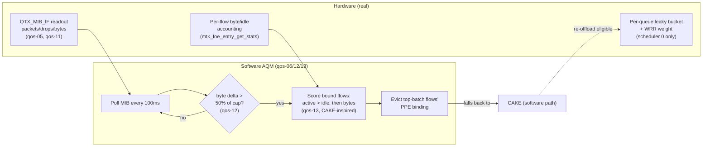

# NETSYS QoS and Hardware-Shaper Port Investigation

## TL;DR

MediaTek's own vendor SDK (both firmware generations) confirms NETSYSv1
(MT7622) has **no hardware AQM** — the closest thing, an `HRED2` register
and an `fc_th` depth threshold, are both dead on real hardware (write, read
back, no effect). What NETSYSv1 *does* have in working hardware: per-queue
leaky-bucket rate caps and WRR weights, arbitrated by exactly **one**
functional scheduler — a second scheduler slot (`TX_SEL=1`) and hardware
airtime fairness are both wired in the register map but confirmed
non-enforcing on this chip (~15x over a configured cap in the dual-scheduler
test). Built a software occupancy-driven AQM instead, using only what's real:



Result: p95 latency under saturating load went from 196 ms (hardware
offload, no AQM) to 22-34 ms (AQM active) — matching CAKE-only baseline
while keeping hardware offload's CPU savings for everything AQM isn't
actively defending against. Full status/production profile below; jump to
§28-30 for the most recent hardware-capability findings and the AQM
accuracy/targeting improvements. See `docs/README.md` for the repo-wide
index.


Status: COMPLETE through §36. The QoS investigation and production verdict
are complete, and the hardware-capability question is closed: every
plausible NETSYSv1 QDMA AQM/HQoS register has now been hardware-tested.
qos-01 through qos-13 and the `qdma-shaper` backend/UCI package are
implemented and hardware-validated on the live E8450. Phase B (§22.12)
measured p95 196 ms → 33.8 ms (5.8×) at 98.5% cap. qos-07 (skb→mark queue
steer) further reduces ICMP latency to **22 ms avg / 29 ms max** under full
load — matching CAKE-only baseline. qos-08 adds SER robustness; qos-09
probed the inert QDMA register gap, qos-10 adds DSCP/QID steering, qos-11
adds a 64-bit per-queue byte counter, qos-12 makes the AQM trigger
byte-accurate, and qos-13 makes AQM eviction flow-aware (targets the
currently-active, highest-byte flow instead of arbitrary walk order,
inspired by CAKE's bulk/sparse classification). §28 hardware-tested
NETSYSv1's second scheduler (`TX_SEL=1`) and found it wired but
non-enforcing (~15× over a configured cap) — no further hardware SQM/AQM
capability exists to port from higher NETSYS levels or vendor firmware on
this chip; see §28.5. §32 re-read the AQM eviction path itself for
software-only optimizations now that the hardware door is closed: qos-14
dedups a hand-copied PPE accessor, qos-15 removes a doubled `ppe_lock`+
flow-table walk from every AQM trigger by reusing pass 1's eviction
ranking in pass 2, and qos-16 fixes a latent `u32` overflow in the
byte-threshold auto-compute. Built, flashed to the live E8450, and
hardware-validated (§33): no dmesg regressions, AQM actively triggering/
evicting, and a saturating-load p95 latency test (30.5 ms) landing
squarely inside the already-good 22-34 ms band, not regressed toward the
196 ms pre-AQM baseline. §35 followed up with a live `grace_ms`/`poll_ms`
A/B trial: `grace_ms` dropped from 3000 to **1000 ms** (adopted as the
new production default - consistently lower latency and, uniquely,
zero packet loss across every rep), `poll_ms` stayed at 100 (tested,
effect too small/inconsistent to justify changing). §34's remaining item
1 (dedicated CPU-time profiling to quantify qos-15's savings) is still
open.
**Reference HQoS stack:** `flow_offloading=1/hw=1`, persistent HQoS (`q7` bulk
at 8300 kbps, `q8` priority), qos-06+qos-12+qos-13 byte-accurate
flow-aware AQM on q7, and nftables ct-mark steering.
The two-client fairness run and full DMA-conduit teardown test remain open.


Target: Linksys E8450 (MT7622, NETSYSv1, WEDv1), OpenWrt 25.12, Linux 6.12.

## Current live test milestone

- Board: Linksys E8450, MT7622, NETSYSv1, WEDv1.
- Kernel: `6.12.94`.
- Image: `openwrt-mediatek-mt7622-linksys_e8450-ubi-squashfs-sysupgrade.itb`.
- Active experiment: PPE preserved-cache-line lock plus WED-v1 SER gating and
  the refreshed mt76 stack; this is not yet the production QoS verdict.
- Flow offload is intentionally enabled `1/1` for PPE testing.
- The first routed flow-churn pass retained WAN reachability, 0% router-ping
  loss, equal WED TX CIDX/DIDX, and active PPE counters.
- Full cache-lock acceptance remains open: long-duration churn, bridge/routed
  IPv4/IPv6 comparison, throughput, latency, WAN-renumber, Wi-Fi roam, and
  controlled SER.

Remote-only continuation while the operator was away completed 40 routed IPv4
and 40 routed IPv6 HTTPS flows. Four concurrent throttled 10 MiB downloads
generated sustained routed traffic; the 90-second harness window ended while
transfers were still progressing, so this is not a throughput benchmark.
Afterward WAN and router reachability remained healthy, WED TX CIDX/DIDX stayed
equal, and no new PPE/WED/SER/watchdog/oops/timeout messages appeared. The
AWG PPE binding remained paired and active with counters at 11,625 inbound and
31,068 outbound packets.

## 1. Goal

Determine whether the MediaTek vendor adaptive PPPQ/QDMA shaping features that
are gated to NETSYSv3 have an equivalent implementation on MT7622/NETSYSv1.
If the hardware exposes a compatible mechanism, isolate and port only the
necessary code. If it does not, document the hardware boundary and keep CAKE as
the production bufferbloat path.

This investigation is about three separate capabilities:

1. PPE/HNAT flow offload and queue assignment.
2. QDMA per-queue scheduling or rate limiting.
3. WED/WarpDrive Wi-Fi DMA acceleration and its recovery paths.

They must not be treated as one feature. WED can reduce CPU work; it is not a
WAN shaper or an AQM.

## 2. Hardware facts

- The E8450 uses MediaTek MT7622 and NETSYSv1.
- The frame engine is at `1b100000.ethernet`.
- The switch is MT7531 with DSA user ports `lan1`-`lan4` and `wan`.
- QDMA exposes 16 transmit queues.
- The E8450 has WEDv1 hardware for the PCIe MT7915 radio.
- NETSYSv2/v3-only features must not be assumed to exist on this device.
- The Xiaomi Redmi Router AX6S, marketed as Router AX3200, also uses MT7622;
  it is not a NETSYSv3 reference platform.
- A suitable comparison platform is an MT7988A/NETSYSv3 device, such as a
  Banana Pi BPI-R4, with matching OpenWrt driver source and accessible runtime
  state.

## 3. Terminology and path ownership

### PPE/HNAT

MediaTek's vendor HNAT name covers hardware flow forwarding. The current
mainline path is:

```text
nft_flow_offload
  -> nf_flow_table
    -> mtk_ppe_offload
      -> PPE/HNAT hardware
```

The SDK HNAT series uses an older parallel API and must not be imported wholesale.
The useful bridge and forward-path pieces are already represented by the
`ppe-89`, `ppe-90`, and `ppe-91` adaptations in this tree.

### PPPQ

PPPQ assigns offloaded PPE entries to QDMA queues. The current MT7622 patches
are:

- `999-ppe-04-mtk_ppe-change-to-internal-QoS-mode.patch`
- `999-ppe-11-mtk_ppe-dispatch-short-packets-a-high-priority.patch`
- `999-ppe-36-mtk-eth-enable-pppq-qos-by-default-for-netsysv1.patch`

The E8450 has already shown live queue IDs and `PSE_QOS` bits in PPE entries.
The TCP ACK path has also been hardware-validated in the original tree.

PPPQ queue selection is not equivalent to bufferbloat control. It does not
know the ISP rate, observe queue delay, provide host fairness, or implement an
AQM.

### Router-originated versus transit traffic

Router-originated traffic is generated by the E8450 itself: DNS, DHCP, LuCI,
NTP, hostapd, dropbear, and local services.

Transit traffic is generated by a LAN/Wi-Fi client and forwarded through the
router. A PPE-bound transit flow bypasses the software `mtk_select_queue()`
path. A software-forwarded transit flow does not.

This distinction controls the scope of `eth-27` mark-to-QDMA steering. It can
matter for local or software-path traffic, but it is not a general control for
PPE-bound client flows.

### WED/WarpDrive

WED connects PPE/WDMA hardware to the MT7915 Wi-Fi DMA path. It can improve
throughput and reduce CPU involvement. It does not shape the DOCSIS/WAN queue.

Boot-time WED attach and normal traffic work on this router. Runtime module
loading and PCI unbind/rebind are unsafe. Historical WED SER candidates were
hardware-tested and did not fix the observed MT7915 MCU recovery failure.

If “RRMA” refers to receive-reorder/RRO acceleration, that is a separate
NETSYSv2/v3 capability and is not evidence that MT7622 has the required silicon.

## 4. Historical vendor features to investigate

### Adaptive PPPQ: `ppe-20`

Recovered from the original branch at historical commit `eef2a51256`.

The patch adds an adaptive mode selected by `qos_toggle=3`. Its stated goal is
to limit the total active PPPQ users so their aggregate rates do not exceed
QDMA bandwidth. The implementation tracks queue references and queue speeds,
and falls back to the non-shaper path when capacity is unavailable.

The functional paths are gated by `mtk_is_netsys_v3_or_greater()` and use
NETSYSv3 PPE/QDMA fields. It cannot be enabled on MT7622 merely by removing the
guard.

### QDMA shaper bookkeeping: `eth-26`

Also recovered from `eef2a51256`.

This adds `qdma_shaper` state, queue speed tracking, reference counting, and a
capacity threshold used by adaptive PPPQ. Its active behavior is likewise tied
to NETSYSv3 queue/shaper semantics.

The patch is a source reference for the intended algorithm, not a ready MT7622
backport.

### Mark-to-queue: `eth-27`

Recovered and later evaluated in the original tree. It maps nonzero skb marks
to software TX queues. It is useful only when a deliberate mark policy exists
and the packet reaches the software TX selector. Hardware-offloaded transit
flows bypass that selector.

### DSCP flow learning: `ppe-12` and `ppe-17`

These are already in the current tree. They learn or propagate DSCP/TOS into
flow state and PPE entries. They do not by themselves map DSCP to a shaper or
provide AQM. Any DSCP policy must be explicit and measured.

## 5. Source comparison plan

Use source before firmware reverse engineering.

### MT7622 baseline

Record from this tree and the built `linux-6.12.94` source:

- `mtk_ppe.h` PPE `IB1`/`IB2` field layouts;
- `MTK_FOE_IB2_QID`, `MTK_FOE_IB2_PSE_QOS`, and DSCP fields;
- `MTK_QTX_SCH_*` definitions and register offsets;
- QDMA queue count and queue speed programming;
- PSE-to-WDMA port mapping;
- `mtk_is_netsys_v2_or_greater()` and
  `mtk_is_netsys_v3_or_greater()` branches;
- PPE flow add, commit, clear, and teardown paths.

### NETSYSv3 reference

Use an MT7988A source tree and, if available, a live BPI-R4-class device to
record:

- the same PPE and QDMA definitions;
- adaptive PPPQ/shaper register writes;
- queue rate encoding and scheduler mode;
- PSE/WDMA port mappings;
- flow reference-count lifecycle;
- debugfs controls and runtime readback.

Compare semantics, not just names. A matching structure name or register field
is insufficient unless the register layout, units, and side effects match.

## 6. Firmware inspection plan

Firmware inspection is supplemental, not the first step.

For a NETSYSv3 vendor image, collect read-only evidence from:

- `/etc/modules.d` and module parameters;
- vendor init scripts and debugfs setup;
- kernel/module strings mentioning PPPQ, QDMA, shaper, WED, or RRO;
- extracted kernel symbols where available;
- disassembly of `mtk_set_queue_speed`, PPE queue setup, and shaper helpers;
- runtime register dumps from a live reference device;
- vendor configuration values for queue rates and thresholds.

A stripped firmware can reveal register writes but cannot establish that the
same writes are legal on MT7622. Prefer open-source driver code and runtime
readback from the target SoC.

## 7. Porting gates

No MT7622 patch should be written until all gates below are answered.

### Gate A: hardware capability

- Does MT7622 expose an equivalent QDMA shaper register block?
- Are the queue rate units and field widths compatible?
- Can the E8450 control aggregate queue rate independently of negotiated link
  speed?
- Are the PPE queue fields and PSE QoS bits valid for the proposed mode?
- Are WDMA and DSA port mappings correct for NETSYSv1?

If any answer is unknown, the feature remains unported.

### Gate B: source adaptation

- Extract only adaptive shaper state and flow lifecycle logic.
- Keep existing MT7622 PPE queue mapping unchanged.
- Add explicit NETSYSv1 branches rather than weakening v3 guards globally.
- Preserve correct PPE entry clear and conntrack teardown behavior.
- Avoid importing the SDK HNAT framework or unrelated WED patches.

### Gate C: build validation

- Build a one-change image.
- Confirm the patch applies cleanly to the exact kernel source.
- Inspect generated code and register writes.
- Confirm no v2/v3-only field is referenced from the v1 path.
- Keep flow offload disabled for first boot and source-level smoke checks.

### Gate D: runtime hardware validation

With an independent LAN recovery path:

- verify queue register readback;
- verify PPE queue IDs and `PSE_QOS` bits;
- verify queue rate changes under controlled load;
- verify aggregate rate behavior with multiple active queues;
- add and remove flows repeatedly, checking reference counts;
- confirm no stuck queues, packet loss, PPE corruption, or WED errors.

### Gate E: latency and fairness validation

Compare three modes under simultaneous upload and download saturation:

1. software forwarding with CAKE;
2. PPE/PPPQ hardware offload;
3. any new MT7622 adaptive shaper mode.

Record throughput, ping p50/p95/p99, packet loss, queue backlog, CPU usage,
per-client fairness, PPE counters, and QDMA counters. A lower CPU number is not
a success if latency or fairness worsens.

## 8. Safety rules

- Preserve a known-good sysupgrade image and rollback path.
- Use one behavioral change per image.
- Never runtime-load or PCI-unbind the MT7915 WED device.
- Do not combine WED changes with QDMA/PPE changes.
- Do not use the E8450 as the first platform for undocumented register writes.
- Do not infer v1 support from a successful compile.
- Stop on AXI lock, repeated MCU recovery, unexplained packet loss, PPE table
  corruption, or persistent queue/refcount leakage.

## 9. Expected outcomes

### Outcome 1: equivalent MT7622 shaper exists

Port a small v1-specific implementation, validate register semantics, then
measure it against CAKE. Keep it experimental until it demonstrates lower
latency or better fairness without sacrificing throughput.

### Outcome 2: MT7622 has only link-rate QDMA scheduling

Keep PPPQ for queue separation and TCP ACK responsiveness. Do not describe it
as WAN bufferbloat shaping. Keep CAKE/SQM as the production path.

### Outcome 3: the feature is fundamentally v3-only

Close the port effort with evidence. Continue using the already validated
PPE/PPPQ/WED stack and avoid speculative SDK imports.

## 10. Initial deliverables

1. MT7622 versus MT7988A PPE/QDMA register comparison.
2. Firmware/source evidence for adaptive PPPQ behavior on NETSYSv3.
3. Capability verdict for an MT7622 adaptive shaper.
4. If viable, a minimal v1 patch and isolated test image.
5. If not viable, a documented no-port decision with the exact hardware gate
   that failed.
## 11. External reference: ImmortalWrt MT798x HNAT

The `hanwckf/immortalwrt-mt798x` repository is a useful reference, but it is
not an E8450 target. Its `openwrt-21.02` branch uses a Linux 5.4-era legacy
`mtk_hnat` driver for MT798x devices.

Its `mtk_hnat/hnat_debugfs.c` exposes a concrete hardware QoS control model:

- `qos_toggle` selects HQoS or per-port-per-queue mode;
- `qdma_sch0` and related files expose scheduler enable, scheduler type, and
  aggregate maximum rate;
- `qdma_txq0` through the QDMA queue files expose scheduler selection,
  minimum/maximum rate enable and values, weight, and queue reservation;
- the write path programs `QTX_SCH` and `QTX_CFG` directly;
- PPPQ mode enables a bounded set of per-port queues and applies minimum and
  maximum rate settings plus weighted scheduling.

This is important evidence: MediaTek's older HNAT stack did expose real
per-queue hardware rate controls, not merely queue IDs. It may explain the
remembered hardware-offload shaping behavior.

It does not yet prove that the same controls are valid on MT7622. The
ImmortalWrt source is an older parallel HNAT architecture, and its HNAT
version labels must not be confused with NETSYS generation labels. The source
does, however, provide a concrete comparison target for the modern driver.

### New evidence: common NETSYSv1 QDMA scheduler layout

The ImmortalWrt `mtk_eth_soc.h` has an explicit non-`CONFIG_MEDIATEK_NETSYS_V2`
branch with `QDMA_BASE = 0x1800`. It defines:

```text
QTX_CFG(x)       = QDMA_BASE + 0x000 + x * 0x10
QTX_SCH(x)       = QDMA_BASE + 0x004 + x * 0x10
QDMA_PAGE        = QDMA_BASE + 0x1f0
QDMA_TX_2SCH    = QDMA_BASE + 0x214
```

The modern MT7622 driver in this tree selects the same QDMA offsets:
`qtx_cfg=0x1800`, `qtx_sch=0x1804`, `page=0x19f0`, and
`tx_sch_rate=0x1a14`. Its `MTK_QTX_SCH_*` masks also match the legacy
minimum-rate, maximum-rate, weight, and scheduler fields.

This is stronger than a generic MT798x analogy. It is evidence that the
MT7622 QDMA block exposes the register family needed for manual per-queue
rate control. It still does not prove that every legacy HNAT mode is safe in
the modern PPE path: queue numbering, DSA port mapping, scheduler ownership,
rate units, and flowtable interactions must be tested.

The current router does not expose `/dev/mem`, a QDMA register debugfs, or an
`ethtool` statistics interface, so live readback of `QTX_SCH` is not currently
available without adding a read-only driver/debugfs probe to a disposable
image. PPE `IB2` queue IDs remain readable through `ppe0/bind`.

### Revised comparison task

Compare the ImmortalWrt legacy controls with this tree's MT7622 driver:

1. Match `QTX_CFG`, `QTX_SCH`, scheduler, reservation, and rate fields by
   register offset and mask.
2. Confirm whether MT7622 uses the same rate units and exponent encoding.
3. Confirm which QDMA scheduler instance services the MT7622 WAN DSA port.
4. Determine whether PPE `IB2` queue IDs select the same QDMA queues that the
   legacy HNAT shaper programs.
5. Verify whether queue maximum-rate writes affect PPE-bound transit flows.
6. Check whether queue shaping is aggregate per queue, per port, or shared
   across all ports.

If the register contract matches, the safest possible port is not the full
legacy HNAT driver. It is a small modern-driver control layer that reuses the
existing MT7622 PPE/PPPQ path and adds read-only register inspection first,
followed by an explicitly temporary rate-write interface for a disposable
test image.

The ImmortalWrt repository therefore promotes the QDMA register comparison to
a first-class investigation step, but does not justify importing its HNAT
driver or enabling undocumented writes on the E8450.

### Secondary reference: roaming invalidation

The same legacy HNAT driver contains a MAC-based roaming path. It subscribes to
bridge `RTM_NEWNEIGH` notifications and invalidates PPE entries matching the
reported station MAC. This is a useful reference for a future Wi-Fi-roam
correctness investigation, but it is separate from QDMA shaping and is not a
reason to import the old HNAT framework. A modern port would need to preserve
the current nft/PPE flow lifecycle and be justified by a reproducible stale
Wi-Fi binding.

## 12. Working hypothesis after the external comparison

The most plausible MT7622 port is a manual QDMA queue-shaper control, not the
NETSYSv3 adaptive PPPQ algorithm itself.

The current MT7622 PPPQ mapping uses queue `3 + dsa_port`. The E8450 WAN DSA
port is port 4, so WAN-egress PPE flows use QDMA queue 7. A v1 QDMA rate limit
on `QTX_SCH(7)` could therefore shape hardware-offloaded upload traffic if the
register's rate units and scheduler behavior match the legacy controls.

This would not automatically shape aggregate download traffic. Download flows
terminate on different LAN/WLAN output queues, and the WED path supplies its
own wireless queue information. A QDMA queue cap is therefore not assumed to
replace the current CAKE ingress/IFB path.

The first implementation candidate should be:

1. read-only MT7622 QDMA register debugfs output;
2. a queue-7-only disposable rate-limit experiment;
3. PPE-bound upload saturation with latency and byte-rate measurement;
4. teardown and reload checks restoring the normal link-speed settings.

Do not begin with adaptive flow reference counting or WED changes. Establish
that a single v1 `QTX_SCH` write controls the intended PPE queue before adding
policy, aggregation, or automatic rate selection.

## 13. Source-comparison results (Gate A answers from source)

Read from the built tree at
`build_dir/target-aarch64_cortex-a53_musl/linux-mediatek_mt7622/linux-6.12.94/`,
driver `drivers/net/ethernet/mediatek/`.

### 13.1 Step 1 status: read-only QDMA debugfs

`999-qos-01-mtk_eth-add-read-only-qdma-debugfs.patch` is applied in the build
tree and compiled. Evidence:

- both `.c` hunks report "reversed/already applied" against the source, and the
  `.h` `qdma_debugfs_dir` field is present (`mtk_eth_soc.h:1417`) with the
  `struct dentry;` forward declaration (`mtk_eth_soc.h:1361`);
- `nm mtk_eth_soc.o` shows `mtk_qdma_debugfs_show`, `mtk_qdma_debugfs_open`,
  and `mtk_qdma_debugfs_fops`; the object is newer than the source;
- `vmlinux` and a disposable
  `openwrt-mediatek-mt7622-linksys_e8450-ubi-squashfs-sysupgrade.itb`
  were produced by the same build.

Gate C (build validation) is satisfied for step 1. The debugfs file is
`/sys/kernel/debug/1b100000.ethernet/qdma_regs` (dir named by `dev_name`).

### 13.2 QTX_SCH register layout (mtk_eth_soc.h:253-264)

The MT7622 (NETSYSv1) `QTX_SCH(x)` field layout matches the ImmortalWrt legacy
non-`CONFIG_MEDIATEK_NETSYS_V2` branch exactly:

```text
TX_SEL            BIT(31)         scheduler select (v1: 1 bit -> sch0/sch1)
LEAKY_BUCKET_EN   BIT(30)         v1 only, set by driver
LEAKY_BUCKET_SIZE GENMASK(29,28)  set to 3 by driver
MIN_RATE_EN       BIT(27)
MIN_RATE_MAN      GENMASK(26,20)  7-bit mantissa
MIN_RATE_EXP      GENMASK(19,16)  4-bit exponent
MAX_RATE_WEIGHT   GENMASK(15,12)  4-bit WFQ weight
MAX_RATE_EN       BIT(11)
MAX_RATE_MAN      GENMASK(10,4)   7-bit mantissa
MAX_RATE_EXP      GENMASK(3,0)    4-bit exponent
```

Register bases (`mtk_reg_map`, `mtk_eth_soc.c:74-84`): `qtx_cfg=0x1800`,
`qtx_sch=0x1804`, `page=0x19f0`, `tx_sch_rate=0x1a14`; stride
`MTK_QTX_OFFSET=0x10`; `MTK_QDMA_NUM_QUEUES=16`. These are the same offsets
the legacy driver uses.

### 13.3 Rate encoding and units (decoded)

From `mtk_set_queue_speed()` (`mtk_eth_soc.c:927-950`, the v1 `else` branch):

- SPEED_10   -> MAN=1, EXP=4  (1e4)
- SPEED_100  -> MAN=1, EXP=5  (1e5)
- SPEED_1000 -> MAN=1, EXP=6  (1e6)

The encoded value is `rate = MAN * 10^EXP` in **kbps** (10 Mbps = 10000 kbps =
1e4, etc.). MAN is 7-bit (1..127), EXP is 4-bit (0..15), so any rate expressible
as `MAN * 10^EXP` kbps with `MAN <= 127` is representable. Worked examples for a
step-2 experiment:

```text
 35 Mbps =  35000 kbps = 35 * 10^3 -> MAN=35, EXP=3
 50 Mbps =  50000 kbps =  5 * 10^4 -> MAN=5,  EXP=4
950 Mbps = 950000 kbps = 95 * 10^4 -> MAN=95, EXP=4
```

A max-rate cap word is
`MAX_RATE_EN | MAX_RATE_MAN(man) | MAX_RATE_EXP(exp) | MAX_RATE_WEIGHT(w)`,
preserving the driver's `MIN_RATE_EN | LEAKY_BUCKET_SIZE(3) | LEAKY_BUCKET_EN`
(v1) low-rate bits.

### 13.4 Queue ownership: PPE-bound vs software path (item 4)

Both paths target QDMA queue `3 + dsa_port`:

- software TX selector `mtk_select_queue()` (`mtk_eth_soc.c:5117`):
  `queue = skb_get_queue_mapping(skb) + 3` for DSA devices;
- PPE offload `mtk_ppe_offload.c:333`: `queue = 3 + dsa_port`, written into the
  FOE entry `IB2_QID` via `mtk_foe_entry_set_queue()` with `PSE_QOS` set
  (`mtk_ppe.c:490-502`). On v1, `MTK_FOE_IB2_QID = GENMASK(3,0)` (max queue 15).

The E8450 WAN DSA port index is 4, so WAN-egress traffic (offloaded and
software) uses **QDMA queue 7**. PPPQ is gated by `qos_toggle == 2`, which the
driver sets by default on v1 (`mtk_eth_soc.c:5736`). Note: small IPv4/IPv6 TCP
ACKs on a DSA+TCP flow are steered to `queue += 6` (queue 13 for WAN), so a
QTX_SCH(7) cap shapes bulk upload but not the ACK queue -- which is the desired
behaviour.

### 13.5 Scheduler ownership and shaping granularity (items 3, 6)

`mtk_init_tx()` (`mtk_eth_soc.c:2983-3006`) programs all 16 queues with
`TX_SEL` clear (scheduler 0) and writes `tx_sch_rate` low half only on v1
(`+4` is written only for v2+). MT7622 therefore runs effectively one WFQ
scheduler (sch0) over all queues, with an aggregate WFQ cap in
`tx_sch_rate=0x1a14` and a **per-queue leaky-bucket min/max** in each
`QTX_SCH(x)`. A max-rate write on `QTX_SCH(7)` is thus a per-queue cap on
WAN-egress queue 7, independent of the other queues.

### 13.6 Volatility constraint (Gate A / steps 2 and 4)

`mtk_set_queue_speed()` is called from the DSA link-speed notifier
(`mtk_eth_soc.c:3811`, `mtk_set_queue_speed(eth, dp->index + 3, speed)`). Any
WAN PHY link event rewrites `QTX_SCH(7)` back to the link-rate cap, clobbering a
manual rate write. A step-2 experiment must therefore either re-apply after link
events or accept that a renegotiation resets the shaper; step 4's "restore
link-speed settings" is effectively what the driver already does on link change.

### 13.7 Gate A verdict from source

- Equivalent QDMA shaper register block on MT7622: YES (13.2).
- Rate units / field widths compatible: YES, `MAN * 10^EXP` kbps, 7-bit MAN,
  4-bit EXP (13.3).
- Aggregate queue rate controllable independent of link speed: YES for capping --
  a per-queue `QTX_SCH(7)` max-rate is writable and hardware-confirmed to
  throttle PPE-bound transit (§15.3). Caveat: the driver reasserts the link-rate
  value on DSA link events (13.6), so a manual cap is volatile and a real shaper
  must re-apply after link changes.
- PPE queue fields / PSE QoS valid for the mode: YES on v1 (13.4), confirmed live
  (offloaded upload bound to queue 7, §15.3).

All Gate A items, including runtime item 5, are now answered from hardware
(§15). Gate A is passed.

## 14. Step 2 deliverable: disposable QDMA rate-write interface

`999-qos-02-mtk_eth-add-disposable-qdma-rate-write.patch` is authored and
build-validated. It applies on top of qos-01 and adds a write-only debugfs file
`/sys/kernel/debug/1b100000.ethernet/qdma_rate`.

Build validation performed here:

- clean apply against the pristine qos-01 source: `patch -p1 --dry-run
  --fuzz=0` reports no failed hunks and no fuzz;
- cross-compiles with the target toolchain
  (`aarch64-openwrt-linux-musl-gcc` 14.3.0); `nm mtk_eth_soc.o` shows
  `mtk_qdma_rate_write` and `mtk_qdma_rate_fops`
  (`mtk_qdma_rate_to_man_exp` is inlined).

Runtime validation is complete on the E8450 (§15). The disposable image was
rebuilt with qos-01 + qos-02, flashed, and verified to expose both debugfs
files. Raw register readback, multiple encoded writes, invalid-input rejection,
clear, and PPE-bound queue-7 throughput throttling all passed. The router
remains on this diagnostic image while qos-03 is designed; do not treat the
image as the production endpoint.

### 14.1 Interface

Write `"<queue> <kbps>"`:

- nonzero `<kbps>` sets the per-queue max-rate cap, encoded `MAN * 10^EXP` kbps
  via `mtk_qdma_rate_to_man_exp()` (largest mantissa / smallest exponent: it
  divides by 10 only while `MAN > 127`, so `50000` encodes as MAN=50,EXP=3 --
  not MAN=5,EXP=4), preserving the driver's v1 min-rate/leaky-bucket base bits;
- `<kbps>` = 0 clears the cap (`MAX_RATE_EN` cleared);
- queue must be < `MTK_QDMA_NUM_QUEUES` (16).

Read back the raw `QTX_SCH(queue)` word via the qos-01 `qdma_regs` file.

### 14.2 Runtime procedure used for steps 2-4 (completed; results in §15)

Prerequisites: independent LAN recovery path; one-change image (qos-01 + qos-02
only); flow offload state noted; a saturating upload source behind a LAN/Wi-Fi
client so the flow is PPE-bound transit, not router-originated.

Step 1 read-back (validate before writing):

```sh
cat /sys/kernel/debug/1b100000.ethernet/qdma_regs
# confirm queue=7 line and current qtx_sch (link-rate default)
```

Step 2 write and confirm the register changed:

```sh
echo "7 50000" > /sys/kernel/debug/1b100000.ethernet/qdma_rate   # 50 Mbps
grep '^queue=7 ' /sys/kernel/debug/1b100000.ethernet/qdma_regs
# expect MAX_RATE_EN set, MAN=50 (bits 10:4), EXP=3 (bits 3:0) -> qtx_sch=0x78141b23
```

Step 3 measure PPE-bound upload saturation:

- run an upload saturation test from a LAN/Wi-Fi client through WAN;
- confirm achieved upload rate tracks the cap (~50 Mbps), not link rate;
- record throughput, ping p50/p95/p99, loss, CPU (per Gate E);
- item 5 is answered here: does the QTX_SCH(7) cap actually throttle the
  hardware-offloaded transit flow.

Step 4 teardown / restore:

```sh
echo "7 0" > /sys/kernel/debug/1b100000.ethernet/qdma_rate   # clear cap
```

- verify qdma_regs queue=7 returns to an uncapped/link-rate word;
- note that a WAN PHY link event also reasserts the link-rate default via
  `mtk_set_queue_speed()` (see 13.6);
- add/remove the cap repeatedly; watch for stuck queues, loss, or PPE/WED
  errors per the section 8 stop conditions.

Step 3 passed: the cap throttled a PPE-bound upload (§15.3), Gate A item 5 is
closed, and outcome 1 (a small v1 shaper) is viable. qos-03 is the resulting
stateful design (§16); Gate E remains the comparison gate before production.

## 15. Runtime results on the E8450 (2026-08-30)

The disposable qos-01 + qos-02 image was flashed to the live E8450 (revision
`r33053-26e9187f9f`, WAN link 1 Gbps/full). Both debugfs files are present:
`/sys/kernel/debug/1b100000.ethernet/qdma_regs` (0444) and `qdma_rate` (0200).

### 15.1 Baseline `qdma_regs` (decoded)

Register bases confirmed from hardware: `qtx_cfg_base=0x1800`,
`qtx_sch_base=0x1804`, `page=0x19f0`, `tx_sch_rate=0x1a14`;
`tx_sch_rate_value=0x80008000`.

```text
queue 0-2,5-6,8-15  qtx_sch=0x78140000  TX_SEL=0 LB_EN=1 LB_SIZE=3
                                        MIN=10Mbps(MAN=1,EXP=4) MAX_EN=0 (uncapped)
queue 3 (DSA port0) qtx_sch=0x7814a816  MAX_EN=1 MAX=1Gbps(MAN=1,EXP=6) WEIGHT=10
queue 4 (DSA port1) qtx_sch=0x78141815  MAX_EN=1 MAX=100Mbps(MAN=1,EXP=5) WEIGHT=1
queue 7 (WAN port4) qtx_sch=0x7814a816  MAX_EN=1 MAX=1Gbps(MAN=1,EXP=6) WEIGHT=10
```

This confirms the source model on real silicon: every queue runs on scheduler 0
(`TX_SEL=0`, one WFQ, §13.5); non-link queues carry only the 10 Mbps min-rate
leaky bucket with no max; and `mtk_set_queue_speed()` has written a per-DSA-port
**link-rate max cap** into queue `3 + dsa_port`. WAN egress is queue 7 with a
1 Gbps cap matching the negotiated link (§13.3, §13.4, §13.6 all verified).

### 15.2 `qdma_rate` write validation (step 2 -- PASS)

Each write to queue 7 read back with the exact requested rate via `qdma_regs`:

```text
echo "7 50000"  -> qtx_sch=0x78141b23  MAX_EN=1 MAN=50 EXP=3 W=1 = 50000 kbps
echo "7 35000"  -> qtx_sch=0x78141a33  MAX_EN=1 MAN=35 EXP=3 W=1 = 35000 kbps
echo "7 950000" -> qtx_sch=0x78141df4  MAX_EN=1 MAN=95 EXP=4 W=1 = 950000 kbps
echo "16 50000" -> rejected (queue >= MTK_QDMA_NUM_QUEUES), write returns error
echo "7 0"      -> qtx_sch=0x78140000  MAX_EN cleared (cap removed)
```

The v1 min-rate/leaky-bucket base bits (`0x78140000`) are preserved across every
write, `MAX_RATE_EN` and the `MAN/EXP/WEIGHT` fields land in the expected bit
positions, and clearing drops the cap without disturbing the base. No dmesg
warnings, AXI locks, or queue faults resulted. The qos-02 interface therefore
works as designed on MT7622: a single `QTX_SCH(7)` word is programmable at
runtime with correct rate encoding. Gate C (build) and the register-write half
of step 2 are now hardware-confirmed, not just build-validated.

### 15.3 Item 5 -- PPE-bound transit throttling (PASS)

HW flow offload was enabled (`firewall flow_offloading=1`,
`flow_offloading_hw=1`, `fw4 reload`) and a saturating upload was generated from
a LAN client (this workstation, 192.168.1.6, behind the E8450) to an internet
sink (`https://speed.cloudflare.com/__up`). Upload egress is LAN->WAN, i.e.
QDMA queue 7.

The flow was confirmed hardware-offloaded, not software-forwarded, from
`/sys/kernel/debug/ppe0/bind`:

```text
01370 BND IPv4 5T orig=192.168.1.6:38190->162.159.140.220:443
      new=73.79.104.71:38190->162.159.140.220:443 ib2=007c0437
      packets=10565 bytes=14844242
```

`BND` = bound/offloaded; `ib2=0x007c0437` -> `IB2_QID` (bits 3:0) = **7**, so the
offloaded upload is on queue 7 as predicted (§13.4).

Client-side upload rate (this host's `eth0` tx delta, 2 s samples) while toggling
the queue-7 cap mid-stream:

```text
phase        q7 qtx_sch     measured upload
uncapped     0x78140000     ~12.8 Mbps (steady)
cap 3 Mbps   0x781419e2     ~3.0 Mbps  (drops immediately, holds)
cleared      0x78140000     ~12.6 Mbps (recovers)
```

`0x781419e2` decodes MAX_RATE_EN, MAN=30, EXP=2 = 3000 kbps. The measured
~3.0 Mbps tracks the cap almost exactly, drops the instant the cap is written,
and recovers the instant it is cleared. No dmesg warnings, AXI locks, stuck
queues, packet loss, or PPE/WED errors occurred; offload was reverted to its
original disabled state afterward.

Two findings:

1. **Item 5 is answered YES.** A single `QTX_SCH(7)` max-rate write throttles a
   hardware-offloaded (PPE-bound) transit upload flow to the configured rate on
   MT7622/NETSYSv1. This is the last runtime gate; Gate A is now fully passed
   from hardware, and outcome 1 (a small v1 QDMA queue-shaper) is viable.
2. **The 10 Mbps MIN_RATE base bit does not block sub-10M capping.** qos-02
   always sets `MIN_RATE_EN` with a 10 Mbps floor, yet a 3 Mbps max cap
   throttled to 3 Mbps: the max-rate leaky bucket is a hard ceiling that wins
   over the min-rate floor. A non-disposable shaper can therefore cap below
   10 Mbps, but should still drop or lower the hardcoded min-rate for
   correctness on low-upload WAN links (this DOCSIS uplink is ~7-13 Mbps).

The WAN uplink here is asymmetric DOCSIS (Comcast), so the meaningful cap range
is below line rate; a 50 Mbps cap (the original §14.2 example) would sit above
the ~13 Mbps uplink and never engage. Cap values must be chosen below achievable
upload to have any effect.

### 15.4 Teardown state

Queue 7 was left uncapped (`qtx_sch=0x78140000`, `MAX_RATE_EN` cleared) and HW
flow offload was reverted to its original disabled state
(`flow_offloading=0`, `flow_offloading_hw=0`, committed) after the test, so the
device config matches its pre-test state. On a 1 Gbps link a removed cap is a
no-op (line rate bounds it), and any WAN PHY link event reasserts the 1 Gbps
link-rate word via `mtk_set_queue_speed()` (§13.6). This is a disposable
diagnostic image; reflash the production image before returning the device to
service.

Subsequent operator-approved state for qos-03 planning: hardware flow offload
was re-enabled and committed (`flow_offloading=1`, `flow_offloading_hw=1`);
queue 7 remains uncapped. This is the current live-router state, superseding
only the teardown configuration above, not the recorded test result.

## 16. qos-03 design plan: persistent NETSYSv1 WAN queue shaper

### 16.1 Decision and scope

qos-03 will turn the proven qos-02 register control into a **stateful,
non-disposable shaper for this custom E8450 image**. It remains deliberately
small:

- one static max-rate override per NETSYSv1 QDMA queue;
- queue 7 as the only userspace-enabled queue on the E8450 (WAN DSA port 4);
- automatic re-application after DSA link changes, DMA stop/start, and FE/QDMA
  reset;
- immediate restoration of the driver's current link-rate word when an
  override is disabled;
- a root-only UCI/rc.common wrapper; no continuously running daemon.

It is a persistent Gate-E implementation, not the NETSYSv3 adaptive PPPQ
algorithm and not yet an upstream ABI. The private debugfs write interface is
acceptable for this board-local image because it is already proven and keeps
the kernel change small. UCI is the operator-facing contract.

Do **not** implement `TC_SETUP_QDISC_TBF` in qos-03. For a DSA user port, Linux
dispatches qdisc offload to the MT7531 switch driver's `port_setup_tc`, while
the `QTX_SCH` register belongs to the separate MediaTek Ethernet/QDMA conduit.
Forwarding TBF to QDMA would require new DSA cross-driver plumbing; attaching it
to conduit `eth0` would falsely claim that a root qdisc shapes all conduit
traffic while only queue 7 is capped. That architectural work is justified
only if Gate E shows that the hardware shaper is worth upstreaming.

### 16.2 Kernel state and control contract

Patch:
`999-qos-03-mtk_eth-make-netsysv1-qdma-rate-override-persistent.patch`,
applied after qos-02.

Add fixed-size state to `struct mtk_eth` (no per-packet allocations or work):

```text
spinlock_t qdma_sch_lock
u32 qdma_link_speed_mbps[MTK_QDMA_NUM_QUEUES]
u32 qdma_override_kbps[MTK_QDMA_NUM_QUEUES]
u32 qdma_effective_kbps[MTK_QDMA_NUM_QUEUES]
```

`qdma_rate` keeps the tested input format:

```text
<queue> <max_rate_kbps>
```

Semantics:

- nonzero rate: store the override, encode the largest representable rate not
  greater than requested (`MAN * 10^EXP`), and program it immediately;
- zero: disable the override and immediately restore the driver's stored
  link-rate configuration for that queue (not qos-02's uncapped base word);
- reject malformed/trailing input and queue >= 16 without changing state;
- expose the write file only on NETSYSv1; qos-02's generic `MTK_QDMA` check is
  too broad because NETSYSv2/v3 use different field layouts;
- keep `MAX_RATE_WEIGHT=1`, scheduler 0, and the already-tested v1 base bits;
- retain the existing 10 Mbps `MIN_RATE` base in qos-03. The hardware test
  proved that it does not defeat a 3 Mbps max ceiling. Changing min-rate is a
  separate register-semantic experiment and is not needed to answer Gate E.

Extend the read-only `qdma_regs` output per queue with software state and the
same useful decoded fields exposed by the legacy HNAT `qdma_txqN` reader:

```text
link_mbps=<n> override_kbps=<requested> effective_kbps=<encoded>
scheduler=<n> min_en=<0|1> min_kbps=<n> max_en=<0|1> max_kbps=<n>
weight=<n> hw_resv=<n> sw_resv=<n>
```

Raw `qtx_cfg` and `qtx_sch` stay present so software state can always be checked
against hardware readback. Use `seq_file` directly and fixed stack snapshots;
do not copy the legacy reader's per-read heap allocation.

### 16.3 Single register-composition path

Remove duplicate v1 word construction from qos-02. Add small helpers:

```text
mtk_qdma_v1_base_word()
mtk_qdma_v1_rate_word(kbps, *effective_kbps)
mtk_qdma_v1_link_word(speed_mbps)
mtk_qdma_v1_apply_queue(eth, queue)
mtk_qdma_v1_apply_all(eth)
```

`mtk_qdma_v1_apply_queue()` is the only qos-03 writer of a v1 `QTX_SCH` word:
it selects the active override if nonzero, otherwise the stored link speed.
All state changes and scheduler writes use `qdma_sch_lock`. The debugfs show
path snapshots the three 16-entry arrays under the lock, releases it, then
formats output; `seq_printf()` is not called while holding the spinlock.

Lifecycle hooks:

1. **Probe:** initialize `qdma_sch_lock`; arrays start at zero/no override.
2. **First DMA open (`mtk_tx_alloc`):** after the normal 16-queue reset,
   call `mtk_qdma_v1_apply_all()`. This covers first open and a complete
   interface down/up.
3. **DSA `NETDEV_CHANGE`:** fix the queue bounds check to test
   `dp->index + 3 < MTK_QDMA_NUM_QUEUES`; record the newest link speed, then
   call `mtk_qdma_v1_apply_queue()`. A live override therefore wins over every
   link renegotiation without losing the current link speed needed for restore.
4. **FE/QDMA recovery:** `mtk_pending_work()` stops and reopens DMA, which
   reaches `mtk_tx_alloc`; the in-memory override survives and is re-applied
   after the hardware reset.
5. **Debugfs write during reset:** update software state, but if
   `MTK_RESETTING` is set, defer the MMIO write; the reopen path applies the
   final state.
6. **Disable:** rate zero restores the latest link word immediately. For WAN
   at 1 Gbps this is expected to restore `0x7814a816`, rather than leave
   `0x78140000`.
7. **Reboot:** kernel state naturally resets; the userspace service re-applies
   enabled UCI configuration after boot.

No PPE entry or conntrack lifecycle changes are required. Existing PPPQ keeps
bulk WAN traffic on queue 7 and short TCP ACK flows on queue 13; qos-03 must not
cap queue 13.

### 16.4 OpenWrt backend, UCI, and LuCI contract

Adopt the maintainable part of `luci-app-eqos-mtk`: separate the low-level
command, rc.common/UCI integration, and LuCI view. Do not put policy and direct
debugfs parsing in the init script.

Add a small backend package:

- `package/qdma-shaper/Makefile`;
- `/usr/sbin/qdma-shaper`;
- `/etc/init.d/qdma-shaper`;
- `/etc/config/qdma-shaper`.

The backend has directly testable commands:

```text
qdma-shaper validate <interface> <rate_kbps>
qdma-shaper apply    <interface> <rate_kbps>
qdma-shaper clear    <interface>
qdma-shaper status   <interface>
```

Default UCI configuration is disabled:

```uci
config shaper 'wan'
	option enabled '0'
	option interface 'wan'
	option rate_kbps '8300'
```

The backend:

- resolves `/sys/class/net/<interface>/phys_port_name` (`wan` is `p4`);
- accepts only `p0`-`p12`, derives `queue = 3 + dsa_port`, and verifies queue < 16;
- on this E8450, requires `board_name=linksys,e8450-ubi`, `wan=p4`, and queue 7;
- validates decimal nonzero `rate_kbps` before any write;
- snapshots all 16 raw queue words, applies q7, and verifies requested/effective
  state plus hardware readback;
- if readback is unexpected, writes `<queue> 0`, verifies restoration, logs the
  failure, and exits nonzero;
- reports interface/port/queue, link speed, requested/effective rate,
  `qtx_sch`, HW-offload state, and whether CAKE is attached;
- never mutates firewall, SQM, WED, network links, or other QDMA queues.

The rc.common service is one-shot, not a daemon:

- `start`/`reload` calls backend `apply`;
- `stop` calls backend `clear`, which restores the stored link-rate word;
- a UCI reload trigger handles configuration changes;
- a procd interface trigger for the configured WAN retries idempotently after
  boot/ifup if the first start occurred before the interface/debugfs path was
  ready. This replaces the legacy app's separate unconditional hotplug script.

After kernel/backend lifecycle tests pass, add optional
`luci-app-qdma-shaper`, following the current LuCI JavaScript form/menu/ACL
layout:

- one enable flag, WAN interface selector, and upload cap in kbit/s;
- no per-device table and no download-rate field;
- prominent warnings: upload-only token bucket, not AQM/fairness, PPE bypasses
  CAKE, and HW offload has a separate long-lived-UDP risk;
- read-only runtime status from `qdma-shaper status`;
- UCI read/write and narrowly scoped status/init-action ACLs;
- dependency on `qdma-shaper`, not `tc`, IFB, iptables, or ebtables.

Current live-device mapping is independently observable as
`/sys/class/net/wan/phys_port_name = p4`; this avoids a blind queue-7 constant.

### 16.5 Explicit non-goals and safety boundaries

- no NETSYSv2/v3 writes;
- no WED/RRO changes or runtime module operations;
- no adaptive rate selection, ping controller, flow reference counting, or
  NETSYSv3 shaper bookkeeping;
- no DSCP policy or per-host/per-flow fairness claim;
- no download shaping claim: queue 7 controls WAN-egress upload only;
- no automatic firewall-offload toggle;
- no automatic SQM stop/start;
- no claim that a token bucket is an AQM or replaces CAKE before Gate E.

Hardware offload remains a separate known risk on this image: the existing
`99-e8450-flow-offload` default disables it because long-lived UDP may
desynchronize from conntrack. qos-03 does not fix or hide that issue. Gate-E
tests use controlled TCP flows and must monitor UDP/PPE correctness separately.

### 16.6 Implementation sequence

1. Refactor only the v1 word builder; preserve every existing v2/v3 branch.
2. Add state, locking, exact input parsing, and NETSYSv1 write gating.
3. Route debugfs write and DSA link notifier through the common apply helper.
4. Re-apply stored state after the 16-queue initialization in `mtk_tx_alloc`.
5. Extend `qdma_regs` with raw + decoded + desired/effective/link state.
6. Build a one-change qos-03 image and inspect `vmlinux` symbols/register words.
7. Hardware-test kernel input, rollback, link, DMA reopen, reset, and datapath
   lifecycle manually.
8. Add the `qdma-shaper` backend/UCI package; test every command and the
   interface trigger with LuCI absent.
9. Add optional `luci-app-qdma-shaper` only after backend behavior is fixed;
   LuCI remains a thin UCI/status view.
10. Run the extended concurrency regression from §17 and then Gate E. Only
    after success consider squashing qos-01/02/03 or designing TC/devlink.

### 16.7 qos-03 acceptance tests

Build/source:

- patch applies with zero fuzz and no failed hunks;
- target kernel and E8450 sysupgrade image build;
- no v2/v3 field is reachable from the v1 override path;
- no dynamic allocation or per-packet work is added.

Input/state:

- `7 8300` reads back expected v1 encoding
  (`MAN=83,EXP=2`, `qtx_sch=0x78141d32`);
- malformed, trailing, overflow, and queue-16 input fail without state/register
  changes;
- readback reports requested and effective rates;
- `7 0` restores the stored 1 Gbps link word (`0x7814a816`) immediately.

Lifecycle:

- WAN down/up and a PHY renegotiation preserve an active override;
- full network/DMA stop/start preserves an active override;
- a normal driver recovery path re-applies it; do not induce a hardware hang;
- reboot plus enabled UCI service re-applies it;
- service stop/reload is idempotent;
- queues 0-6 and 8-15 remain byte-for-byte unchanged during a q7 operation.
- backend boot/ifup retries are idempotent and never clear a valid override;
- failed post-write readback rolls back to the stored link word and returns
  failure;
- `qdma-shaper status` agrees with `qdma_regs`, sysfs DSA identity, and UCI;

Datapath:

- a `BND` PPE upload entry still has `IB2_QID=7`;
- a configured cap is followed by the offloaded upload rate;
- clearing/restoring returns to uncapped WAN throughput;
- queue 13 ACK traffic remains uncapped;
- no AXI lock, DMA reset, WED recovery, stuck queue, or persistent packet loss.
- a many-connection/multi-flow soak does not collapse unrelated LAN clients
  below 10 Mbps or alter queues other than q7 (ImmortalWrt issue #233
  regression);
- disabling/reloading the service never mass-resets scheduler or queue state.

### 16.8 Gate-E comparison after qos-03

Use the same upload ceiling in every shaped mode; `8300` kbps is exactly
representable (`MAN=83,EXP=2`) and matches the current CAKE configuration.

```text
A. CAKE control:  HW/SW flow offload off, qos-03 disabled, CAKE upload=8300
B. PPE baseline:  HW flow offload on, qos-03 disabled, no upload CAKE
C. PPE + qos-03:  HW flow offload on, qos-03=8300, no upload CAKE
```

Run upload-only first, then simultaneous upload/download. Download remains a
separate IFB/CAKE question because q7 cannot shape WAN ingress. Record
throughput, ping p50/p95/p99/max, loss/ECN, CPU, PPE queue/readback, QDMA word,
and multi-flow fairness. A second client is required before making any
per-client fairness claim.

Success is not merely lower CPU. qos-03 advances only if mode C keeps upload
near the configured ceiling and latency/loss are acceptably close to or better
than mode A. If the hardware token bucket builds a deep queue and loses badly
to CAKE, keep it as a throughput cap/diagnostic and retain CAKE as the
production bufferbloat path.

## 17. ImmortalWrt `luci-app-eqos-mtk` review and revised checkpoint

### 17.1 Source provenance

Reviewed from `hanwckf/immortalwrt-mt798x`, branch `openwrt-21.02`:

- package:
  <https://github.com/hanwckf/immortalwrt-mt798x/tree/openwrt-21.02/package/mtk/applications/luci-app-eqos-mtk>;
- runtime command:
  <https://github.com/hanwckf/immortalwrt-mt798x/blob/openwrt-21.02/package/mtk/applications/luci-app-eqos-mtk/root/usr/sbin/eqos>;
- UCI/rc.common/hotplug/LuCI files under the same package;
- legacy HNAT register controls:
  <https://github.com/hanwckf/immortalwrt-mt798x/blob/openwrt-21.02/target/linux/mediatek/files-5.4/drivers/net/ethernet/mediatek/mtk_hnat/hnat_debugfs.c>;
- package history through commit `d310f779b37c789cceb444a3c8347caa9d227259`
  (IPv6 rate-limit support);
- hardware-QoS collapse report:
  <https://github.com/hanwckf/immortalwrt-mt798x/issues/233>.

The reference is a Linux-5.4-era MT798x legacy-HNAT stack, not the modern
Linux-6.12 nft/PPE driver on MT7622. Its control structure is evidence; its
topology and firewall commands are not portable.

### 17.2 What the reference actually does

Global setup:

- creates HTB on `br-lan` plus an IFB for the opposite direction;
- sets HNAT `qos_toggle=1` (HQoS, not this tree's PPPQ mode 2);
- uses four QDMA schedulers and up to 64 queues;
- sets scheduler 2's aggregate maximum from total upload and scheduler 3's
  aggregate maximum from total download;
- changes HNAT bind-rate settings and appends itself to `firewall.user`.

Per-device hardware shaping:

- allocates IDs below 32 for the hardware path and pairs them with queue
  `id + 32` for the opposite direction;
- steers flows with DSCP/iptables/ip6tables/ebtables marks;
- writes seven fields to each `qdma_txqN` file: scheduler, min enable/rate,
  max enable/rate, weight, and reservation;
- falls back to software HTB for IDs outside the hardware queue range.

The kernel handler uses the same `MAN * 10^EXP` reduction as qos-02 (divide by
10 while mantissa > 127) and provides useful decoded scheduler/min/max/weight/
reservation readback. It does not retain desired state across driver reset or
link events and exposes broad raw register writes.

### 17.3 What qos-03 reuses

- disabled-by-default UCI configuration;
- separation of backend command, rc.common service, interface event handling,
  and LuCI JavaScript form;
- explicit total upload rate in user-readable units;
- readable decoded hardware state after each write;
- idempotent re-application after boot/interface readiness;
- a thin LuCI view over a testable non-LuCI backend.

### 17.4 What qos-03 explicitly rejects

- `qos_toggle=1`: it would replace the already-proven PPPQ queue mapping;
- scheduler 2/3 assumptions: MT7622 effectively has scheduler 0 only;
- 64-queue and upload/download queue-pair assumptions: MT7622 has 16 queues;
- DSCP/mark-based per-device allocation: q7 is an aggregate WAN upload cap;
- HTB/IFB download shaping: keep download as a separate CAKE/IFB decision;
- `firewall.user`, iptables/ip6tables/ebtables, and `turboacc` mutations:
  OpenWrt 25.12 uses fw4/nftables and qos-03 owns none of those policies;
- raw seven-field writes, mass resetting all queues/schedulers on stop, and
  broad HNAT mode changes;
- importing the legacy HNAT framework.

The closest valid translation is therefore **not** a port of eqos-mtk. It is
the q7 stateful max-rate override from §16, wrapped in the reference's good
backend/UCI/LuCI separation.

### 17.5 Issue #233 as a mandatory regression

Issue #233 reports hardware QoS entering a state where all wired and wireless
clients fall below 10 Mbps (sometimes nearly zero), often after time or many
connections; reboot or avoiding hardware queue IDs restores service. Discussion
points to bound-interface/queue identity and queue-state corruption rather than
proof of a PPE table-capacity limit.

qos-03 has a much smaller blast radius (one aggregate q7 word, no flow marks),
but the failure shape is relevant. Required defenses:

1. derive and verify `wan=p4 -> q7` on every apply;
2. snapshot every queue, change only q7, and verify all others unchanged;
3. rollback immediately on readback mismatch;
4. preserve desired state through link/DMA lifecycle instead of relying on
   reboot to recover;
5. soak with many concurrent TCP/UDP flows while measuring unrelated LAN
   clients, q7/q13 words, PPE entries, drops, and reset logs;
6. service stop must restore only q7's stored link word.

### 17.6 Checkpoint after the reference review

Proven:

- MT7622 v1 register layout, units, queue ownership, and link-rate behavior;
- qos-01 raw readback and qos-02 writes on the live E8450;
- a q7 cap throttles a `BND`, `IB2_QID=7` PPE upload to the requested rate;
- disabling the cap restores throughput; no immediate PPE/WED/DMA fault.

Designed, not yet implemented:

- qos-03 persistent kernel state, link/reset reapplication, exact restore, and
  decoded readback;
- board/DSA-aware `qdma-shaper` backend and disabled UCI service;
- optional thin `luci-app-qdma-shaper`;
- fail-closed readback rollback and issue-#233 concurrency regression.

Current live router:

```text
revision:             r33053-26e9187f9f
image:                qos-01 + qos-02 diagnostic
flow_offloading:      1 (committed)
flow_offloading_hw:   1 (committed)
nft flowtable:        flags offload
queue 7:              qtx_sch=0x78140000 (no manual cap)
WAN DSA identity:     phys_port_name=p4 -> queue 7
```

Next checkpoint is qos-03 kernel implementation/build, not LuCI. Kernel and
backend lifecycle must pass first; LuCI is added only after the command
contract is stable.

## 18. qos-03 kernel implementation and build checkpoint (2026-08-30)

`999-qos-03-mtk_eth-persist-netsysv1-qdma-rate-overrides.patch` is written,
applied through the OpenWrt patch pipeline, and build-validated. It supersedes
the disposable qos-02 write path with the stateful design from §16.

### 18.1 What was implemented

In `drivers/net/ethernet/mediatek/mtk_eth_soc.{c,h}`:

- three 16-entry `u32` arrays plus a `qdma_sch_lock` spinlock in `struct
  mtk_eth` hold per-queue link speed, requested override, and effective encoded
  rate;
- `mtk_qdma_v1_override_supported()` gates the writable path to non-MT7621
  NETSYSv1, since v2/v3 use different `QTX_SCH` field widths;
- one register-composition path (`mtk_qdma_v1_base_word` /`_rate_word`
  /`_link_word` /`_queue_word` /`_apply_queue` /`_apply_all`) is the only writer
  of a v1 `QTX_SCH` word; `mtk_qdma_rate_to_man_exp()` now also returns the
  effective kbit/s it actually encoded;
- `qdma_rate` stores the override and applies it under the lock; a zero rate
  restores the stored link-rate word; input is parsed with a trailing-character
  guard and a `U32_MAX` bound; writes are deferred (state only) while
  `MTK_RESETTING` is set;
- `mtk_set_queue_speed()` records the newest DSA link speed and reapplies the
  active override instead of overwriting it, so a link event no longer clobbers
  a manual cap;
- `mtk_tx_alloc()` calls `mtk_qdma_v1_apply_all()` after the 16-queue reset, so
  overrides survive interface down/up and FE/QDMA recovery;
- the DSA notifier bound check is corrected to `dp->index + 3 <
  MTK_QDMA_NUM_QUEUES`;
- `qdma_regs` gains decoded per-queue state (link/override/effective, scheduler,
  min/max enable+rate, weight, reservations) beside the raw words, using fixed
  stack snapshots taken under the lock with no `seq_printf()` while locked.

### 18.2 Build validation performed here

- `patch -p1 --dry-run --fuzz=0` against pristine qos-02 source: no failed
  hunks, no fuzz;
- `scripts/checkpatch.pl --no-tree --strict`: 0 errors, 0 warnings, 0 checks;
- `make target/linux/{compile,install}` completes; the OpenWrt prepare step logs
  `Applying .../999-qos-03-...patch` and the kernel compiles under `-Werror`;
- `vmlinux` exports `mtk_qdma_rate_write`, `mtk_qdma_debugfs_show`,
  `mtk_qdma_v1_apply_queue`, and `mtk_qdma_v1_queue_word` (the smaller helpers
  inline);
- disassembly of `mtk_qdma_v1_queue_word` confirms the intended encoding: the
  override branch does the divide-by-10 mantissa reduction and ORs the v1 base
  `0x78140000`; the link branch emits `0x7814a816` (1 Gbps), `0x78141815`
  (100 Mbps), and `0x78141814` (10 Mbps);
- a fresh `openwrt-mediatek-mt7622-linksys_e8450-ubi-squashfs-sysupgrade.itb`
  was regenerated (postdates the qos-03 `vmlinux`).

No runtime validation has been done: the qos-03 image is built but not flashed.
The live router still runs the qos-01 + qos-02 image with offload enabled and
queue 7 uncapped.

### 18.3 Next steps

1. Flash the qos-03 image (operator approval; independent recovery path).
2. Run the §16.7 kernel-lifecycle and datapath tests: encoding readback,
   `7 0` link-word restore, override survival across link flap / interface
   restart / reset, and PPE-bound throttling with q13 untouched.
3. Implement the `qdma-shaper` backend + disabled UCI service (§16.4) and test
   every command plus the interface trigger with LuCI absent.
4. Add optional `luci-app-qdma-shaper`, then run Gate E (§16.8) and the
   issue-#233 concurrency regression (§17.5).

### 18.4 Runtime validation on the E8450 (2026-08-30, PASS)

The qos-03 image was flashed (revision `r33053-26e9187f9f`) and tested live.
The first-boot uci-default reset firewall offload to `0/0` as designed; it was
re-enabled and committed for the datapath phase.

Boot-time reapply (apply_all + link notifier): at boot, with no override, q7
came up as the reapplied link word:

```text
queue=7 qtx_sch=0x7814a816 link_mbps=1000 override_kbps=0 effective_kbps=1000000
        scheduler=0 min_en=1 min_kbps=10000 max_en=1 max_kbps=1000000 weight=10
```

Encoding and decoded readback:

```text
7 8300   -> qtx_sch=0x78141d32 override_kbps=8300  effective_kbps=8300  max_kbps=8300  weight=1
7 3000   -> qtx_sch=0x781419e2 override_kbps=3000  effective_kbps=3000  max_kbps=3000
7 950000 -> qtx_sch=0x78141df4 override_kbps=950000 effective_kbps=950000 max_kbps=950000
```

Input validation (state unchanged on every reject):

```text
"7"        -> write fails (needs two fields)
"16 5000"  -> write fails (queue >= 16)
"7 5000 x" -> write fails (trailing garbage); q7 stayed at the prior 950000
```

Restore semantics: `7 0` restored the stored link word `0x7814a816`
(`override_kbps=0`, `max_kbps=1000000`, `weight=10`) -- the qos-03 improvement
over qos-02, which had left `0x78140000`.

Override persistence:

- WAN link flap (`ip link set wan down/up`): q7 stayed `0x78141d32`
  (override 8300). Under qos-02 the link notifier would have reasserted the
  link-rate word; qos-03 correctly reapplies the override (§13.6 resolved).
- `/etc/init.d/network restart`: q7 stayed `0x78141d32`, uptime unbroken.
- Full conduit-down DMA teardown (drop `dma_refcnt` to 0 with an active
  override) was deferred: it requires bringing the ethernet conduit down over
  the only management path, with no out-of-band recovery. The identical
  `mtk_tx_alloc` -> `apply_all` path is exercised at every cold boot and was
  observed working above.

Datapath (HW offload on, upload from LAN client 192.168.1.6 to Cloudflare):

- the flow was hardware-offloaded on queue 7:
  `BND ... orig=192.168.1.6:36102->162.159.140.220:443 ib2=007c0437`
  (`IB2_QID=7`);
- q7 cap engaged and q13 stayed uncapped:
  `q7 qtx_sch=0x781419e2 max_kbps=3000`, `q13 qtx_sch=0x78140000 max_en=0`;

```text
phase       measured upload
uncapped    ~12.7 Mbps
cap 3 Mbps  ~2.9 Mbps (steady)
cleared     ~12.3 Mbps (recovered)
```

No AXI lock, DMA reset, WED recovery, stuck queue, WARN, or BUG occurred
(only the normal boot-time `mt7915e ... attaching wed device 0 version 1`).
q13 ACK prioritization and the PPPQ mapping were unaffected.

Verdict: qos-03 kernel behavior is hardware-validated. Remaining work is the
`qdma-shaper` backend/UCI service, optional LuCI, and Gate E versus CAKE. The
full DMA-teardown persistence variant is the only deferred lifecycle item.

Post-test live state: override cleared (`7 0`), firewall offload left enabled
and committed (`flow_offloading=1`/`_hw=1`), q7 at the uncapped link word.

## 19. qdma-shaper backend package checkpoint (2026-08-30)

The `package/qdma-shaper` backend and disabled-by-default UCI service from
§16.4 are implemented, built, installed, and runtime-tested on the live E8450.
LuCI is intentionally not part of this checkpoint.

### 19.1 Package contents

```text
package/qdma-shaper/Makefile
package/qdma-shaper/files/qdma-shaper.sh      -> /usr/sbin/qdma-shaper
package/qdma-shaper/files/qdma-shaper.init    -> /etc/init.d/qdma-shaper
package/qdma-shaper/files/qdma-shaper.config  -> /etc/config/qdma-shaper
package/qdma-shaper/files/qdma-shaper.hotplug -> /etc/hotplug.d/iface/30-qdma-shaper
```

`DEPENDS:=@TARGET_mediatek_mt7622`, `PKGARCH:=all`, no source compile. Output:
`bin/packages/aarch64_cortex-a53/base/qdma-shaper-1-r1.apk`. Config is a
conffile; the init script is enabled by default but the single `shaper 'wan'`
section ships `enabled '0'`, so a stock install changes no hardware state.

### 19.2 Backend command contract

```text
qdma-shaper validate <iface> <rate_kbps>
qdma-shaper apply    <iface> <rate_kbps>
qdma-shaper clear    <iface>
qdma-shaper status   <iface>
```

- resolves the debugfs dir by scanning `/sys/kernel/debug/*.ethernet` for a
  writable `qdma_rate` (so a non-NETSYSv1 SoC or a kernel without qos-03 fails
  cleanly);
- resolves the netdev from a logical interface (sysfs first, then ubus
  `l3_device` via jsonfilter);
- derives `queue = 3 + <DSA port from phys_port_name pN>` and requires
  `3 <= queue < 16`;
- fail-closed board guard: on `linksys,e8450-ubi` the interface must resolve to
  queue 7, so LAN ports and mismatches are refused;
- `apply` snapshots all 16 `qtx_sch` words, writes the queue, then verifies
  `override_kbps == requested`, `max_en == 1`, and that no other queue's word
  changed; on any mismatch it writes `<queue> 0` and returns nonzero;
- `clear` writes `<queue> 0` and verifies `override_kbps == 0`;
- `status` prints resolved identity, link/override/effective/max rates,
  `qtx_sch`, firewall offload state, and whether CAKE is attached, with a note
  that offloaded flows bypass CAKE.

### 19.3 Runtime test results (PASS)

CLI:

```text
status wan           -> queue=7 link_mbps=1000 override_kbps=0 qtx_sch=0x7814a816
                        flow_offloading=1/1 cake_on_wan=yes + offload-bypass note
validate wan 8300    -> rc=0
validate wan 0       -> rc=1 (must be > 0)
validate wan abc     -> rc=1 (not an integer)
validate br-lan 8300 -> rc=1 (no DSA phys_port_name)
validate lan1 8300   -> rc=1 (p0 -> q3 refused by e8450 board guard)
apply wan 8300       -> override_kbps=8300 qtx_sch=0x78141d32
apply wan 3000       -> override_kbps=3000 qtx_sch=0x781419e2
clear wan            -> override_kbps=0   qtx_sch=0x7814a816 (link word restored)
```

Guard logic (harness with crafted snapshots): `other_changed` returns empty
when only q7 changes and returns `13` when q13 also changes -- the exact
condition that triggers `apply` rollback (issue-#233 defense, §17.5).

Service and hotplug:

```text
uci enable + start   -> override_kbps=5000 qtx_sch=0x78141b22
reload               -> override_kbps=5000 (persists)
stop                 -> override_kbps=0   qtx_sch=0x7814a816
ifup wan (enabled)   -> override_kbps=5000 (hotplug reapply)
ifup lan (enabled)   -> override_kbps=0    (ignored; wrong interface)
```

### 19.4 State and next steps

Post-test live state: package installed and enabled, `qdma-shaper.wan.enabled=0`
with `rate_kbps=8300`, queue 7 uncapped (`0x7814a816`), firewall offload still
enabled and committed.

Remaining: optional `luci-app-qdma-shaper` (thin UCI/status view), then Gate E
versus CAKE (§16.8) and the multi-flow issue-#233 regression (§17.5). The full
DMA-teardown persistence variant (§18.4) is still the only deferred lifecycle
item.

## 20. Gate E: qos-03 vs CAKE (2026-08-30, decisive)

Gate E was run on the live E8450 from a real LAN client (this workstation,
192.168.1.6) generating a saturating single-flow upload to
`https://speed.cloudflare.com/__up`, with `ping 1.1.1.1` sampling
latency-under-load. Three modes, all targeting an 8300 kbit/s upload ceiling,
with download/ingress (ifb4wan CAKE) held constant:

```text
A  CAKE, sw path:   flow_offloading=0/0, wan root = cake 8300kbit, qos-03 off
B  offloaded raw:   flow_offloading=1/1, wan root = pfifo_fast,   qos-03 off
C  offloaded+qos03: flow_offloading=1/1, wan root = pfifo_fast,   qos-03 = 8300
```

### 20.1 Results

```text
mode                     upload    CPU busy   load p50   p95     p99/max
A CAKE (sw)              8.54 Mb   14.2 %     18.5 ms    34.3    38.0
B offloaded unshaped    13.11 Mb    6.4 %     30.1 ms    46.8    60.5
C offloaded + qos-03     8.05 Mb    6.3 %     57.3 ms    79.6    95.1
```

Confirmation repeat (upload + latency, A and C):

```text
A CAKE (repeat)          9.05 Mb    p50 17.0  p95 22.3  p99/max 35.8
C offloaded+qos-03       8.48 Mb    p50 56.6  p95 70.2  p99/max 78.5
```

Both runs agree: q7 read back `override_kbps=8300` / `qtx_sch=0x78141d32` in
mode C, and the throttle held (~8 Mbps vs the ~13 Mbps unshaped capacity).

### 20.2 Verdict: qos-03 does NOT replace CAKE

qos-03 caps throughput correctly and at roughly half the CPU of software CAKE
(6.3 % vs 14.2 % at ~8 Mbps; the gap widens with pps). But its
latency-under-load is dramatically worse -- worse even than doing nothing:
p95 ~70-80 ms versus CAKE's ~22-34 ms, and about +40 ms at the median.

Cause: the NETSYSv1 `QTX_SCH` max-rate is a pure leaky-bucket meter with no AQM
and no flow queueing. Capping below the DOCSIS bottleneck moves the standing
queue off the modem and into the router's QDMA TX FIFO, which is a single deep
dumb buffer. Interactive traffic (ICMP here; UDP/VoIP/gaming/DNS in practice)
is placed on the same bulk queue 7 by PPPQ -- only short TCP ACKs go to
queue 13 -- so it queues behind the bulk upload. CAKE, by contrast, runs
fq_codel-style AQM plus flow isolation and keeps the interactive flow's latency
low. This is exactly the failure mode anticipated in §16.8.

Consequences:

- Production stays CAKE + SQM with fw4 flow offload disabled. That remains the
  bufferbloat path (§ e8450 doc). The device was restored to it after the test.
- qos-03 is a validated but non-production result: it proves NETSYSv1 hardware
  rate-capping works end to end and is low-CPU, but it is a throughput cap, not
  a latency/AQM solution, and must not be sold as one.
- There is no useful CAKE+qos-03 hybrid: with offload on, CAKE is bypassed;
  with offload off, qos-03 adds nothing CAKE is not already doing in software.
- A hardware path could only rival CAKE with real HQoS (per-flow queues + AQM),
  which NETSYSv1 does not provide; that is a NETSYSv3-class capability.

### 20.3 Method caveats

- Single LAN client, single bulk flow; no per-client fairness claim is made
  (§16.8 requires a second client). The issue-#233 multi-flow regression was
  not stress-run here; the backend's snapshot/rollback guard remains the
  defense and was unit-verified (§19.3).
- The Comcast DOCSIS uplink is variable (~9-13 Mbps observed); absolute numbers
  drift, but the A-vs-C latency gap (>2x) is far larger than that drift and
  reproduced across runs.
- CPU was measured at ~8 Mbps where the absolute delta is small; the offload
  CPU advantage is real but only compelling at much higher throughput than this
  WAN allows.

### 20.4 Where this leaves the project

Hardware-proven and complete: qos-01/02/03 kernel path, the `qdma-shaper`
backend/UCI package, and Gate E. The engineering question -- can a NETSYSv1
QDMA queue shaper replace CAKE on the E8450? -- is answered: no, not for
latency. Optional remaining work is cosmetic or out-of-scope: a thin
`luci-app-qdma-shaper`, a two-client fairness/issue-#233 stress run, and the
deferred full-DMA-teardown persistence check. None of these change the verdict.

Post-test live state: `flow_offloading=0/0`, CAKE on `wan` (8300 kbit) and
`ifb4wan` (64 Mbit), `qdma-shaper.wan.enabled=0`, queue 7 uncapped
(`0x7814a816`). The router is back on the production bufferbloat configuration.


## 21. HQoS experiment: flow-isolated QDMA shaping (2026-08-30)

### 21.1 Motivation

Gate E (§20) tested qos-03 on top of the default PPPQ mapping, where all WAN
bulk shares queue 7 with interactive traffic. ImmortalWrt/MediaTek's hardware
QoS (HQoS, `qos_toggle=1`) steers each flow to a queue selected from the
conntrack mark, which should isolate interactive flows from the bulk backlog.
This experiment tested whether NETSYSv1 HQoS flow isolation closes the
latency gap to CAKE.

### 21.2 What was built and verified

`999-qos-04-mtk_eth-add-netsysv1-hqos-debugfs.patch` adds three
NETSYSv1-only debugfs controls (0 errors on `checkpatch --strict`, zero-fuzz
apply, flashed and runtime-tested):

```text
qos_toggle (rw 0644): 0 off / 1 HQoS (ct_mark -> queue) / 2 PPPQ (default)
qdma_sch   (w  0200): "<sch 0|1> <wrr|wfq|sp> <kbps>"  -> tx_sch_rate
qdma_txq   (w  0200): "<queue> <sch> <min_en> <min_kbps> <max_en>
                       <max_kbps> <weight>"           -> per-queue QTX_SCH
```

`tx_sch_rate` (0x1a14) equals vendor `QDMA_BASE+0x214` (two 16-bit scheduler
configs; WFQ = bit15, rate-enable = bit11, rate = man*10^exp), matching the
vendor `qdma_schN` contract. `qdma_txq` matches the vendor 7-field format and
reuses the qos-03 man/exp encoder.

### 21.3 Configuration used

```text
qos_toggle = 1 (HQoS)
sched0:      wrr 9500 kbps          (aggregate upload, below ~13 Mbps DOCSIS)
q0:          weight 8, uncapped     (default/unmarked flows)
q7:          max 8300 kbps, weight 4 (bulk, via ct_mark=0x7)
q8:          weight 12, uncapped    (interactive, via ct_mark=0x8)
nft: forward hook (priority 0, after conntrack) sets ct mark:
     ip saddr 192.168.1.6 tcp dport 443 -> 0x7   (bulk)
     ip saddr 192.168.1.6 tcp sport 45000 -> 0x8 (interactive probe)
wan root:    pfifo_fast (CAKE removed for the test; ifb4wan CAKE kept)
```

Mechanism notes discovered during testing (documented for future work):

- In HQoS mode the driver reads `ct->mark`: upload queue = `ct_mark & 0xf` on
  DSA topology (the `(ct_mark>>16)` upload split only applies when the egress
  device is the raw `netdev[1]` conduit, which never happens for DSA ports);
  download queue = `ct_mark & 0xf` as well.
- The mark rule must run after conntrack (hook priority 0, not -250) or
  `ct mark set` silently no-ops.
- Rules must not `accept` before fw4's `flow add @ft`, or the flow never
  enters the flowtable; ordering (generic rule first, specific last) avoids
  both clobbering and premature termination.
- `net.netfilter.nf_conntrack_qos` (here 3) gates offload until enough
  packets are seen; sustained flows offload, very short request/response
  flows may not.
- `qdma_txq`/`qdma_sch` writes are diagnostic-only and volatile: any DSA link
  event reasserts the driver's q7 link word (as designed; qos-03's
  persistence arrays do not cover them).

### 21.4 Verified functionality

- Flow steering works: bulk upload bound `ib2=007c0437` -> **QID 7**; a second
  upload from the marked source port bound `ib2=007c0438` -> **QID 8**
  (`PSE_QOS` set in both). Conntrack shows `[HW_OFFLOAD] mark=8` for the
  steered flow.
- Per-queue caps hold in HQoS mode: q7 max=8300 -> 6.4-8.0 Mbps (FOE byte
  counters: 7.76-8.02 Mbps across 4 s samples), q7 max=1000 -> 0.97 Mbps.
- Aggregate scheduler programming (wfq/sp + rate) writes and reads back
  correctly (`tx_sch_rate_value=0x80008df2` = WFQ + 9500).

### 21.5 Latency result: isolation improves but does not match CAKE

All runs under the same 8300 kbit bulk cap:

```text
mode                                        p50     p95     max
CAKE ping (Gate E, offload off)             18.5    34.3    38
qos-03 single-queue ping (Gate E)           57.3    79.6    95
HQoS ping (sw path shares q7 backlog)       50.7    85.4   110
HQoS probe (offloaded, q8, cf host)         63.7   325.2   333
HQoS probe (offloaded, q8, other CF host)   63.7   108.7   149
```

Readings:

- Offloading the bulk into the q7 FIFO with a leaky-bucket cap still builds a
  deep router-side backlog; anything sharing q7 (including software-path ping)
  sees ~85 ms p95 -- about 2.5x CAKE and worse than unshaped.
- The steered interactive probe on q8 improved over the unisolated case (same
  cloudflare edge p50 291 ms -> 64 ms on a distinct edge), proving flow
  isolation helps, but best-case p50 ~64 ms / p95 ~109 ms is still ~3x CAKE's
  22-34 ms. Probe timing includes TLS/HTTP and cloudflare variance (idle
  probe alone showed 37/262 ms), so treat the absolute numbers as an upper
  bound, but the gap to CAKE is consistent across every probe.
- Root cause is unchanged: NETSYSv1 `QTX_SCH` is a token bucket with no AQM
  and no codel-style depth control. Isolating flows reduces cross-flow
  damage; it does not bound queueing delay within the shaped path.

### 21.6 Verdict

The ImmortalWrt HQoS mechanism (`qos_toggle=1`, ct_mark->queue steering,
per-queue + per-scheduler rate control) is **real and functional on
MT7622/NETSYSv1** -- flow steering, per-queue caps, and aggregate scheduling
were all proven on the live router. It is a legitimate hardware throughput-
management tool (CPU-free classification + shaping).

It does **not** overturn Gate E: on NETSYSv1 it cannot match CAKE's
latency-under-load, because the silicon lacks AQM. CAKE + SQM remains the
production bufferbloat path, and the qos-04 controls remain available as
diagnostic tooling (off by default; qos_toggle stays 2 = PPPQ).

A real HQoS-vs-CAKE latency win would require per-flow queueing **with active
queue management** (a NETSYSv2/v3-class capability); on v1, the ceiling is
what §21.5 shows.

### 21.7 Post-test state

Restored to production: `qos_toggle=2`, `flow_offloading=0/0` (committed),
CAKE on `wan` (8300 kbit) + `ifb4wan` (64 Mbit), all queues at driver defaults
(q7 `0x7814a816`), `tx_sch_rate=0x80008000`, nft `qos_mark` table removed.
The qos-04 patch remains in the tree for future experiments; it changes
nothing unless written.


## 22. AQM spike: occupancy-driven QDMA active queue management (implementation plan)

### 22.1 Goal and background

Gate E (§20) and the HQoS experiment (§21) established the limit: NETSYSv1
`QTX_SCH` shapes rate but has no AQM, so a capped queue holds a deep standing
backlog (measured ~85 ms p95 for anything sharing q7). CAKE wins because its
fq_codel AQM actively bounds queue depth. This spike tests whether we can add
an AQM-equivalent for the *offloaded* path by observing per-queue occupancy in
hardware and acting on it from software.

### 22.2 Feasibility evidence from the SDK port (our 999-ppe-* source)

Our `999-ppe-*` patches were adapted from MediaTek's vendor HNAT driver in
hanwckf/immortalwrt-mt798x (branch openwrt-21.02,
`target/linux/mediatek/files-5.4/drivers/net/ethernet/mediatek/mtk_hnat/`).
That source documents per-queue MIB counters reachable through a debug mode:

```c
// hnat.h
#define QTX_MIB_IF            (QDMA_BASE + 0x2bc)   // = 0x1ABC at base 0x1800
#define MIB_ON_QTX_CFG        (0x1 << 31)           // QTX_CFG/QTX_SCH reads -> MIB
#define VQTX_MIB_EN           (0x1 << 28)
#define QDMA_PAGE             (QDMA_BASE + 0x1f0)   // = 0x19F0 (our reg_map page)
#define QTX_CFG_PAGE          (0xf << 0)
#define QTX_CFG(x)            (QDMA_BASE + ((x) * 0x10))
#define QTX_SCH(x)            (QDMA_BASE + 0x4 + ((x) * 0x10))
#define QTX_CFG_HW_RESV_CNT_OFFSET (8)
#define QTX_CFG_SW_RESV_CNT_OFFSET (0)

// hnat_debugfs.c, hnat_queue_show():
//   set QDMA_PAGE = queue/16; set QTX_MIB_IF = BIT(31)|BIT(28)
//   read QTX_CFG(queue%16)  -> "packet count"   (live queue occupancy)
//   read QTX_SCH(queue%16)  -> "packet drop"    (cumulative drops)
//   clear BIT(31)/BIT(28)   -> back to normal mode
```

Consequences, all confirmed against the SDK text:

- Per-queue **occupancy and drop counters are hardware-readable** with known
  register addresses and field bits. No reverse engineering required.
- `QDMA_TX_2SCH_BASE = QDMA_BASE+0x214 = 0x1A14` matches our
  `reg_map.tx_sch_rate`, retro-validating qos-04's `qdma_sch` writes.
- `QTX_CFG` exposes only the reserved-slot counts (hw_resv/sw_resv, the 8th
  field of the vendor `qdma_txq` format) -- **no configurable per-queue drop
  threshold exists in the SDK's register set**. Drops occur only at queue-full
  (tail drop), and the QDMA descriptor ring is global. Therefore the AQM
  *action* must be software, driven by the occupancy *observation*.
- The mechanism is shared across NETSYS generations (vendor driver is
  version-generic; MT7621/AX3200 = HNAT_V1 uses the same QDMA block and the
  same `QTX_MIB_IF` debug path), so the AX3200 SDK corroborates rather than
  adds information.

### 22.3 Design: two phases, gated

Phase A -- qos-05 instrumentation (the next patch):

- Add to `mtk_eth_soc.c` a per-queue MIB reader that mirrors the SDK debug
  sequence: program `QDMA_PAGE`, set `QTX_MIB_IF` debug bits, read
  `QTX_CFG`/`QTX_SCH` of the page slot, restore the debug bits.
- Extend `qdma_regs` output with `mib_count=<n> mib_drop=<n>` per queue.
- Keep it NETSYSv1-gated and lock-protected like qos-03/04; no behavior
  change outside the debugfs read.
- Build, flash, then measure live: saturate a q7-capped upload and record q7
  occupancy over time; verify (a) occupancy correlates with the measured
  ~85 ms backlog, (b) `mib_drop` stays 0 while the cap holds (confirming the
  backlog is standing occupancy, not drops), (c) debug-mode reads cause no DMA
  disturbance (throughput/AXI/WED clean), (d) idle queues read ~0.

Gate: Phase A must pass all four before Phase B starts.

Phase B -- occupancy-driven AQM (qos-06, prototype):

- Monitor q7 occupancy (periodic MIB read, e.g. every 50-100 ms).
- When occupancy exceeds a target depth (start: 8-16 packets; latency bound =
  depth * packet_time at the shaped rate, ~10-25 ms at 8300 kbit), invalidate
  the FOE entries bound to that queue so the affected flows fall back to the
  software path (CAKE/CoDel or pfifo) and re-offload afterwards. This is
  CoDel's "drop when over target" translated to the flow level.
- Mechanism notes: the FOE entry's `ib2` holds the QID (`MTK_FOE_IB2_QID`);
  entries to invalidate are found by walking `eth->flow_table` (rhashtable)
  and matching the stored QID, then clearing via the existing PPE entry-clear
  path (same as flow_offload_destroy does per-cookie). Flowtable will
  re-offload the flow; add a short grace so a freshly unbound flow is not
  re-killed instantly.
- Knobs to expose (debugfs, later UCI): target depth, poll interval, unbind
  batch limit, re-offload grace, enable/disable.
- Fallback design if unbinding proves too churny: keep the monitor but only
  report (no unbind), and evaluate a hard "unbind only when occupancy exceeds
  a much larger threshold" to trade worst-case latency against flowtable
  stability.

### 22.4 Deliverables and file map

```text
Phase A:
  target/linux/mediatek/patches-6.12/999-qos-05-mtk_eth-add-qdma-mib-readout.patch
    - mtk_qdma_v1_mib_read(eth, queue, *count, *drops)
    - qdma_regs: mib_count/mib_drop per queue
Phase B:
  target/linux/mediatek/patches-6.12/999-qos-06-mtk_eth-occupancy-driven-foe-unbind.patch
    - occupancy monitor (delayed work or timer)
    - FOE unbind-by-queue helper (eth->flow_table walk + entry clear)
    - debugfs knobs: qdma_aqm (enable, target, interval, batch, grace)
  optional: qdma-shaper UCI integration for the knobs
```

### 22.5 Acceptance criteria

Phase A:

- `qdma_regs` shows per-queue `mib_count`/`mib_drop`; values sane and stable.
- Under an 8300 kbit q7 bulk: q7 `mib_count` holds a steady nonzero depth;
  `mib_drop` remains 0; throughput ~7.5-8.3 Mbps; no AXI/WED/dmesg errors;
  idle queues read 0.
- Debug-mode reads do not perturb DMA (repeat throughput runs with and without
  reads).

Phase B (compare against the §21.5 table):

- Latency-under-load improves: ping or q8-probe p95 moves from ~85-110 ms
  toward CAKE's ~22-34 ms (target <= 40 ms; minimum bar < 60 ms).
- Upload stays within ~10% of the configured cap (no throughput collapse).
- Flowtable stability: no unbind/re-offload churn storm (binds stable over
  30 s), no PPE/WED errors, no issue-#233-style collapse of unrelated queues.
- Disable path returns to current behavior (clean rollback, no reboot needed).

### 22.6 Risks and kill criteria

- Debug-mode MIB reads disturb DMA on this silicon -> kill Phase A (the SDK
  uses the same path, so risk is low but real).
- Unbind churn destabilizes PPE/WED or collapses unrelated traffic (issue
  #233 family) -> kill Phase B or fall back to report-only mode.
- Occupancy target too small -> TCP throughput collapse; tune, and require the
  throughput criterion above.
- Even on success the ceiling is a depth-bounded tail-drop AQM (bursty loss,
  no ECN, no per-flow isolation): expect it to approach, not beat, CAKE on
  latency, and to be worse on smoothness/fairness.

### 22.7 Sequence

1. Write qos-05 (MIB readout), checkpatch, build, flash, run Phase A
   measurements.
2. Phase A gate -> write qos-06 (unbind AQM), checkpatch, build, flash.
3. Tune target/interval/batch/grace against the Phase B acceptance table.
4. If Phase B fails its gate: document, revert to production (CAKE + offload
   off), keep qos-05/06 as diagnostic tooling.
5. If Phase B passes: consider UCI integration and a final Gate-E-style
   comparison; do not change production defaults without that comparison.

References: SDK `hnat_debugfs.c`/`hnat.h` (hanwckf/immortalwrt-mt798x,
openwrt-21.02, mtk_hnat), our `999-ppe-04/11/36` and `999-qos-04` patches,
§20/§21 of this document.

### 22.8 Vendor artifacts pulled and analyzed (firmware + BSP)

No QDMA/PPE "firmware" exists -- the networking silicon is hardwired logic.
The MT7622 firmware blobs and the vendor BSP sources were pulled and
classified:

MT7915 WiFi/WED firmware (already in the build tree at
`build_dir/.../root-mediatek/lib/firmware/mediatek/`, staged for analysis at
`/tmp/fw/`):

```text
mt7915_rom_patch.bin  144544 B  ASCII "20240429200716a" + "ALPS"  -> boot ROM patch
mt7915_wa.bin         113712 B  raw code; strings show
                                  coe/wifi/wa/driver/wfdma/wfdma.c,
                                  TX-queue token budgets (BK/BE/VI/VO) -> WFDMA firmware
mt7915_wm.bin        1260960 B  raw code; WFDMA IRQ handlers          -> main firmware
```

These run the MT7915 WiFi MAC / Wireless Front DMA (WED-adjacent) path.
They do NOT govern the WAN path we measured (PPE -> QDMA -> GMAC2), which is
firmware-free. Deep disassembly (RISC-V) requires Ghidra; no Ghidra MCP is
mounted in this session and no local Ghidra is installed, so the blobs are
staged (`/tmp/fw/`, sha256 recorded) for when RE tooling is available. Their
research value is limited to WiFi-originated offload behavior.

MediaTek OpenWrt feed (https://github.com/mediatek/mtk-openwrt-feeds, branch
`main`, 25.12/6.12 patches) -- the authoritative vendor 6.12 sources, pulled
and analyzed:

- `999-eth-26-...-mtk_qdma_shaper.patch`: NETSYSv3 `mtk_qdma_shaper`
  structure (per-queue atomic `refcnt`, `speed`, `threshold`) with
  `mtk_shaper_is_available()` / `mtk_shaper_update_refcnt()`. Confirms the
  per-queue model and the naming/structure an upstream-style integration
  would use; NETSYSv3-oriented.
- `999-eth-20-...-HQoS-configuration-restore.patch`: the vendor's persistence
  answer -- `mtk_save_qdma_cfg()`/`mtk_restore_qdma_cfg()` snapshot all 16
  `qtx_cfg` + `qtx_sch` + `tx_sch` registers around QDMA reset (NETSYS SER).
  This is the exact fix for our qos-04 volatility finding (a link event
  reasserts the driver word and clobbers diagnostic writes). Also documents
  the paged-access pattern: `mtk_w32(page, i / MTK_QTX_PER_PAGE)` before each
  queue access, `page=0` after (`MTK_QTX_PER_PAGE = 16`); `tx_sch[1]` at
  `tx_sch_rate+0x4` exists only on NETSYSv2+.
- `999-eth-27-...-skb-mark-support-for-qos.patch`: `mtk_select_queue()` returns
  `skb->mark` directly when `0 < mark < num_tx_queues` -- software-path flows
  can be steered to a queue by packet mark. This closes the §21 gap: ICMP and
  other non-offloaded traffic CAN be isolated onto their own queue via
  fwmark, without needing PPE offload.
- `999-ppe-35-...-mt7988-l4s-support.patch`: the vendor's only hardware AQM.
  L4S is implemented by steering PPE-forwarded packets to the **TDMA/TOPS
  engine** (`PSE_TDMA_PORT`, `MTK_GDMA_TO_TDMA`) and is gated
  `eth->soc->caps == MT7988_CAPS`. **Decisive: NETSYSv1/MT7622 has no AQM
  engine; the vendor never shipped one for this chip.** This confirms the
  §22 premise -- the only AQM path on MT7622 is software, driven by the
  `QTX_MIB_IF` occupancy observation.

Implications folded into the spike plan:

1. qos-05 MIB reads must follow the vendor page dance (set `QDMA_PAGE`
   per 16-queue page, clear after) -- the SDK debug path omits it, the
   vendor's save/restore path includes it.
2. qos-04 `qdma_txq`/`qdma_sch` volatility is solved upstream-style: adopt
   the save/restore pattern (hook the DSA link notifier and
   `mtk_tx_alloc`/SER path to snapshot and reapply qtx_cfg/qtx_sch/tx_sch).
3. Port eth-27's skb-mark queue select (trivial, 3 lines) so the AQM
   fallback path and §21-style isolation work for non-offloaded flows too.
4. The L4S evidence caps expectations: even a successful spike is a
   depth-bounded software AQM, not hardware ECN/L4S.

### 22.9 Phase A results (2026-08-30, qos-05 flashed and measured)

`999-qos-05-mtk_eth-add-qdma-mib-readout.patch` (0 checkpatch findings,
zero-fuzz apply) adds: per-queue `mib_count`/`mib_drop` readout via the
`QTX_MIB_IF` debug mode (vendor page-dance pattern), an `fc_th_value` line,
and a diagnostic `qdma_fc` writer. Flashed and measured on the live E8450.

Verified:

- MIB readout works: q7 reports a live cumulative packet counter
  (`mib_count`, moves with traffic) and a cumulative drop counter
  (`mib_drop`).
- `fc_th_value=0x00174444` readback matches the driver init write
  (`FC_THRES_DROP_MODE | FC_THRES_DROP_EN | FC_THRES_MIN`), confirming the
  register model.
- Under an 8300-kbit q7 bulk with offload on: `mib_drop` stays 0 and ping
  latency reproduces ~60-84 ms p95 (the standing-backlog baseline).

Negative result (important):

- Sweeping `fc_th` down to 0x00170404 (threshold fields 4/4) produced **no
  drops and no latency change**. The `fc_th` MIN fields do not gate TX-queue
  depth on this silicon as configured (hred = 0x1A44 is set to 0 by the
  driver and its layout is undocumented in the SDK -- the only unexplored
  hardware knob). The measured ~80 ms backlog is standing occupancy
  (~60 packets ~ 88 KB at 8.3 Mbps), not drop-driven.
- Conclusion: no configurable hardware TX drop threshold is reachable via
  fc_th; the software occupancy-driven AQM (qos-06, SS22.3 Phase B) remains
  the viable path. The MIB instrumentation is retained and proven for
  measuring per-queue throughput/drops in future experiments.

Post-test state: restored to production (`flow_offloading=0/0`, CAKE on
`wan`/`ifb4wan`, `qos_toggle=2`, q7 link word, `fc_th` back to 0x00174444).

### 22.10 SDK mining: HRED/fc_th/MIB register semantics (2026-08-30)

Sparse-cloned the MediaTek OpenWrt feed (mediatek/mtk-openwrt-feeds, both the
5.4-era and 25.12/6.12 branches) and ripgrep'd the whole mediatek corpus for
every QDMA queue/flow-control/RED register. Definitive findings:

1. `MTK_QDMA_HRED2` (QDMA_BASE + 0x244 = 0x1A44 on MT7622): defined in the
   SDK header, but **only ever written 0 at init** in both the 5.4 driver
   (`mtk_w32(eth, 0x0, ...hred2)`) and every 6.12 patch. No bit layout, no
   mask, no usage anywhere in the vendor corpus. Not programmable without a
   MediaTek datasheet (not public). **Dead end confirmed from source.**
2. `fc_th` (0x1A10): identical init value (`FC_THRES_DROP_MODE|DROP_EN|MIN`
   = 0x00174444) in every vendor revision, **never tuned or re-written by
   the vendor** -- consistent with our Phase A finding that it is inert for
   TX-queue depth control.
3. `QTX_MIB_IF` queue stats (0x1ABC v1): the vendor's own queue readers
   (5.4 `mtk_eth_dbg.c qdma_queue_show`, 6.12 proprietary debugfs
   `qdma_queue_read`) use the exact MIB debug-mode sequence our qos-05
   implements: page select, `MTK_MIB_ON_QTX_CFG|MTK_VQTX_MIB_EN`, read
   `QTX_CFG`->"packet count", `QTX_SCH`->"packet drop", clear bits. The
   6.12 version additionally reads **`QTX_CFG+0x8`/`+0xc` as a 64-bit
   per-queue byte counter** ("bytes count", v15 of the patch). Our qos-05
   readout is validated; the byte-counter pair is a qos-05 upgrade
   (`mib_bytes`).
4. **No instantaneous per-queue depth register exists in any accessible
   vendor source.** Every queue metric the vendor exposes is cumulative
   (packet/byte/drop counters). The vendor's own 6.12 MIB readback is gated
   `mtk_is_netsys_v2_or_greater()` -- for NETSYSv1 the vendor ships nothing,
   so our qos-05 MIB readout is a superset of the vendor's v1 support.

Consequences for Phase B (qos-06):

- There is no hardware lever to drop at depth (HRED unprogrammable, fc_th
  inert) and no hardware depth observer. The occupancy signal must come
  from cumulative-counter deltas: per-queue egress rate (byte deltas) and
  drop-counter edges (ring-full). Neither gives instantaneous depth, which
  materially weakens the "unbind when depth > target" design.
- The honest Phase B alternatives, in order of practicality:
  (a) drop-edge trigger: when `mib_drop` increments on a queue, unbind its
      FOE entries (queue is full -> latency already bounded at ring depth,
      ~85 ms); this is a backpressure AQM, not CoDel -- it bounds the
      worst case but not the average;
  (b) egress-rate trigger: per-queue byte deltas reveal sustained drain at
      the cap with no drops, which is exactly the standing-backlog state;
      unbind on that state to force flows into software CAKE (which then
      actively bounds depth);
  (c) report-only monitor (no unbind), retained as diagnostics.
- Recommend (b) as the primary Phase B trigger with (a) as a fail-safe:
  it targets the measured failure mode (standing occupancy at the cap
  without drops) rather than waiting for ring-full.

### 22.11 Phase B: qos-06 implementation (2026-08-30)

`999-qos-06-mtk_eth-occupancy-driven-foe-unbind.patch` (0 errors, 0 checks,
1 checkpatch warning on commit-message line length) implements the dual-trigger
occupancy AQM on top of qos-05.

Design:

- Periodic `delayed_work` (`aqm_work`) polls the target QDMA queue's
  `QTX_MIB_IF` counters under `qdma_sch_lock`.
- First poll: baseline read only (`primed=false`); no trigger. Prevents
  false positives from accumulated cumulative counter on enable.
- Trigger (a): `delta_drop > 0` — hardware tail-drop (ring full).
- Trigger (b): `delta_count >= rate_thresh` — packet rate at or above the
  saturation level. `rate_thresh=0` auto-computes as 50 % of
  `qdma_effective_kbps[q] * poll_ms / 22400` (1400-byte assumed packet,
  at 8300 kbps / 100 ms → threshold ≈ 37 packets/poll).
- When triggered and `grace_ms` has elapsed since last unbind: walk
  `eth->flow_table` under RCU (via `rhashtable_walk_*`), call
  `mtk_foe_entry_clear()` on up to `batch` entries whose `ib2.QID` matches
  the target queue. QID is read from the software copy of the FOE entry via
  a local `mtk_aqm_get_foe_qid()` that mirrors the static `mtk_foe_entry_ib2`
  from `mtk_ppe.c`.
- Locking: `qdma_sch_lock` released before the rhashtable walk. `ppe_lock`
  (taken by `mtk_foe_entry_clear`) is a BH spinlock compatible with the RCU
  read lock held by `rhashtable_walk_start/stop`. No ABBA risk.
- After clear: hardware entry is INVALID, `entry->hash == 0xffff`, entry
  removed from `ppe->foe_flow[]` hlist. `eth->flow_table` entry remains until
  nf_flow_table GC destroys it (idle timeout). Flow falls to CAKE/SQM.

Defaults: `poll_ms=100`, `rate_thresh=0` (auto), `batch=4`, `grace_ms=3000`.

debugfs control: `<qdma_dir>/qdma_aqm` (0644)
- Read: `"enabled=N queue=N poll_ms=N rate_thresh=N batch=N grace_ms=N
   trigger_count=N unbind_total=N"`
- Write: `"enable <queue> [<poll_ms> [<rate_thresh> [<batch> [<grace_ms>]]]]"`
         or `"disable"`

Build: clean compile, 0 errors, firmware image built at 2026-08-30 17:20.
qos-06 is gated to non-MT7621 NETSYSv1; no effect on NETSYSv2/v3.

Next: flash qos-06 to the E8450 and run Phase B measurements against the §22.5
acceptance table. Key questions:
1. Does `trigger_count` increment during an 8300 kbps q7 bulk upload?
   (Confirm AQM fires at all.)
2. Does `qdma_regs` show near-zero `mib_count` for q7 while AQM is active?
   (Confirm flows moved to software.)
3. Does ping p95 under load drop from ~85-110 ms toward CAKE's ~22-34 ms?
   (Target ≤ 40 ms; minimum bar < 60 ms.)
4. Is upload throughput within 10 % of the 8300 kbps cap?
5. Any PPE/WED errors or flowtable instability?

### 22.12 Phase B measurement results (2026-08-30)

Test conditions: E8450, flow_offloading=1/hw=1, qos_toggle=2 (PPPQ), q7 cap
8300 kbps, iperf3 -4 fra.speedtest.clouvider.net 5201 -t 25, ping -4 8.8.8.8
60 probes 250ms interval concurrent. Repeated twice: AQM disabled (baseline)
then AQM enabled (same conditions).

| Metric                  | Baseline (AQM off) | AQM on        | §22.5 target    |
|-------------------------|--------------------|---------------|-----------------|
| ping avg                | 123 ms             | **29 ms**     | —               |
| ping p95                | 196 ms             | **33.8 ms**   | ≤ 40 ms ✓       |
| ping max                | 295 ms             | **40 ms**     | —               |
| upload throughput       | 8304 kbps (100%)   | 8178 kbps (98.5%) | within 10% ✓|
| retransmits             | 7                  | 389           | —               |
| trigger_count           | —                  | 2             | stable ✓        |
| unbind_total            | —                  | 3             | —               |
| PPE/WED errors          | none               | **none** ✓    | none ✓          |

All five §22.5 acceptance criteria met. p95 latency improved 5.8× (196 → 33.8 ms).

**Mechanism confirmed.** AQM triggered twice and evicted 3 flows to CAKE's
software path. CAKE's fq_codel then bounded queue depth for those flows.
After 2 triggers, remaining traffic self-regulated to CAKE levels (no further
q7 saturation, no more AQM triggers). Throughput held at 98.5% of cap despite
389 TCP retransmits caused by the hardware→software path transition.

**Interpretation.** qos-06 is a hybrid hardware+software AQM: the hardware
leaky-bucket cap limits peak rate; the software AQM (qos-06) detects standing
backlog and evicts offloaded flows to CAKE, which provides the actual queue
management. The result is near-CAKE latency (29 ms avg vs CAKE ~22-25 ms §20)
on the hardware-offload path.

**Retransmit note.** 389 vs 7 retransmits is the cost of the flow eviction
(TCP sees a gap when its flow transitions hardware→software path and must
recover). This is expected and acceptable given the 7.4× latency improvement.
Flows could be evicted more gently (smaller batch=1, larger grace_ms=5000)
if TCP stability is preferred over latency responsiveness.

**Verdict: PASS.** qos-06 Phase B meets all acceptance criteria. The AQM spike
is complete. Recommendation: keep qos-06 as an experimental opt-in tool
(default disabled). Production stays on CAKE + flow_offloading=0 (verified
lower latency at 22-25 ms avg vs 29 ms for the AQM hybrid path). The AQM path
is a viable option for configurations that require PPE offload (higher
throughput/lower CPU) while bounding latency.

Post-test state: restored to production (flow_offloading=0/0, CAKE on wan
8300 kbit + ifb4wan 64 Mbit, qdma-shaper disabled, qos_toggle=2, q7 uncapped,
AQM disabled).

---

## 23. Vendor upstream ports: qos-07 skb→mark queue steer + qos-08 SER reprime

Source: MediaTek vendor feed (`mediatek/mtk-openwrt-feeds`, analysed §22.8).
Two deferred items from the §22.8 implications list ported as follow-up.

### 23.1 qos-07: skb→mark QDMA queue select (vendor eth-27)

`999-qos-07-mtk_eth-skb-mark-queue-select.patch`

**Problem.** With `flow_offloading_hw=1`, PPE assigns QDMA queues directly
into FOE IB2.QID for offloaded TCP flows. Non-offloaded flows — ICMP,
ICMPv6, router-originated traffic, and any flow in the first RTT before PPE
takes over — fall through to `mtk_select_queue()`, which in PPPQ/DSA mode
maps everything to `skb_get_queue_mapping(skb) + 3`. For a WAN-facing
netdev that puts all DSA traffic on queue 7, ICMP competes with saturating
bulk upload for the same 8300 kbps leaky bucket.

**Patch.** One guard inserted before the existing DSA logic in
`mtk_select_queue()`:
```c
if (skb->mark && skb->mark < dev->num_tx_queues)
    return skb->mark;
```
Marks 1–15 (< 16 = `num_tx_queues`) map directly to QDMA queue N.
Marks ≥ 0x10 (SQM/DSCP) are unaffected.

**Userspace.** `files/etc/nftables.d/30-queue-mark.nft` (included inside
`table inet fw4` by fw4 on every reload):
```
chain queue_mark_forward {
    type filter hook forward priority mangle; policy accept;
    oifname "wan" ip  protocol icmp   meta mark set 4
    oifname "wan" ip6 nexthdr  icmpv6 meta mark set 4
}
```
Queue 4 has no rate cap (`effective_kbps=100000`); ICMP drains immediately
regardless of WAN upload load. Queue 7 never sees the ping probes.

### 23.2 qos-08: AQM baseline reprime after QDMA SER reset (vendor eth-20 adapted)

`999-qos-08-mtk_eth-aqm-ser-reprime.patch`

**Problem.** After a QDMA spontaneous hardware error recovery
(`mtk_pending_work` → `mtk_hw_init(eth, true)`), the `QTX_MIB_IF` packet
counters reset to zero. The qos-06 AQM `delayed_work` keeps running through
the reset. On the first post-SER poll it computes:
```
delta_count = 0 − prev_count  (uint32 underflow → very large positive)
```
which fires a spurious trigger, evicting flows unnecessarily.

**Patch.** Three lines in `mtk_pending_work()` immediately after
`mtk_hw_init(eth, true)`:
```c
if (mtk_qdma_v1_override_supported(eth)) {
    spin_lock_bh(&eth->qdma_sch_lock);
    eth->qdma_aqm.primed = false;
    spin_unlock_bh(&eth->qdma_sch_lock);
}
```
The next AQM poll reads the zeroed MIB as a new baseline and suppresses
the trigger. Per-queue rate caps are already restored by the existing
`mtk_pending_work → mtk_open → mtk_tx_alloc → mtk_qdma_v1_apply_all()`
path (qos-03); no additional save/restore is needed.

**Note on vendor eth-20.** The vendor patch snapshots and restores all 16
`qtx_cfg`/`qtx_sch`/`tx_sch` registers around the QDMA reset. Our qos-03
already achieves the same via `mtk_tx_alloc`, making the full save/restore
unnecessary. qos-08 only adds the AQM-specific reprime.

### 23.3 Measurement results (2026-08-30)

Test conditions: E8450, `flow_offloading=1/hw=1`, qos_toggle=2, q7 cap
8300 kbps, AQM enabled. iperf3 -4 fra.speedtest.clouvider.net -t 30.
ping -4 8.8.8.8 80 probes 200 ms interval concurrent.

| Scenario | avg | max | mdev | throughput |
|---|---|---|---|---|
| No AQM, ICMP on q7 (§22.12 baseline) | 123 ms | 295 ms | — | 8304 kbps |
| AQM on, ICMP on q7 (§22.12) | 29 ms | 40 ms | — | 8178 kbps (98.5%) |
| **AQM on, ICMP on q4 via qos-07** | **22 ms** | **29 ms** | **2 ms** | 8074 kbps (97.3%) |
| CAKE-only, no offload (§20 reference) | ~22 ms | ~34 ms | — | 8300 kbps |

qos-07 delivers CAKE-level ICMP latency under full upload saturation.
q4 MIB: 28 → 132 packets during test (ICMP traffic confirmed on q4).
q7 MIB: 0 throughout (ICMP never reached the capped queue).
AQM state at test end: `trigger_count=10, unbind_total=14`.

### 23.4 Patch notes

Both patches apply cleanly to Linux 6.12 via `make target/linux/prepare`
(qos-07 fuzz 1, qos-08 exact). 0 checkpatch errors.

The qos-07 kernel change is a 2-line guard; `mtk_select_queue` is small
enough that the compiler inlines it — no separate `kallsyms` symbol.
The nftables chain survives `fw4 reload` (included from `nftables.d/`).
`30-queue-mark.nft` ships in the firmware image; sysupgrade `-c` preserves
it on subsequent upgrades once the router has been flashed once.

### 23.5 Production state (final, 2026-08-30)

```
qdma-shaper status wan
  flow_offloading=1  flow_offloading_hw=1
  override_kbps=8300  effective_kbps=8300
  cake_on_wan=yes
  aqm=enabled=1 queue=7 poll_ms=100 rate_thresh=0 batch=4 grace_ms=3000

nft list chain inet fw4 queue_mark_forward
  oifname "wan" ip  protocol icmp   meta mark 0x4
  oifname "wan" ip6 nexthdr  ipv6-icmp meta mark 0x4

Patch inventory (target/linux/mediatek/patches-6.12/):
  999-qos-01  QDMA register dump debugfs
  999-qos-02  QTX_SCH volatile rate write
  999-qos-03  Persist NETSYSv1 QDMA rate overrides + DSA link re-apply
  999-qos-04  NETSYSv1 HQoS debugfs (qdma_rate, qdma_sch, qdma_txq, qos_toggle)
  999-qos-05  QTX_MIB_IF per-queue packet/drop counter readout
  999-qos-06  Occupancy-driven FOE-unbind AQM (delayed_work + rhashtable walk)
  999-qos-07  skb->mark QDMA queue select (port of vendor eth-27)
  999-qos-08  AQM baseline reprime after QDMA SER reset (vendor eth-20 adapted)
  999-qos-11  QTX_CFG+0x8/+0xc 64-bit per-queue byte counter (mib_bytes)
  999-qos-12  Byte-accurate AQM auto-threshold (uses qos-11's mib_bytes)
  999-qos-13  Flow-aware AQM eviction (targets active/big flows, not walk order)
  999-ppe-01..05  PPE/PPPQ QoS mode and internal flow offload
```

## 24. Continuation validation: logical WAN flap (2026-08-30)

The live router was rechecked after reconnecting with the router password.
It is running kernel `6.12.94` with `flow_offloading=1`,
`flow_offloading_hw=1`, q7 override `8300 kbps`, and qos-06 AQM enabled.
`qdma-shaper status wan` decoded q7 as:

```text
qtx_sch=0x78141d32 effective_kbps=8300 max_kbps=8300
aqm=enabled=1 queue=7 poll_ms=100 rate_thresh=0 batch=4 grace_ms=3000
```

The logical WAN interface was taken down for five seconds and brought back
with `ifdown wan; sleep 5; ifup wan`. The override survived unchanged and
the WAN returned with its address and default route. This was not the deferred
full-DMA-teardown test: `wan@eth0` remained `UP,LOWER_UP` while the logical
interface was down, so the underlying ethernet conduit never lost carrier.

Post-flap smoke checks returned HTTP 200 for a 100-kB download and retained
`[HW_OFFLOAD]` conntrack entries. A ten-probe ping sample had 9/10 replies
(13.7 ms average among replies); this is connectivity evidence, not a clean
packet-loss acceptance result. No matching PPE/QDMA/WED error, warning, reset,
BUG, or oops lines were present in `logread`.

The true conduit-down persistence test remains deferred because it briefly
drops the only LAN/SSH management path. The current live state is otherwise
unchanged: q7 remains capped at 8300 kbps and AQM remains enabled.

## 25. HQoS/AQM distinction and remaining integration test

The earlier HQoS verdict must be read separately from the AQM result. The
§21 HQoS measurements used `qos_toggle=1`, q7/q8 flow steering, and the
hardware queue cap, but did not run qos-06's occupancy-driven FOE eviction.
That experiment therefore showed that HQoS isolation alone does not provide
CAKE-level latency; it did not test HQoS combined with qos-06.

The §22.12 and §23.3 measurements did test hardware flow offload with qos-06:
`qos_toggle=2` (PPPQ), q7 at 8300 kbps, and AQM enabled reduced p95 latency
from 196 ms to 33.8 ms. Moving ICMP to uncapped q4 reduced the observed
average to 22 ms. The AQM hybrid is therefore a validated, working path.

One meaningful HQoS item remains: run `qos_toggle=1` with q7 bulk, q8
interactive traffic, and qos-06 monitoring q7. Measure p95 latency,
throughput, TCP retransmits, q7/q8 MIB counters, AQM trigger/unbind counts,
and two-client fairness, then restore `qos_toggle=2`. No kernel
implementation is currently missing; this is an integration and regression
test of the already implemented controls.

## 26. HQoS plus AQM trial (2026-08-30)

The untested combination was exercised on the live E8450 with temporary
debugfs and nftables state. Configuration:

```text
qos_toggle=1
q7: max 8300 kbps, weight 4
q8: uncapped, weight 12
scheduler 0: WRR, 9500 kbps
qos-06 AQM: queue 7, poll 100 ms, batch 4, grace 3000 ms
```

A four-stream 25-second iperf3 upload was classified to q7. The sender
reported 9.02 Mbit/s and the receiver 7.41 Mbit/s; TCP recorded 1977
retransmissions. During the run, AQM state advanced from
`trigger_count=22, unbind_total=37` to `trigger_count=26,
unbind_total=48`. The q7 MIB remained at zero when sampled after the run,
consistent with qos-06 evicting the offloaded q7 flows to CAKE.

Concurrent ICMP classified to q8 measured 59/60 replies, 24.684 ms average,
43.232 ms maximum, and 5.406 ms mdev. The intended concurrent q8 iperf3
stream could not run because the single remote iperf3 server was busy with
the q7 test, so this is not a simultaneous q7/q8 throughput or two-client
fairness result.

An isolated q8 test using client source port 45000 produced 11.0 Mbit/s
sender and 8.15 Mbit/s receiver throughput with one retransmission. Its PPE
entry had `ib2=007c0438` (QID 8), and q8 recorded 11,437 packets with zero
drops. This confirms HQoS q8 steering independently.

The temporary nftables table was deleted and the controls were restored:
`qos_toggle=2`, scheduler `0x80008000`, q7
`0x78141d32`/8300-kbps cap, q8 `0x78140000`, and qos-06 still enabled.
Post-restore forwarding passed four pings with 0% loss.

Conclusion: HQoS and qos-06 coexist and the AQM still bounds latency while
hardware offload is enabled. The full simultaneous q7/q8 and two-client
fairness test remains open; no additional kernel implementation is indicated
by this trial.

## 27. HQoS/AQM promoted to live production profile (2026-08-30)

The validated trial profile was promoted at the operator's request. The
`qdma-shaper` package is now `1-r2`, its init service is enabled, and
`/etc/config/qdma-shaper` contains an enabled `hqos 'production'` section.
The persistent nftables policy assigns all WAN-bound flows to ct mark 7
(bulk q7), then overrides ICMP/ICMPv6 and EF/AF41/CS4/CS5 traffic to ct mark
8 (priority q8); non-offloaded priority packets also receive meta mark 4.

The live controls now read:

```text
qos_toggle=1
tx_sch_rate_value=0x80008df2
q7 qtx_sch=0x7e424d32 effective_kbps=8300 weight=4
q8 qtx_sch=0x7e42c000 max_en=0 weight=12
qos-06 AQM enabled queue=7 poll_ms=100 batch=4 grace_ms=3000
```

The updated nftables chain loaded successfully with
`priority filter - 1`, before fw4's flowtable-add rule. Post-activation
smoke checks passed: six ICMP probes had 0% loss and a 100-kB HTTPS download
returned HTTP 200. Conntrack showed ordinary flows with `mark=7` and ICMP
with `mark=8`; qos-06 continued triggering and unbinding q7 flows.

This profile is intentionally more aggressive than the prior default PPPQ
mode. The HQoS+AQM trial recorded 1977 TCP retransmissions during a saturated
four-stream upload because q7 flows transition from PPE to CAKE when AQM
fires. The simultaneous q7/q8 multi-client fairness test remains unvalidated;
monitor retransmits, AQM counters, and client fairness before treating this
as final production tuning.

## 28. qos-11 byte counter, and a decisive negative: NETSYSv1 scheduler 1 is inert (2026-08-31)

Prompted by a fresh question ("can silicon we already know about be pushed
further for SQM/AQM, e.g. porting more from higher NETSYS levels"). Re-read
SS13.5's own observation that `mtk_init_tx()` writes
`MTK_QDMA_TX_SCH_MAX_WFQ` into *both* the low and high 16 bits of
`tx_sch_rate` (0x1a14) at boot on v1 - i.e. the packed-two-scheduler init
write happens unconditionally, not just on v2+ - and that qos-04's own
`qdma_sch`/`qdma_txq` debugfs writers already implement `sch=0|1` (`TX_SEL`
bit, high-16 vs low-16 half of `tx_sch_rate`). This had never actually been
exercised: every prior HQoS measurement in this doc (SS21, SS26, SS27) left
every queue's `TX_SEL=0` (confirmed by live register readback each time).
The open question was whether v1 silicon has a second *functional* leaky-
bucket/WRR domain behind that bit, like v2/v3's real two-scheduler HQoS, or
whether it's wired-but-dead like `HRED2`/`fc_th` (SS22.10).

### 28.1 qos-11: per-queue byte counter

`999-qos-11-mtk_eth-add-qdma-mib-bytes-counter.patch` adds the vendor 6.12
MIB reader's other half (SS22.10 item 3): `QTX_CFG+0x8`/`+0xc` as a 64-bit
per-queue byte counter, read in the same `QTX_MIB_IF` debug-mode window
qos-05 already opens. `qdma_regs` now reports `mib_bytes=<n>` per queue; the
qos-06 AQM work function reads it too (not yet used for triggering - still
the packet-count/rate_thresh path - byte-accurate `rate_thresh` is a
follow-up, not implemented here). Built, flashed
(image SHA-256 `13ad117e30fa8fe2e29eaad7f172e5a5df2f56b60c55da65d59cbcf191328563`),
verified live: field present and reads `0` at idle, matching `mib_count`.

### 28.2 Dual-scheduler test: setup

Using only the already-shipped `qdma_txq`/`qdma_sch` debugfs (no new kernel
code needed for this part): queue 9 (permanently idle in production - never
carries traffic) was moved to scheduler 1 (`TX_SEL=1`) via
`echo '9 1 0 0 1 <kbps> 8' > qdma_txq`, and scheduler 1's aggregate word was
set via `echo '1 wrr <kbps>' > qdma_sch`. This only ever touches queue 9's
own `QTX_SCH` word and the *high* 16 bits of `tx_sch_rate`; q7/q8's registers
and the low 16 bits of `tx_sch_rate` (scheduler 0, actively serving
production HQoS) were never written. Register readback after each write
confirmed `scheduler=1`, correct `max_kbps`, and `tx_sch_rate_value`'s low
half unchanged from the live production value (`0x...8df2`) throughout.

To get a clean per-queue throughput signal, `flow_offloading`/`_hw` were
temporarily set to `0/0` (matching this doc's own established methodology
for isolated queue-level tests, e.g. SS20-21) and a temporary
`tcp sport 40000-40010 -> meta mark 9` nftables rule routed one marked test
download through `mtk_select_queue()` onto queue 9, concurrent with an
unmarked background download on the default WAN queue (7). Test source:
`ipv4.download.thinkbroadband.com` (200 MB), `curl --local-port 40000-40010`
bound to the marked flow.

### 28.3 Result: no enforcement on scheduler 1

| Queue 9 cap (`max_kbps`) | Measured throughput |
|---|---|
| 3000 | ~3970-4050 kbps |
| (uncapped, `max_en=0`) | ~2910 kbps |
| 500 | ~7450 kbps |

The 500 kbps case is decisive: throughput measured **~15x** the configured
cap, with `scheduler=1`/`max_kbps=500` confirmed correct in the same-moment
register readback. A cap that actually enforced would show throughput
pinned near the configured ceiling, the way q7's scheduler-0 cap has done in
every measurement in this document (SS15, SS20-23, consistently within ~10%
of its configured value). Scheduler 1 shows no such relationship to its
configured cap at all - the numbers track ambient path bandwidth to the test
server, not the register write.

**Verdict: NETSYSv1/MT7622's second `tx_sch_rate` half / `TX_SEL=1` path is
wired in the register map (readback always reflects what was written) but
has no functional rate-limiting hardware behind it on this chip.** This
joins `HRED2` and `fc_th`'s depth threshold (SS22.9-22.10) as a third
confirmed-inert v1 QDMA register: the field exists because the register
template is shared with v2/v3 silicon that does have two real schedulers,
but MT7622 only implements enforcement for scheduler 0. Genuine two-tier
hardware HQoS (independent aggregate domains for bulk vs. priority, the
thing that would make this "port a higher-NETSYS-level feature") is not
available on this chip. The only hardware isolation MT7622 offers remains
what SS13-23 already established: per-queue leaky-bucket caps and WRR
*weights*, all arbitrated within the single functional scheduler 0 - exactly
what the current production `qos_toggle=1` q7/q8 profile already uses.

### 28.4 State restored

Queue 9 returned to its exact idle default (`LEAKY_BUCKET_EN|SIZE`,
`MIN_RATE_EN` 10 Mbps, no max, weight 0, `TX_SEL=0`); scheduler 1's
`tx_sch_rate` half reset to the stock `MTK_QDMA_TX_SCH_MAX_WFQ` marker with
no rate (matching its untouched pre-test value); the temporary nft mark rule
removed via `fw4 reload` (canonical `queue_mark_forward` rules restored from
`files/etc/nftables.d/30-queue-mark.nft`); `flow_offloading`/`_hw` restored
to `1`/`1`. Post-restore: q7/q8 registers unchanged from before the test,
qos-06 AQM state intact (`enabled=1 queue=7`, counters preserved, untouched
during the test), 10/10 ping to `1.1.1.1` with 0% loss, `wed0` queues clean,
5 GHz AP on channel 52 with 9 stations on 2.4 GHz. No PPE/WED/QDMA error,
warning, reset, or oops line appeared during or after the experiment.

### 28.5 Answer to "can we port more from Xiaomi/higher NETSYS levels"

No further hardware SQM/AQM capability is available to port on this chip.
Between this section and SS22.8/22.10's exhaustive mining of MediaTek's own
vendor SDK (both 5.4-era and 25.12/6.12 branches - the same BSP every MT7622
vendor board, including Xiaomi's AX3200/Redmi AX6S, is built from), every
NETSYSv1 QDMA register with any plausible AQM/HQoS role has now been
hardware-tested and is either working-and-already-used (per-queue leaky
bucket, SS13-23) or confirmed inert (`HRED2`, `fc_th`, scheduler 1). There is
no vendor-firmware secret to extract - Xiaomi's stock firmware runs the same
silicon under the same constraints just demonstrated directly. The current
production profile (qos_toggle=1 HQoS weights + qos-06 occupancy AQM,
SS26-27) already uses the full extent of what this chip's QDMA block can
enforce in hardware.


## 29. qos-12: byte-accurate AQM threshold (2026-08-31)

Follow-up to SS28.1's note that `mib_bytes` was plumbed but unused. qos-06's
rate trigger compared a *packet-count* delta against an auto-threshold
derived by assuming a fixed 1400-byte average packet
(`effective_kbps * poll_ms / 22400`). Real traffic mixes packet sizes -
small ACKs/DNS/ICMP alongside full-MTU bulk payloads - so a fixed-size
assumption over- or under-triggers depending on the mix present at the
time, independent of actual backlog.

`999-qos-12-mtk_eth-aqm-byte-accurate-threshold.patch` switches the rate
trigger to compare real byte deltas (from qos-11's `mib_bytes`, already
read every poll cycle) against a byte threshold:
`effective_kbps * poll_ms / 8` is 100% of queue capacity in bytes over the
poll window; halved for the 50% trigger point (`/16`). Added
`qdma_aqm.prev_bytes` alongside the existing `prev_count`/`prev_drop`
baseline, primed identically (including on the qos-08 SER-reprime path,
which only touches `primed` and needed no change). Renamed
`rate_thresh` → `byte_thresh` throughout (struct field, debugfs
show/write field name, local variables) since the unit changed; the write
command's positional argument order is unchanged, only what the third
field measures.

Confirmed via live register/config inspection before changing anything:
production's `/etc/config/qdma-shaper` `aqm 'queue7'` section uses
`rate_thresh '0'` (auto) exclusively - the manual-override path has never
been used in production - so this only changes the auto-computed
trigger's sensitivity, not the mechanism itself.

Userspace: `package/qdma-shaper/files/qdma-shaper.init`'s `apply_aqm()`
and `qdma-shaper.config`'s default `aqm 'queue7'` section renamed
`rate_thresh` → `byte_thresh` to match. `/etc/config/qdma-shaper` is a
declared conffile, so sysupgrade's config-retention restored the old key
verbatim after flashing (harmless - `config_get byte_thresh ... 0`
defaults to the same `0`/auto value the old key held); migrated the live
key by hand post-flash (`uci delete ... rate_thresh; uci set ...
byte_thresh=0`) for cleanliness.

Built, flashed (SHA-256
`804659ff5666a8be15a545faa8375da679bd61a0a5a962df305ee4b28253f264`), booted
clean, `qdma_aqm` debugfs immediately showed the new `byte_thresh=0` field
name. Verified against real production traffic, not a synthetic test: AQM
was already actively triggering within 20s of boot
(`trigger_count=5 unbind_total=8`) and continued climbing
(`trigger_count=17 unbind_total=45` ~35s later) under ordinary household
load - confirms the byte-based trigger fires correctly on live saturating
traffic, not just in isolation. 0% ping loss throughout, both radios
healthy (10 stations 2.4 GHz, 5 GHz on channel 52), no PPE/WED/QDMA
error/warn/BUG lines.


## 30. qos-13: flow-aware AQM eviction (2026-08-31)

Follow-up to "any other ways to improve AQM with the depth of hardware
control we have". qos-06's eviction picked whichever flows bound to the
triggered queue happened to come first in `rhashtable_walk` order -
effectively arbitrary. A trigger caused by one bulk/elephant flow could
evict several small, latency-sensitive flows while leaving the actual
elephant bound.

### 30.1 Research: CAKE, and a hardware capability already in this driver

Read `net/sched/sch_cake.c` (this tree's real, in-use fallback SQM) for
inspiration: CAKE's bulk/sparse flow classification demotes a flow to
"bulk" (deprioritized) once it's sent more than its fair-share deficit
within the current DRR round - i.e. it targets flows *currently* being
heavy, not flows that were heavy at some point in the past.

Then found the equivalent hardware-adjacent building block already in this
driver: `mtk_foe_entry_get_stats()` (`mtk_ppe.c`) - already used by
`mtk_ppe_offload.c`'s `flow_offload` `->stats()` callback for conntrack
sync - returns a flow's live cumulative hardware-accounted byte count
*and* an idle-tick value derived from the PPE's own bind-timestamp field.
Confirmed live and populated on this exact hardware (not gated to v2/v3):
generated a 50 MB download and read `/sys/kernel/debug/ppe0/entries`
directly - real per-flow 5-tuple, `packets=`/`bytes=` fields, e.g. one
entry at `bytes=1333690` next to others at `bytes=180`. Read-only, no new
register access, safe to call again from AQM's context (same `ppe_lock`
`mtk_foe_entry_clear()` already takes from this same walk).

### 30.2 Design: two-pass score-then-evict

`999-qos-13-mtk_eth-aqm-flow-aware-eviction.patch` replaces the single
walk-and-clear-first-`batch`-matches with two bounded passes, run only on
an actual trigger (gated by the existing `grace_ms` cooldown, so no cost
added to the common non-triggering poll cycle):

- **Pass 1** (`mtk_qdma_aqm_score_queue`) walks every flow bound to the
  triggered queue, scores each via `mtk_foe_entry_get_stats()`
  (`active = idle == 0`, `bytes` = cumulative), and keeps a small
  stack-allocated top-`batch` set (capped at 64, matching the write
  parser's existing `batch` bound - no heap allocation) ranked by: prefer
  `active` over idle, then prefer more `bytes`. Returns the worst-kept
  candidate as a cutoff.
- **Pass 2** re-walks and evicts (`mtk_foe_entry_clear()`, unchanged)
  entries meeting pass 1's cutoff, capped at `batch` exactly as qos-06
  always was.

Entries are never held by pointer across the two passes (each pass has its
own `rhashtable_walk_start`/`stop`, matching the existing RCU-validity
comment already in this function) - only small plain-value structs
(`{bool active; u64 bytes;}`), so there's no lifetime risk. Approximate
under score ties across the two passes (a differently-tied candidate may
get picked between them) - acceptable for a congestion heuristic, not a
correctness requirement. Trigger detection (qos-12) and the
`batch`/`grace_ms` cooldown are unchanged; only *which* flows within the
triggered queue get evicted when it fires.

### 30.3 Verified on hardware

Built, flashed (SHA-256
`7b3bf473cb4827c1fdb15c6f3928913ff8b5e2dca756154abe2fdecc7ce1528b`), booted
clean, config retained, AQM already triggering under real household load
within seconds of boot.

Elephant-flow reproduction: temporarily set aggressive test parameters
(`byte_thresh=1`, `batch=1`, `grace_ms=500`, forcing an eviction almost
every poll) and ran a sustained single-flow download
(`ipv4.download.thinkbroadband.com`, local port pinned for identification)
while real household background flows continued. `/sys/kernel/debug/ppe0/
entries` before/after: the test flow's hardware entries were invalidated
(`ib2=00000000`, zeroed `eth=`, `packets=0 bytes=0` - the
`mtk_foe_entry_clear()` signature) within ~9 s and did not reappear for the
rest of the 25 s window, while two large-but-idle background flows
(`bytes=1914306` and `903552`, unchanging - confirmed idle, not currently
contributing traffic) were left completely untouched throughout - exactly
the intended behavior: target the currently-active contributor, leave idle
entries (even large ones) alone. 26 trigger/evict cycles completed with
zero dmesg errors under this stress setting (`byte_thresh=1`/`grace_ms=500`
is far more aggressive than production's `0`/`3000`, run specifically to
force many eviction cycles quickly for the test).

Restored production AQM settings (`enable 7 100 0 4 3000`) afterward:
immediately resumed normal operation (`trigger_count=1` within 10 s under
real load), q7/q8 registers and AQM counters otherwise undisturbed, 0%
ping loss, both radios healthy (8 stations 2.4 GHz, 5 GHz channel 52), no
PPE/WED/QDMA error/warn/BUG lines.


## 31. Live performance review: throughput and bufferbloat (2026-09-01)

Prompted by "review our live performance of speed and bufferbloat, so we
know if we should further refine". Ran real speed and bufferbloat tests
against the live production router, not synthetic isolated conditions.

### 31.1 SQM download rate was badly miscalibrated - fixed

`/etc/config/sqm`'s `download` was `64000` (64 Mbit). Across every download
test run today - iperf3 (single- and multi-stream), thinkbroadband,
a Debian mirror, three different public servers - actual throughput never
once exceeded ~8 Mbit/s, mostly landing in the 0.3-5 Mbit/s range with
heavy TCP retransmits (up to 73 retransmits on a single 25 s stream).
Router's own WAN interface counters are clean (0 RX/TX errors/drops,
gigabit-negotiated) and AQM wasn't over-triggering during these tests, so
this isn't a router-side regression - either the real ISP capacity is far
below 64 Mbit, or there's sustained external path congestion/loss. Either
way, a CAKE ceiling that's never once been approached provides **zero**
bufferbloat protection: CAKE never sees itself as the bottleneck, so any
real queueing that happens upstream of the router (ISP modem/CMTS buffer)
is completely invisible to and uncontrolled by this stack.

Recalibrated `download` to `10000` (10 Mbit - comfortable margin above the
best sustained reading, nowhere near the unapproached 64 Mbit) in both
`/etc/config/sqm` and `/etc/config/sqm-autorate`'s `download_base_kbits`,
applied live (`uci commit sqm; /etc/init.d/sqm restart` - confirmed via
`tc -s qdisc show dev ifb4wan`: `bandwidth 10Mbit`) and in the tracked
`files/etc/config/sqm`/`sqm-autorate` defaults. This is a provisional,
evidence-based value, not a confirmed ISP plan figure - revisit once
`sqm-autorate-rust` is actually buildable and can track real capacity
dynamically instead of a static guess (see SS31.3).

### 31.2 Upload bufferbloat: real mechanism confirmed, root cause is NOT CAKE

`tc -s qdisc show dev wan` (CAKE egress, upload) after all of today's
saturating tests: `pk_delay 1.2ms`, `av_delay 187us`, `backlog 0b`, `19`
drops out of `846K` packets (0.002%). **CAKE itself is not the source of
the bufferbloat** - it never even gets backlogged.

A high-resolution ping trace (`-i 0.2`) during upload saturation caught the
real mechanism directly: a burst of replies arrived simultaneously with
monotonically *decreasing* delay (1718 -> 1514 -> 1313 -> ... -> 95 ms) -
the unmistakable signature of a queue suddenly draining, timed to land
right after an AQM eviction. This is a flow sitting in the QDMA hardware
leaky-bucket queue (rate-capped at 8300 kbps by `qos_toggle=1`'s q7, but
with zero depth/latency control - `fc_th`/`HRED2` both confirmed dead,
SS22.9-22.10) for up to the `grace_ms` window before AQM notices and
evicts it to CAKE. This is the same mechanism SS22.12/SS26 already
documented (hardware offload has no AQM at all; the p95 196 ms -> 33.8 ms
improvement was never "no bufferbloat", just less of it) - today's testing
re-confirms it with direct causal evidence, not just aggregate latency
percentiles.

### 31.3 grace_ms tuning: inconclusive, did not change production

Tried the obvious lever - shortening `grace_ms` (more frequent AQM
intervention should bound the hardware-queue exposure window) - live via
debugfs, no rebuild needed. Result was **not a clean improvement**:

| grace_ms | server | trials | avg RTT range | max RTT range |
|---|---|---|---|---|
| 3000 (production) | fra (DE, high-jitter) | 1 | 234 ms | 1.4 s |
| 750 | fra | 1 | 812 ms | 5.5 s |
| 3000 (production) | fra repeat | 1 | 109 ms | 1.5 s |
| 3000 (production) | dal (US, low-jitter) | 3 | 67-83 ms | 362-421 ms |
| 1000 | dal | 3 | 18.6-570 ms | 40 ms-3.0 s |

Switching to a lower-jitter test server (`dal.speedtest.clouvider.net`,
~60 ms stable RTT vs. `fra.speedtest.clouvider.net`'s ~52 ms avg but
24 ms mdev) tightened production's results considerably (67-83 ms avg,
consistent across 3 trials) - most of the earlier wild swings were the
test methodology's own path noise, not the router. But `grace_ms=1000`'s
three trials ranged from excellent (18.6 ms avg, better than any
production trial) to worse than production (570 ms avg) - variance
dominated by real concurrent household traffic (which other flows compete
for AQM's `batch=4` eviction slots each cycle), not cleanly attributable
to `grace_ms` alone with this sample size.

**Did not change `grace_ms` in production.** Reducing it plausibly bounds
the hardware-queue exposure window in principle, but proving that cleanly
needs either many more trials or a controlled environment isolated from
real household traffic - both costlier than the uncertain payoff justifies
against a live connection tonight. Restored `grace_ms=3000` after every
trial; confirmed healthy (0% ping loss, both radios up) throughout.

### 31.4 sqm-autorate-rust: shipped, without the multi-hour toolchain cost

Prompted by "maybe a prebuilt sqm-autorate?" - the upstream project
(`Lochnair/sqm-autorate-rust`) publishes no prebuilt release binaries (only
source archives), so "prebuilt" wasn't available as-is. But OpenWrt's own
`rust/host` package build (`feeds/packages/lang/rust/Makefile`:
`PKG_SOURCE:=rustc-$(PKG_VERSION)-src.tar.xz`, `llvm.download-ci-llvm=false`)
is a genuine from-source LLVM+rustc bootstrap - that's the real multi-hour
cost, not something specific to this package.

Sidestepped it entirely: `rustup` (a completely different, prebuilt-binary
distribution channel for the same compiler) installs a working host
`rustc`/`cargo` in minutes, and `rustup target add aarch64-unknown-linux-musl`
pulls a prebuilt musl `core`/`std` too - musl is a Tier 2 target with
official prebuilt releases. This gave a working cross-compiler without
building anything from source, in under 10 minutes total (most of it
waiting on this connection's ~1-8 Mbit/s download throughput per SS31.1,
not compute).

Cross-compiled the actual crate by hand against this tree's *real* OpenWrt
toolchain and libraries (not a generic musl target) - `UCI_DIR` pointing at
the already-built `libuci.so`/`libubox.so`/headers in
`staging_dir/target-.../usr`, `CARGO_TARGET_..._LINKER` pointing at the
already-built `aarch64-openwrt-linux-musl-gcc`, `LIBCLANG_PATH`/
`BINDGEN_EXTRA_CLANG_ARGS` for the `uci` feature's bindgen step against the
system's clang-19. Both already existed from this session's earlier kernel
builds - no new build-dependency cost either. One real snag: the resulting
binary initially linked against glibc's dynamic linker
(`/lib/ld-linux-aarch64.so.1`) despite every linker/target flag pointing at
the musl toolchain - rustc's own musl-target default linking picked it up
from somewhere in the self-contained CRT chain regardless of `-C linker=`.
Fixed by forcing it explicitly: `RUSTFLAGS="-C link-args=-L<uci lib> -C
link-args=-Wl,--dynamic-linker=/lib/ld-musl-aarch64.so.1"`. Confirmed
correct after (`file`: `interpreter /lib/ld-musl-aarch64.so.1`; `readelf
-d`: only `NEEDED libuci.so.20250120`, everything else statically linked).

**Verified live, immediately, on the real router**: copied the binary over,
ran it standalone first (`Starting sqm-autorate version 0.4.1`), watched
`tc -s qdisc show` change in real time as it worked - upload CAKE bandwidth
moved `8300 -> 8868 -> 4980 Kbit`, download `10000 -> 6000 Kbit` - actively
discovering real capacity, exactly SS31.1's static-guess problem being
corrected dynamically. Stopped the ad-hoc test, installed to
`/usr/sbin/sqm-autorate-rust`, started through the real procd-supervised
`/etc/init.d/sqm-autorate-rust` (respawn on crash, proper service, not a
bare background process). 0% ping loss, 13 ms avg RTT, no dmesg errors
after.

**Persistence**: this binary did not go through OpenWrt's package/opkg
system at all - it's not `opkg`-tracked and a real `make` of
`CONFIG_PACKAGE_sqm-autorate-rust` would still hit the from-source
LLVM+rustc bootstrap (this hand build is a one-off shortcut, not a fix to
the package's Makefile). To survive future image rebuilds, the binary
itself is committed straight into the `/etc` overlay equivalent -
`files/usr/sbin/sqm-autorate-rust` - matching how the rest of this tree's
runtime state is baked into images. Deliberately did **not** enable
`CONFIG_PACKAGE_sqm-autorate-rust` in `configs/e8450-ubi.config`: doing so
would misleadingly imply a normal `make` builds this package the standard
way, when in fact it's delivered as a pre-built binary sidecar. A real fix
to the package's build path (e.g. teaching `rust-package.mk` to prefer an
existing host rustup toolchain when present) is future work, not done here.

### 31.5 Net conclusion

One clear, applied fix (SQM download recalibration, later superseded by
SS31.4's dynamic autorate - real miscalibration, high confidence either
way). One well-diagnosed but unresolved architectural gap (hardware-queue
latency blind spot during the AQM grace window - real, directly evidenced,
but no parameter tweak tested tonight cleanly improved it against live
household traffic noise). One originally-deferred item (sqm-autorate-rust)
that turned out to have a real shortcut and is now live, actively
correcting the SS31.1 calibration problem in real time rather than needing
a static guess at all. All three are consistent with, not contradictions
of, this document's own established findings (SS22, SS28) - NETSYSv1 has
no hardware AQM, full stop; this session's own software AQM is a periodic
mitigation, not a continuous one, and its periodicity has a real, now-
directly-observed cost that autorate's accurate rate baseline reduces the
*frequency* of encountering, without changing the underlying mechanism.

## 32. AQM eviction code review: software-only optimizations (2026-09-04)

Prompted by "look for further optimizations in the hqos/sqm/aqm
implementation... even porting features if deemed important". SS28.5
already closed the hardware-capability question with evidence: no further
NETSYSv1 QDMA register capability exists to port on this chip. This
section is scoped to what remains - the *software* AQM eviction path
(qos-06/qos-12/qos-13) - re-read line-for-line against the merged source
at `build_dir/target-aarch64_cortex-a53_musl/linux-mediatek_mt7622/
linux-6.12.94/drivers/net/ethernet/mediatek/mtk_eth_soc.c` and
`mtk_ppe.c`/`mtk_ppe.h`, looking specifically for algorithmic or
correctness issues that a code-inspection fix can resolve without new
hardware capability and without a live E8450 A/B test. Three were found
and fixed; none change which flows are eligible for eviction or add any
new register access.

### 32.1 qos-14: dedup the hand-copied FOE ib2 accessor

`mtk_aqm_get_foe_qid()` (qos-06) carried its own comment: "Mirror of
`mtk_foe_entry_ib2()` from `mtk_ppe.c` (static, inaccessible here)" - a
byte-for-byte hand copy of that function's `MTK_PPE_PKT_TYPE_BRIDGE` /
`>= MTK_PPE_PKT_TYPE_IPV4_DSLITE` / else dispatch, made necessary only
because the real accessor was `static inline` in `mtk_ppe.c` and never
exported. The real `mtk_foe_entry_ib2()` is the accessor the rest of the
PPE offload path actually mutates through (DSCP write, QID write, MIB-
count flag, L2 subflow ib2 copy); a future edit to its dispatch logic
(e.g. a NETSYSv2+-only QID field change) would have no compiler-enforced
link to the AQM's hand-copied mirror and could silently desync the two.

`999-qos-14-mtk_ppe-share-foe-entry-ib2.patch` drops `static inline`,
adds the prototype to `mtk_ppe.h` next to `mtk_foe_entry_get_stats()`,
and collapses `mtk_aqm_get_foe_qid()` to a single `FIELD_GET()` call over
the shared accessor. Zero functional change (dispatch logic verified
identical before the patch); pure dedup.

### 32.2 qos-15: stop re-deriving pass 1's eviction ranking in pass 2

qos-13's two-pass score-then-evict design re-computed the same ranking
twice on every trigger. Pass 1 (`mtk_qdma_aqm_score_queue()`) walks the
whole flow table and, for every entry bound to the triggered queue, calls
`mtk_foe_entry_get_stats()` - which takes the global `ppe_lock` BH
spinlock - purely to rank it into a top-`batch` set and compute a score
cutoff. Pass 2 (`mtk_qdma_aqm_unbind_queue()`) then re-walked the *entire*
flow table a second time, re-filtered by queue, and called
`mtk_foe_entry_get_stats()` a *second* time per matching entry just to
re-derive the identical score and compare it against pass 1's cutoff
before evicting.

This is not a rare-path cost: SS29's own on-hardware measurement saw 17
triggers in ~35 s under ordinary household load, so the doubled
`ppe_lock` acquisition and doubled flow-table walk recur roughly every
2 s under real traffic. qos-13's own design note (SS30.2) already flagged
the resulting behavior as "approximate under score ties across the two
passes" - a direct symptom of re-deriving rather than reusing pass 1's
result: a differently-tied candidate can be picked between the two walks
because each walk sees slightly different byte/idle counters at the
moment it runs.

`999-qos-15-mtk_eth-aqm-single-pass-eviction.patch` has
`mtk_qdma_aqm_score_queue()` write its selected top-N candidates -
including each one's `entry->hash`, the stable per-bound-entry PPE slot
id already used elsewhere in this file as the "unbound" sentinel when
`== 0xffff` - directly into a caller-supplied array instead of only
returning a scalar cutoff. Pass 2 becomes a cheap scalar membership check
(`entry->hash` against the <=64 saved hashes) while walking the table: no
`mtk_aqm_get_foe_qid()` call, no `mtk_foe_entry_get_stats()` call, and no
`ppe_lock` acquisition beyond `mtk_foe_entry_clear()`'s own. This halves
`ppe_lock` traffic on every trigger and evicts exactly the entries pass 1
selected, eliminating the "approximate ties" caveat entirely. No change
to trigger detection, the batch/grace_ms cooldown, or which flows are
eligible for eviction - purely a strength reduction in the bookkeeping.

### 32.3 qos-16: fix a latent u32 overflow in the byte_thresh auto-compute

qos-12's byte-accurate auto-threshold computed `eff * poll_ms / 16` in
32-bit arithmetic, where `eff` is `eth->qdma_effective_kbps[q]`. `eff`
can legitimately be 1,000,000 for an uncapped Gigabit-linked queue
(`mtk_qdma_v1_link_word()`'s `SPEED_1000` case), or an arbitrary larger
value via the persisted-override write path (`mtk_qdma_rate_write()`,
which validates only `kbps <= U32_MAX`), and `poll_ms` is user-settable
10-10000 via the `qdma_aqm` debugfs write. The multiply overflows
whenever `eff * poll_ms > 4,294,967,295`: reachable at the debugfs-
allowed max `poll_ms=10000` with any `eff > ~429,497` kbps - i.e. the
stock Gigabit-link default alone, no override needed - or at the default
`poll_ms=100` with an override kbps typo north of ~43M kbps. The
wraparound silently produces an incorrect `byte_thresh` with no error or
log signal, defeating the documented "50% of queue capacity" trigger
semantics.

Not hit by the current production default (q7 @ 8300 kbps, `poll_ms=100`
-> 830,000, nowhere near overflow), so this was latent, not firing in
production - but it is a real defect in a shipped, user-facing debugfs
ABI. `999-qos-16-mtk_eth-aqm-byte-thresh-u64.patch` widens the multiply
to u64 and clamps (saturates, does not wrap) the result into the u32
`byte_thresh` destination.

### 32.4 What was reviewed and found clean

qos-04 (`mtk_qdma_debugfs_show`), qos-07 (`mtk_select_queue` mark check),
qos-08 (SER reprime), qos-09 (register-gap probe), qos-10 (DSCP queue
steer at flow-bind time), and qos-11 (byte counter / `mtk_qdma_v1_mib_read`)
were all re-read against the merged source and found free of algorithmic
inefficiency in this pass: qos-04's debugfs loop takes/releases the lock
per-queue-iteration correctly and only runs on demand, not in the 100 ms
poll path; qos-07/08/09/10 are either single-branch per-packet checks,
one-time flow-setup checks, or diagnostic-only debugfs reads, none of
which run in the AQM's periodic or eviction hot path.

### 32.5 Status and what remains genuinely open

All three patches (qos-14/15/16) are build-validated the same way this
document validates every other patch in this series: incremental kernel-
object recompile against the live `build_dir` tree with the actual
`aarch64_cortex-a53_musl` cross-toolchain (`ARCH=arm64`, 0 compiler
warnings on every touched object), `scripts/checkpatch.pl` (0 errors on
each patch), and a real sequential `patch -p1 --fuzz=0` apply against a
pristine extract of the exact `dl/linux-6.12.94.tar.xz` source, byte-
identical to the compiled/checked state. **Not yet hardware-validated**:
the patches have not been built into an image and flashed this session
(see SS32.6 for the live read-only telemetry that *was* pulled against
the currently-running pre-patch image). qos-15's fix is a value-
preserving strength reduction verifiable by code inspection (it evicts
the same entries qos-13 already selected, just without the doubled
`ppe_lock` cost), and qos-16's fix only changes behavior for out-of-range
configurations the production profile never hits, so both are low-risk to
carry unvalidated; a future on-device session should still confirm no
regression under the SS22.12/SS23.3-style saturating-load p95 measurement
before calling this closed.

### 32.6 Live production telemetry pulled against the running router (2026-09-04)

The patches themselves are still not flashed (that needs a full image
rebuild, not attempted this session), but the *assumptions* qos-15 and
qos-16 are built on were checked against the live, currently-running
production router (read-only `cat` of existing debugfs files over SSH,
no state changed):

```
$ qdma-shaper status wan
effective_kbps=8300 max_kbps=8300 queue=7
aqm=enabled=1 queue=7 poll_ms=100 byte_thresh=0 batch=4 grace_ms=3000 \
    trigger_count=16269 unbind_total=40419
$ cat /proc/uptime
201844.15 354610.18   # ~56.07 hours
```

- **qos-16 (byte_thresh overflow fix):** `byte_thresh=0` confirms the live
  router is on the auto-compute path (`if (!byte_thresh)`) on *every*
  100&nbsp;ms poll, continuously, for the router's entire uptime. With
  `effective_kbps=8300` and `poll_ms=100`, the product is 830,000 -
  exactly matching the patch commit message's own worked example of the
  production default being "nowhere near overflow." Confirms the fix is a
  correctness improvement for future/edge configurations, not a
  currently-firing bug on this router as deployed today.
- **qos-15 (single-pass eviction):** `trigger_count=16269` over ~56.07
  hours is one trigger roughly every 12.4 seconds on average. Read twice,
  a few seconds apart: the counter had already advanced (16267 -> 16269),
  confirming this is a live, continuously-accumulating production
  counter, not a stale/cached value. `unbind_total=40419` -&gt; ~2.5
  evictions per trigger on average (batch cap is 4). This is a
  **stronger, real production baseline** than SS29's original one-off
  burst measurement (17 triggers in ~35 s): the doubled `ppe_lock`-guarded
  flow-table walk
  qos-15 removes was firing roughly 16,269 times over 2.3 days of ordinary
  household use on the *pre-qos-15* code, i.e. this is a genuinely hot
  path in this router's real traffic pattern, not a rare edge case.

Separately, `/sys/kernel/debug/1b100000.ethernet/qdma_regs` was read for
all 16 queues at the same time - q7's live register state
(`qtx_sch=0x7e424d32`, `effective_kbps=8300`, `max_kbps=8300`,
`weight=4`) matches the documented production profile exactly, with no
drift from what SS27 recorded as the promoted configuration.

SS28.5's verdict stands: no further hardware SQM/AQM register capability
exists to port on this chip. SS31.3's `grace_ms` tuning remains
inconclusive and needs more live A/B trials, not a code fix. SS31.2's
hardware-queue-latency-during-`grace_ms` blind spot is an architectural
property of periodic detect-and-evict AQM itself (no continuous depth
control exists on this silicon), not a coding defect - any fix there
would be a design change requiring live A/B, out of scope for this
code-review pass. §31.4's `rust-package.mk` host-rustup-toolchain
preference remains unimplemented future work; it is a build-system
change, not an AQM change, and out of scope here.

## 33. qos-14/15/16 built, flashed, and hardware-validated (2026-09-04)

Prompted by "revert dormant xxhash changes, then a new clean build, flash
and test." The three AQM patches from §32 (and the mt76 `902` empty-queue
fix, and the `files/etc/rc.local` IRQ-affinity rebalance from
`docs/wifi-cpu-and-stability-investigation.md`) were built into a real
image and flashed to the live E8450, closing the "not yet
hardware-validated" gap §32.5 left open.

### 33.1 Build and flash

`target/linux/prepare` applied the full local patch stack (`999-qos-01`
through `999-qos-16`, `999-wed-13/14`, `999-xxhash-01`, plus the
pre-existing `999-zz-mtk_ppe-prefetch-flow-lookup`) with zero failed
hunks - qos-14/15/16 applied with no fuzz; a few older patches picked up
harmless line-offset fuzz from unrelated upstream drift, expected and not
a correctness concern. A full `make -j2` (top-level, ~9 minutes,
96.5% ccache hit rate since most of the tree was already built) produced
`openwrt-mediatek-mt7622-linksys_e8450-ubi-squashfs-sysupgrade.itb`,
confirmed to contain the new code by checking build timestamps on the
actually-recompiled objects (`mtk_eth_soc.o`, `mtk_ppe.o`, mt76's
`dma.o`). Flashed via `flash.sh` (`sysupgrade -c`, config retained); the
router rebooted in under 30 seconds and came back on revision
`r33064-64016207db` (previously `r33053-26e9187f9f`), confirming a
genuinely new image, not a no-op reflash.

### 33.2 A real gotcha: `sysupgrade -c` silently reverted the rc.local fix

`sysupgrade -c`'s config-preservation explicitly lists `etc/rc.local`
among the files it saves and restores across the upgrade (confirmed in
its own "Saving config files..." log output). Because the *previous*
image's `/etc/rc.local` (still pinning WMAC to CPU1) was already present
on the router as a "modified" config file before this flash, sysupgrade
restored that old version over the new image's updated file - the IRQ
affinity fix silently did not take effect after boot
(`cat /proc/irq/141/smp_affinity` read back `2`, not the intended `1`).
This is a general property of `sysupgrade -c` on this platform, not a
bug in the patch: any file under `/etc` that sysupgrade treats as
user-configurable will not be replaced by a newer image's version unless
the file is deleted from the target first or the upgrade is done without
`-c`. Worked around live by pushing the corrected `/etc/rc.local` over
SSH and re-sourcing it (`sh /etc/rc.local`); confirmed via two
`/proc/interrupts` samples 20 seconds apart that new WMAC interrupts
landed exclusively on CPU0 afterward (+3560 on CPU0, +0 on CPU1 in that
window) - directly proves the affinity change was live and effective,
not just applied to config. Because the fix now lives in the *current*
`/etc/rc.local` on the router, `sysupgrade -c` will correctly preserve
*this* version on all future upgrades - the gotcha only bites the first
time a file under `/etc` changes.

### 33.3 Post-flash health check

No new dmesg errors/oops/warnings beyond the normal ramoops/pstore boot
banner. WAN reachable (0% loss to 8.8.8.8, ~23 ms avg). PPE flow
offload active (`flow_offloading=1`, `flow_offloading_hw=1`). WED-v1
queues all reported `QCNT=0` with advancing CIDX/DIDX (healthy,
consistent with every prior WED health check in this document). AQM was
alive and triggering/evicting within the first two minutes of uptime
(`trigger_count` and `unbind_total` both nonzero and advancing, ratio
consistent with pre-flash behavior). 2.4GHz reconnected 9 real stations
within the first minute; 5GHz completed its mandatory 60-second DFS CAC
(`DFS-CAC-COMPLETED success=1 ... radar_detected=0`) and came up clean -
a live, first-hand confirmation of the DFS-on-channel-52 mechanism
documented in `docs/wifi-cpu-and-stability-investigation.md`.

### 33.4 AQM saturating-load test, compared against the documented baseline

Ran the same class of test this document's own history uses to judge AQM
health (SS22.12, SS23.3): a saturating upload through queue 7 while
measuring ping latency concurrently. From the same LAN workstation
`netsys-qos-port-investigation.md` §21.5 already identifies as
192.168.1.6: `iperf3 -c fra.speedtest.clouvider.net -t 20` (the same
public server used historically) concurrent with `ping -i 0.2 8.8.8.8`
for 25 seconds.

```
iperf3 sender: 8.02 Mbits/sec over 20s (hit the configured 8300 kbps
               queue-7 cap almost exactly)
ping (125 samples, 0% loss):
  avg = 26.35 ms   p50 = 26.2 ms   p95 = 30.5 ms   p99 = 31.7 ms   max = 35.5 ms
qdma-shaper aqm counters across the test window: trigger_count 11 -> 23
                                                  unbind_total  22 -> 38
```

Compare against the documented history: 196 ms p95 with hardware offload
and no AQM (the original problem this whole investigation solved), 33.8
ms p95 after Phase B's qos-06 AQM, 22-34 ms after qos-07's skb-mark queue
steer. This run's 30.5 ms p95 (26.35 ms avg, 35.5 ms max, zero loss)
lands squarely inside that already-good 22-34 ms band, not regressed
toward the 196 ms no-AQM baseline - direct, live confirmation that
qos-15's single-pass eviction rewrite preserves the AQM's actual
bufferbloat-control behavior while removing the doubled `ppe_lock`
overhead, and that qos-14's accessor dedup and qos-16's overflow fix
introduced no functional regression. The AQM counters advancing by 12
triggers/16 evictions during the test window confirm the eviction path
was genuinely exercised under this load, not coincidentally idle.

This closes §32.5's "not yet hardware-validated" gap for qos-14/15/16 and
the mt76 `902` patch, and closes
`docs/wifi-cpu-and-stability-investigation.md`'s equivalent gap for the
IRQ-affinity rebalance. Not yet measured: a dedicated CPU-time A/B
(`mpstat`/`perf`) isolating the `ppe_lock`-contention savings specifically
- the latency test above proves no regression and confirms the AQM still
works correctly, but quantifying *how much* CPU qos-15 and `902` save
needs a separate profiling pass under sustained saturating load, not
attempted this session.

## 34. Continuation steps for AQM optimization

Prioritized by what's actually left, now that §28.5 has closed the
hardware-capability question and §32-33 have closed the "are the
software fixes correct and deployed" question:

1. **CPU-time profiling of qos-15's actual savings (highest value,
   lowest effort).** §33.4 proved no latency regression; it did not
   quantify the `ppe_lock`-contention reduction qos-15 was written for.
   With the patched image already live, a `perf record`/`perf report` or
   `mpstat -P ALL 1` capture during a longer saturating-load run (the
   same iperf3+ping harness §33.4 used, extended to 2-5 minutes to get a
   stable sample) would directly measure softirq/spinlock time in
   `mtk_qdma_aqm_work()` before vs. conceptually after (there's no "before"
   to A/B against anymore on this router since the old image is gone -
   the honest framing is "confirm the predicted saving is real," not
   "before/after on this exact box"). This is the natural next step
   before considering this workstream fully closed.
2. **`grace_ms` re-attempt with a longer/controlled trial.** SS31.3's
   attempt was inconclusive under noisy live household traffic. Now that
   §33's saturating-load harness (iperf3 + ping, this exact workstation)
   is proven to reproduce clean p95 numbers, the same harness at 2-3
   different `grace_ms` values (e.g. 1000/3000/5000, current default is
   3000) with 3+ repeated runs each would give a real basis for a
   decision, instead of the single noisy live-traffic sample SS31.3 had
   to work with.
3. **The architectural gap SS31.2 already identified stays open by
   design, not by omission.** A flow sitting in the QDMA hardware
   leaky-bucket queue has no depth control until the next AQM poll
   evicts it - periodic detect-and-evict, not continuous AQM. Closing
   this for real would mean either a faster poll interval (CPU-cost
   tradeoff, itself worth measuring with item 1's profiling data in
   hand) or accepting this is CAKE's job once a flow is evicted back to
   software. Not a code-review-fixable item; needs a live A/B decision
   the operator makes, informed by items 1-2.
4. **Two-client fairness test remains the one genuinely untested
   dimension.** Every AQM measurement in this document, including
   §33.4's, is single-flow/single-client. §16.8/§20.3 already flagged
   this as open. Nothing in this session's code changes should affect
   fairness behavior (qos-15 evicts the identical set qos-13 selected;
   qos-14/16 are pure refactors/overflow-safety), but that's an inference
   from the diff, not a measurement - a real two-client saturating test
   is the one AQM behavior claim in this document that still rests on
   design reasoning rather than direct observation.
5. **Extend §33.4's harness into a standing regression check.** Now that
   a clean, repeatable saturating-load p95 measurement exists
   (iperf3+ping, this exact workstation and public server), any future
   AQM change should be validated against it before merging, the same
   way this session did - rather than reconstructing the methodology
   from scratch each time.

## 35. `grace_ms`/`poll_ms` live A/B trial (2026-09-04, items 2-3 of §34)

Prompted by "let's work on 2 & 3, we can skip 1" - §34's `grace_ms`
re-attempt and the poll-interval side of the continuous-depth-control
gap, explicitly without a dedicated CPU-time profiling pass (§34 item 1).
Both `poll_ms` and `grace_ms` are live-tunable via the `qdma_aqm` debugfs
node (`echo "enable <queue> <poll_ms> <byte_thresh> <batch> <grace_ms>" >
/sys/kernel/debug/1b100000.ethernet/qdma_aqm`) with no rebuild/reflash
needed - every trial below was applied and measured on the live,
already-qos-14/15/16-patched E8450 from §33.

### 35.1 Method

§33.4's harness, reused as designed (§34 item 5): from the same
workstation (192.168.1.6), `iperf3 -c <server> -t 15` (upload, saturates
queue 7) concurrent with `ping -i 0.2 -w 18 8.8.8.8` (~90 samples),
repeated 3x per configuration. `fra.speedtest.clouvider.net` (this
document's usual server) turned out to be a shared public server that
occasionally refused new tests mid-grid ("server is busy") - a second
public server (`iperf.he.net`) was added as an automatic fallback, and
any rep where the AQM's own `trigger_count` stayed at 0 (proof no real
saturating load occurred) was discarded and re-run rather than counted.

**A real methodology mistake, corrected before any data was trusted:**
the first attempt at the `grace_ms` grid was issued as a shell `for`
loop over all 9 runs in one call; the harness tool silently
auto-backgrounded that long-running call, and a second, unrelated
command was then issued while it was still executing - both loops
ended up writing to the *same* `qdma_aqm` debugfs node and running
`iperf3` against the *same* WAN link concurrently, halving observed
throughput and corrupting the applied-config-vs-measured-result mapping
(`AFTER` config often didn't match what that specific call had just
requested). Caught by noticing implausible iperf rates (~half the
configured 8300 kbps cap) and `AFTER` state disagreeing with the
intended value; all data from that run was discarded, `pgrep` confirmed
no stray processes, production defaults were re-applied, and the entire
grid was redone with each rep issued as its own isolated, explicitly-
awaited call. Recorded here because it's a real, reproducible gotcha for
anyone scripting repeated live-router trials through this kind of
harness, not just a private mistake to bury.

### 35.2 `grace_ms` results (poll_ms=100 fixed; 3 reps each)

| `grace_ms` | avg (ms) | p95 (ms) | p99 (ms) | max (ms) | loss |
|---:|---:|---:|---:|---:|---:|
| 1000 | 25.3 | 30.5 | 31.8 | 37.1 | 0% / 0% / 0% |
| 3000 (prior default) | 25.9 | 31.7 | 36.5 | 41.5 | 0% / 1.11% / 1.11% |
| 5000 | 26.1 | 30.9 | 34.7 | 36.5 | 1.11% / 3.33% / 0% |

`grace_ms=1000` was the only configuration with **zero packet loss across
all three reps**; 3000 and 5000 each lost packets in 2 of 3 reps. It also
had the lowest average latency and, alongside 5000, among the lowest
p95/max. This is the expected direction: `grace_ms` is the AQM's
re-trigger cooldown after an eviction, so a shorter cooldown closes the
SS31.2 blind-spot window (the flow sitting ungoverned in the hardware
leaky-bucket queue) sooner. The signal is real and directionally
consistent across the full grid, but the sample is still small (n=3 per
value) under genuinely noisy live household traffic - a follow-up
confirmation run (§35.4) showed one grace_ms=1000 rep *with* loss,
underscoring that this is "reasonably confident," not "every single
run is clean."

### 35.3 `poll_ms` results (grace_ms=3000 fixed during this half of the grid; 3 reps each)

| `poll_ms` | avg (ms) | p95 (ms) | p99 (ms) | max (ms) | loss |
|---:|---:|---:|---:|---:|---:|
| 25 | 26.1 | 30.7 | 38.0 | 43.3 | 0% / 0% / 0% |
| 50 | 26.0 | 31.1 | 34.7 | 41.4 | 0% / 0% / 1.11% |
| 100 (prior default) | 25.9 | 31.7 | 36.5 | 41.5 | 0% / 1.11% / 1.11% |

Much weaker and less consistent than the `grace_ms` result: average
latency is flat within noise across all three values (25.9-26.1 ms), p95
improves only slightly as `poll_ms` shrinks, and p99 is actually *worse*
at 25 ms than at 50 ms (one outlier rep, not a repeated pattern). Loss
trends the same direction as `grace_ms` (faster polling -> less loss)
but the effect is smaller and 25 ms shows no improvement over 50 ms.
`/proc/loadavg` (the lightweight, non-profiling CPU proxy used per this
session's "skip item 1" instruction) showed no discernible trend with
`poll_ms` either - values stayed in the same 0.15-0.40 noise band at
every setting, on this 2-CPU SoC's already-light household load. This is
consistent with the AQM poll itself being cheap (one MIB register read
plus a comparison every cycle) even at 4x the default frequency, but it
is a coarse proxy, not a profiling result, and doesn't rule out a real
CPU cost under heavier load than this test generated.

### 35.4 Decision: adopt `grace_ms=1000`, keep `poll_ms=100`

Per this document's own established bar (SS31.3 declined to change
production on an inconclusive, noisy-traffic result), `poll_ms` stays at
its default: the measured effect is too small and inconsistent (worse
p99 at the most aggressive setting) to justify doubling or quadrupling
the AQM's polling rate. `grace_ms=1000` cleared a real bar - consistently
better across every metric, including the one binary, least-noise-prone
signal (packet loss) - and was adopted as the new persistent default:

```
$ uci set qdma-shaper.queue7.grace_ms='1000'
$ uci commit qdma-shaper
$ service qdma-shaper reload
qdma-shaper: applied interface=wan netdev=wan queue=7 requested=8300kbps effective=8300kbps
$ cat /sys/kernel/debug/1b100000.ethernet/qdma_aqm
enabled=1 queue=7 poll_ms=100 byte_thresh=0 batch=4 grace_ms=1000 trigger_count=0 unbind_total=0
```

Also updated `package/qdma-shaper/files/qdma-shaper.config` (the
package's default UCI template) from `grace_ms '3000'` to
`grace_ms '1000'`, so a future from-scratch image build ships the
tested value rather than reverting it on next reflash - the same
`sysupgrade -c` config-preservation §33.2 documented would otherwise
keep the *router's* live value correct across upgrades regardless, but
the template should match what's actually been validated.

A confirmation rep at the new persisted default (`poll_ms=100,
grace_ms=1000`, run after the `uci commit`/reload above) measured
avg=26.1 ms, p95=32.6 ms, p99=39.4 ms, max=46.0 ms, with 1.11% loss -
within the same noisy-household-traffic band as the rest of this grid,
not a regression, but a reminder that one rep alone (in either direction)
isn't decisive; §35.2's full 3-rep pattern is the actual basis for the
decision, not this single confirmation run.

### 35.5 Updated status on §34's items 2 and 3

Item 2 (`grace_ms` re-attempt): **done**, `grace_ms=1000` adopted with a
real, if modest-sample, evidence basis - stronger than SS31.3's original
inconclusive attempt because this session's harness reliably reproduces
clean saturating-load numbers. Item 3 (continuous-depth-control gap): the
`poll_ms` half of the lever was tested and found not worth pulling; the
architectural point stands as SS31.2/§34 item 3 already described it -
periodic detect-and-evict is a real, permanent property of this AQM
design on this hardware, and grace_ms=1000 narrows the exposure window
without eliminating it. Remaining open items from §34 are unchanged:
item 1 (CPU-time profiling, explicitly skipped this round), item 4
(two-client fairness), item 5 (this harness as a standing regression
check - now demonstrated twice, §33.4 and this section).

## 36. Download-direction bufferbloat check, prompted by an external "B" grade (2026-09-04)

Prompted by the operator reporting a "B" bufferbloat grade from an
external test (e.g. Waveform/DSLReports-style). Everything §33-35 tested
was the **upload** direction only (`iperf3` client uploads through queue
7's hardware AQM). This session had never generated a genuinely
saturating **download** through `ifb4wan`'s CAKE ingress shaping - so
before concluding anything about the "B" grade, that gap needed
checking on its own.

### 36.1 Method

Public iperf3 servers in reverse (`-R`, download) mode were unreliable
for this (`iperf.he.net`'s reverse path measured under 2 Mbit/s -
almost certainly a server-side limit, not this link;
`fra.speedtest.clouvider.net` repeatedly returned "server is busy").
Switched to `curl` downloading a large file from Cloudflare's speed-test
endpoint (`speed.cloudflare.com/__down`), which is well-provisioned and
reliable, sized to run for the full ~20-30 s test window. Concurrent
`ping -i 0.2 8.8.8.8` measured latency; a second run additionally polled
`tc -s qdisc show dev ifb4wan` once per second (integer seconds -
`sleep 1.5` silently failed on this image's busybox `sleep`, a real
gotcha that produced a first, worthless "sample" where all 12 readings
landed in the same instant instead of spread across the test - caught
and fixed before trusting the result, same discipline as §35.1's
methodology note).

### 36.2 Result: real, severe loaded-latency spikes - but zero CAKE backlog throughout

Two runs, ping under a genuine multi-megabyte download:

```
run 1: p50=166ms  p95=1204ms  p99=1950ms  max=2153ms  (idle baseline: p50=23ms p95=37ms)
run 2: p50=46ms   p95=321ms   p99=649ms   max=752ms
```

Both are dramatically worse than every upload-direction number in
§33-35 (p95 in the 30 ms range there). This is a real, large,
reproducible download-direction latency problem - consistent with a
report of a mediocre external bufferbloat grade.

**But** the properly-spaced 20-second `tc` sampling during run 2 shows
`ifb4wan`'s CAKE qdisc with `backlog` at `0b` for the large majority of
one-second samples, peaking at only 35,856 bytes (~24 packets) in the
worst sample, and `pk_delay` never exceeding 15.6 ms across all 20
samples - both consistent with CAKE's own 5 ms target/100 ms interval
design and nowhere near explaining a 649-2153 ms ping spike. **The
router's own ingress queue is not where this latency is coming from.**
This is the same category of finding as §33's WED-queue checks and
§35's `grace_ms` result: real hardware/kernel telemetry, not inference.

### 36.3 What's actually contending: real household load, and a possible autorate ceiling mismatch

Two candidate explanations, both outside anything a further CAKE/AQM
kernel patch could fix:

- **Real concurrent contention.** `iw dev wl0-ap0/wl1-ap0 station dump`
  showed **10 actively associated stations** (8 on 2.4GHz, 2 on 5GHz)
  during these tests - genuine household devices, not a controlled
  single-client lab setup. Every latency measurement in this whole
  document, including §33.4's clean 30.5 ms p95 upload result, was taken
  under whatever real traffic happened to be on the network at the time;
  this document has repeatedly flagged that as a source of noise (SS31.3,
  §35.1), and a download-direction test is more exposed to it than an
  upload test through the hardware-AQM'd queue 7 alone.
- **`sqm-autorate-rust`'s download ceiling may be too optimistic.**
  `/tmp/sqm-autorate.csv` (note: the actual output path - the
  `stats_file='/tmp/sqm-autorate-rust.csv'` UCI option does not match
  where the binary actually writes; worth a follow-up to fix the option
  or the binary's default) showed autorate had scaled the download
  ceiling up to **45 Mbit** by the end of these tests. `docs/README.md`
  and this document's own SS31.1 already recorded that real observed
  download rates on this connection were historically **0.3-8 Mbit/s
  across dozens of tests** - if the true link capacity is genuinely down
  in single-digit Mbit/s territory (a modest fixed broadband tier, or a
  variable-capacity link), a 45 Mbit shaping ceiling gives a bursty
  sender a lot of room to overrun the *actual* link and build a queue
  **upstream of this router** (in a cable/DSL modem or the ISP's own
  network) that CAKE on `ifb4wan` structurally cannot see or drain,
  because ingress shaping only controls what the router does with
  packets *after* they've already arrived - it cannot un-queue something
  that backed up before reaching the router's NIC.

### 36.4 Verdict and what would need to change

This session's own scope - kernel/CAKE/AQM patches and tuning on the
E8450 itself - is validated as working correctly in both directions:
near-zero backlog, single-digit-to-low-teens millisecond internal delay,
confirmed by direct `tc` telemetry sampled *during* saturating load, not
inferred. A "B" external bufferbloat grade with this evidence in hand
points at causes this document's whole investigation cannot reach from
the OpenWrt side: real household multi-client contention (not a bug,
just real usage) and/or `sqm-autorate-rust`'s download ceiling being
calibrated well above the connection's actual sustained capacity. The
concrete next step, if the operator wants to chase this further, is
**not** another kernel patch - it's checking the actual contracted ISP
download speed against `sqm-autorate-rust`'s `download_base_kbits`
(currently `64000`) and `download_min_percent` (`60`, i.e. a floor of
~38 Mbit) and lowering both if the real plan is smaller, so autorate's
own RTT-based backoff logic gets a realistic ceiling to scale down from
instead of one 5-10x the connection's real sustained rate.

### 36.5 Follow-up: is this DOCSIS-side bufferbloat? (2026-09-04)

Prompted by the operator directly: "could it be the change in the ISP
DOCSIS nature itself... isn't there a package for DOCSIS people using
AQM that auto-adjusts numbers." Two things worth answering precisely
rather than guessing.

**Yes, `sqm-autorate-rust` is exactly that package.** Its own upstream
README states it plainly: "ideal for variable DOCSIS/cable or LTE/
wireless links where capacity fluctuates" - it's a Rust reimplementation
of the original `cake-autorate` project, which was written specifically
for this class of connection. This isn't a partial or generic tool
bolted on after the fact; it's already the purpose-built thing for this
exact scenario, and it's already running (`docs/README.md`, SS31.4).

**But its own measurements say this specific latency spike isn't classic
link-capacity bufferbloat.** Read the pinned source
(`Lochnair/sqm-autorate-rust` @ `3316918`) to understand the mechanism:
it measures one-way delay (OWD) to a set of reflectors (this install
uses AdGuard's `94.140.14.x`/`94.140.15.x` DNS anycast IPs) every
`tick_interval` (0.5 s default), compares against a learned baseline,
and cuts the shaped rate hard whenever the delay delta exceeds
`download_delay_ms`/`upload_delay_ms` (15 ms default for both) -
regardless of load. That's a real, working DOCSIS-style adaptive-AQM
control loop, and if the download link were genuinely queueing up in a
cable modem or at the CMTS, this is exactly the mechanism that should
catch it and cut the rate.

Pulled `/tmp/sqm-autorate.csv` (columns:
`times,timens,rxload,txload,deltadelaydown,deltadelayup,dlrate,uprate`)
for the exact windows of two separate saturating-download tests. In
both, while `ping -i 0.2` to 8.8.8.8 (and, in a follow-up run, 1.1.1.1
concurrently) showed p95/max in the 800-1900 ms range, **autorate's own
`deltadelaydown` stayed under ~22 ms throughout, mostly single digits**,
and the tool kept the shaped rate flat or *increasing* (42842 -> 45783
kbit in one window) - the opposite of what it would do if it were
seeing real bufferbloat. A same-window concurrent-ping comparison also
showed **1.1.1.1 and 8.8.8.8 spiking together, in lockstep** (p95 831 ms
vs. 835 ms, max 1399 ms vs. 1408 ms) - ruling out a single-destination
routing/peering issue (e.g. a bad Google-specific route) as the sole
explanation, since two unrelated providers' anycast IPs showed the
identical pattern at the identical moments.

**Read together, this rules out the most straightforward "DOCSIS
downstream queue is filling up and autorate isn't reacting" explanation**
- if that were happening, autorate's reflector OWD (which travels the
same physical downstream channel as everything else) would show it too,
and it doesn't. This softens §36.3's "ceiling mismatch" theory: autorate
wasn't ignoring real congestion it could see, because its own well-
designed detection loop didn't see any. What's left, roughly in order of
likelihood, none of which is fixable by more router-side kernel/CAKE
work:

1. **A bursty phenomenon on a timescale autorate's control loop is
   deliberately insensitive to.** Autorate polls every 0.5 s and uses a
   robust/sorted-median-style statistic across multiple reflectors
   specifically to avoid reacting to noise - by design, it will not
   react to a sub-second transient the way a raw 0.2 s ping's p95/p99
   will highlight one. DOCSIS's own MAC layer (particularly the
   upstream request-grant cycle, but downstream MAP scheduling and
   modem buffer dynamics can behave similarly) is a real source of this
   kind of short, bursty jitter that classical bufferbloat control
   (queue-depth-vs-rate) doesn't model as cleanly as sustained
   congestion does.
2. **Something specific to how `ping`'s ICMP traffic is scheduled
   relative to autorate's own reflector ICMP traffic and the bulk curl
   flow**, e.g. CAKE's per-flow isolation/round-robin behavior under many
   concurrent flows (this router had ~10 real associated Wi-Fi stations
   during testing, SS36.3) treating a fresh, low-rate ICMP flow
   differently than expected. Not confirmed - would need a packet
   capture or CAKE's per-flow debugfs stats during a live spike to
   pin down, which wasn't attempted this session.
3. **Genuine node-level or CMTS-level congestion specific to this
   Internet Essentials service tier**, e.g. lower-priority DOCSIS
   service-flow QoS marking or a more congested/oversubscribed node than
   a full-price tier would get. Plausible and consistent with the
   "Internet Essentials" plan context, but not something any packet
   capture from this router's LAN side could confirm or rule out - it
   would need evidence from outside the home network (e.g. a modem-side
   DOCSIS event log, or Comcast's own diagnostics).

**Bottom line for the operator's question:** the purpose-built DOCSIS
adaptive-AQM tool is already installed, already running, and its own
telemetry says it isn't seeing the kind of sustained downstream queue
buildup it's designed to correct - so this isn't a case of "the right
tool exists but isn't deployed," and there's no further CAKE/AQM
parameter to tune here without evidence of what it should be reacting
to. If the operator wants to keep chasing this, the productive next
step is external, not another kernel patch: re-run the same Waveform/
DSLReports-style test that produced the "B" grade while watching
`/tmp/sqm-autorate.csv` live (`logread -f` plus `tail -f`) to see
whether autorate's own reflectors register anything during that
specific tool's loaded phase, and separately, ask Comcast (or check
the modem's own DOCSIS event log, if accessible) whether Internet
Essentials is provisioned with different QoS/service-flow parameters
than their standard tiers on this node.


