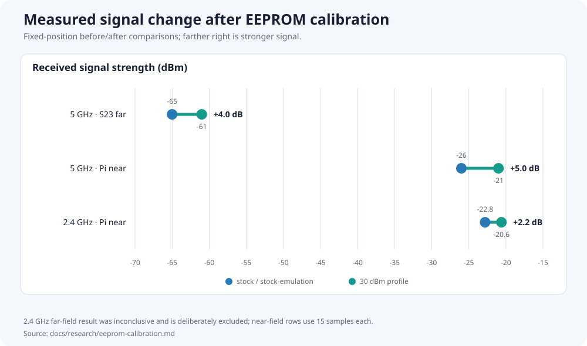

# EEPROM calibration evidence — E8450 test unit

> **Status: historical hardware record.** This document explains the measured
> calibration change on one physical router. It is not a generic flashing
> recipe. Runtime guidance remains in the [ROM handbook](../README.md).

This record consolidates the former factory-dump summary and field map. Raw
images, scan captures, and signal samples remain under
`.recall/router-probes/2026-09-04-factory-dump/` so the measurements can be
rechecked without mixing raw evidence into the maintained handbook.

## Result

The test unit's factory targets limited 5 GHz to 27 dBm and 2.4 GHz to 28 dBm,
below the configured US regulatory ceiling of 30 dBm. Four target bytes per
radio were changed, leaving the interleaved per-device calibration data
untouched.

Post-reboot results:

| Band | Factory-derived ceiling | Calibrated ceiling | Controlled signal result |
|---|---:|---:|---|
| 5 GHz | 27 dBm | 30 dBm | +5.0 dB near-field; +4.0 dB far-field |
| 2.4 GHz | 28 dBm | 30 dBm | +2.2 dB near-field; far-field inconclusive |



The regulatory ceiling remains authoritative. A higher EEPROM target does not
permit operation above the local legal maximum.

## Safety boundary

- EEPROM calibration is partly unit-specific. Never write this test unit's
  complete factory image to another router.
- Preserve an untouched dump from the router being changed before writing.
- Do not alter MAC-address fields or the interleaved `ical`/TSSI calibration
  regions.
- EEPROM is read at driver probe. Reboot after a write; never runtime-reload
  `mt7915e` or PCI unbind/rebind it on this board.
- Use [`scripts/e8450/eeprom.sh`](../../scripts/e8450/eeprom.sh) to inspect and
  validate a copy. Flashing remains a separate explicit action.
- Router credentials and complete unit identifiers are deliberately excluded
  from documentation.

## Evidence set

Raw directory:
[`../../.recall/router-probes/2026-09-04-factory-dump/`](../../.recall/router-probes/2026-09-04-factory-dump/)

| File | MD5 | Meaning |
|---|---|---|
| `factory-ubi0_1.bin` | `b23391d1db51f9298547b1595c8aef44` | Untouched factory volume |
| `factory-patched-canary.bin` | `43f8da69f4f9852b706f3908484eac03` | 5 GHz canary target, `0x26` → `0x29` |
| `factory-final.bin` | `226895bb9a794ea3907790e332d9ef4c` | 5 GHz target, `0x26` → `0x2b` |
| `factory-24g-final.bin` | `2b8a9e0dc98f3d02664102e4e778cb36` | Final 2.4 + 5 GHz calibrated image |
| `sig_*.txt` | — | Fixed-client RSSI samples |
| `scan24.txt`, `scan5.txt` | — | Off-channel BSS surveys |

Factory volume observed: UBI volume `ubi0_1`, 524,288 bytes used in a 634,880
byte capacity. The raw images contain unit-specific identifiers and must be
treated as device backups, not distributable firmware.

## Factory-volume layout

| Offset | Size | Content |
|---|---:|---|
| `0x0000` | approximately `0x180` used | MT7622 WMAC EEPROM, integrated 2.4 GHz radio |
| `0x0180–0x4fff` | — | Remaining area zero-filled |
| `0x5000` | `0x0e00` | MT7915 V1 EEPROM, PCIe 5 GHz radio |
| `0x5e00–0x7fff3` | — | Zero-filled |
| `0x7fff4` | 6 bytes | LAN MAC; do not alter |
| `0x7fffa` | 6 bytes | WAN MAC; do not alter |

No checksum over these fields is consumed by mt76, and U-Boot booted the
modified volume during validation. That does not make arbitrary offsets safe.

## MT7622 WMAC fields — 2.4 GHz

| Relative offset | Field | Factory value | Notes |
|---|---|---|---|
| `0x000` | Chip ID | `22 76` | MT7622 |
| `0x002` | EEPROM version | `02 00` | Version 2 |
| `0x004` | Radio MAC | redacted | Unit-specific |
| `0x034` | `NIC_CONF_0` | `44` | Four TX and four RX paths |
| `0x036/0x037` | `NIC_CONF_1` | `00/20` | TSSI 2.4 GHz enabled |
| `0x052` | `CALDATA_FLASH` | `00` | No DPD/RX-cal flags |
| `0x058 + chain×6` | `TX0_2G_TARGET_POWER` | `0x26` | Four chains; calibrated value `0x2a` |
| `0x0be` | 2.4 GHz rate delta | `0xc6` | Enabled, positive six |
| `0x0f2` | External-PA target | `0x2e` | Present, but external-PA branch is not used |

The changed target offsets are `0x058`, `0x05e`, `0x064`, and `0x06a`.
Interleaved per-device calibration bytes are not target-power fields and must
not be copied or normalized.

## MT7915 V1 fields — 5 GHz

| Relative offset | Field | Factory value | Notes |
|---|---|---|---|
| `0x000` | Chip ID | `15 79` | MT7915 |
| `0x004` | Radio MAC | redacted | Unit-specific |
| `0x050` | DDIE FT version | `01 00` | |
| `0x062` | `DO_PRE_CAL` | `00` | Runtime calibration only |
| `0x190–0x197` | Wi-Fi configuration | `24 52 06 00 28 00 00 15` | Four paths; TSSI bits enabled |
| `0x29d` | 5 GHz rate delta | `0xc4` | Enabled, positive four |
| `0x34b + chain×12` | `TX0_POWER_5G` | group array | Eight channel groups per chain |
| group-7 byte | Target for channels above 144 | `0x26` | Calibrated value `0x2b` |

The changed absolute offsets are `0x5352`, `0x535e`, `0x536a`, and `0x5376`.
The MT7916/MT7981-era V2 offsets used by some community tools do not apply to
this PCIe MT7915 V1 layout.

### 5 GHz channel groups

| Group | Channels | US regulatory ceiling used during this work |
|---:|---|---:|
| 1 | 36–48 | 23 dBm |
| 2 | 52–64, DFS | 24 dBm |
| 3 | 65–96, DFS | 24 dBm |
| 4 | 97–112, DFS | 24 dBm |
| 5 | 113–128, DFS | 24 dBm |
| 6 | 129–144 | 30 dBm |
| 7 | 149–165 | 30 dBm |

Only group 7 was changed. The production radio uses UNII-3, and raising groups
already capped at 23–24 dBm would have no effect.

## Power model

Driver source and three live readbacks produced:

```text
max_power = ceil((target + rate_delta + path_delta) / 2)
path_delta = 12 for four chains
```

Each target-byte step represents 0.5 dBm before the final regulatory clamp.

| Band | Target | Derived maximum |
|---|---:|---:|
| 5 GHz | `0x26` | 27 dBm |
| 5 GHz canary | `0x29` | 29 dBm |
| 5 GHz final | `0x2b` | 30 dBm |
| 2.4 GHz | `0x26` | 28 dBm |
| 2.4 GHz final | `0x2a` | 30 dBm |

## Signal measurements

### Fixed Raspberry Pi client, approximately 1–2 metres

Samples came from `iw dev wlan0 link`, 1.2 seconds apart. Requested transmit
power emulated the original ceiling without rewriting EEPROM between phases.

| Band/state | Mean RSSI | Samples | Raw range |
|---|---:|---:|---|
| 5 GHz, 30 dBm | -21.0 dBm | 15 | all -21 |
| 5 GHz, 27 dBm stock-emulation | -26.0 dBm | 15 | all -26 |
| 5 GHz, 30 dBm recheck | -21.0 dBm | 10 | all -21 |
| 2.4 GHz, 30 dBm | -20.6 dBm | 15 | -22 to -18 |
| 2.4 GHz, 28 dBm stock-emulation | -22.8 dBm | 15 | -24 to -21 |

Limits: close range, 1 dBm client-meter granularity, and no spectrum analyzer.
The 5 GHz result was then checked farther away with a second client.

### Fixed Samsung S23 far-field position

| Band | 30 dBm | Stock-emulation | Result |
|---|---:|---:|---|
| 5 GHz | -61 dBm | -65 dBm at 27 dBm | +4 dB, reproducible |
| 2.4 GHz | typically -49/-50 dBm | typically -47/-48 dBm at 28 dBm | Inconclusive; indoor variation exceeded the expected step |

The 2.4 GHz far-field comparison is explicitly not evidence of improvement.
Its +2.2 dB claim rests on the reversible 15-sample near-field comparison.

## Channel survey and resulting choice

The router radios completed fresh off-channel scans while still serving. Raw
captures contain 33 BSS entries on 2.4 GHz and 14 on 5 GHz.

| Band | Previous channel | Observed competition | Selected channel | Observed competition |
|---|---:|---|---:|---|
| 2.4 GHz | 1 | 12 APs; strongest -38 dBm | 6 | 6 APs; strongest -68 dBm |
| 5 GHz | 149 | 4 APs; strongest -44 dBm | 157 | 3 APs; strongest -87 dBm |

The final deployment used channel 6/HT20 and channel 157/HE40. All eight 2.4
GHz clients rejoined during the recorded acceptance check. This is a local RF
survey, not a channel recommendation for another location.

## Reproduction and rollback

Inspect a router-specific dump first:

```sh
scripts/e8450/eeprom.sh view FILE
scripts/e8450/eeprom.sh check FILE
```

The tool's `stock` and `max30` profiles reproduce this test unit's known byte
patterns. They do not prove another unit has the same factory values.

Validated write sequence:

```text
back up ubi0_1 -> modify a copy -> re-check offsets ->
write the complete copy with ubiupdatevol -> reboot -> verify iw/dmesg
```

The untouched backup is the rollback source. Never substitute a backup from a
different physical router.

## Remaining uncertainty

- A second E8450/RT3200 factory dump has not been compared, so per-model versus
  per-unit target consistency is unknown.
- Long-duration thermal behavior at the raised target lacks a dedicated soak
  test. TSSI remains active, but that is not a replacement for measurement.
- No general 2.4 GHz far-field gain is claimed.
